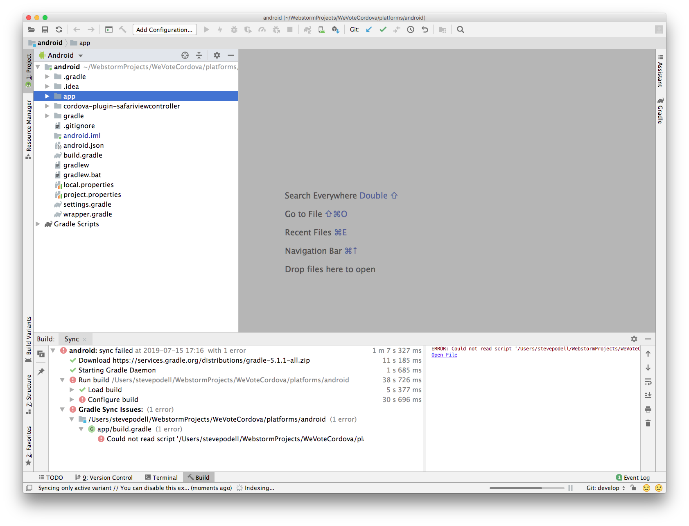
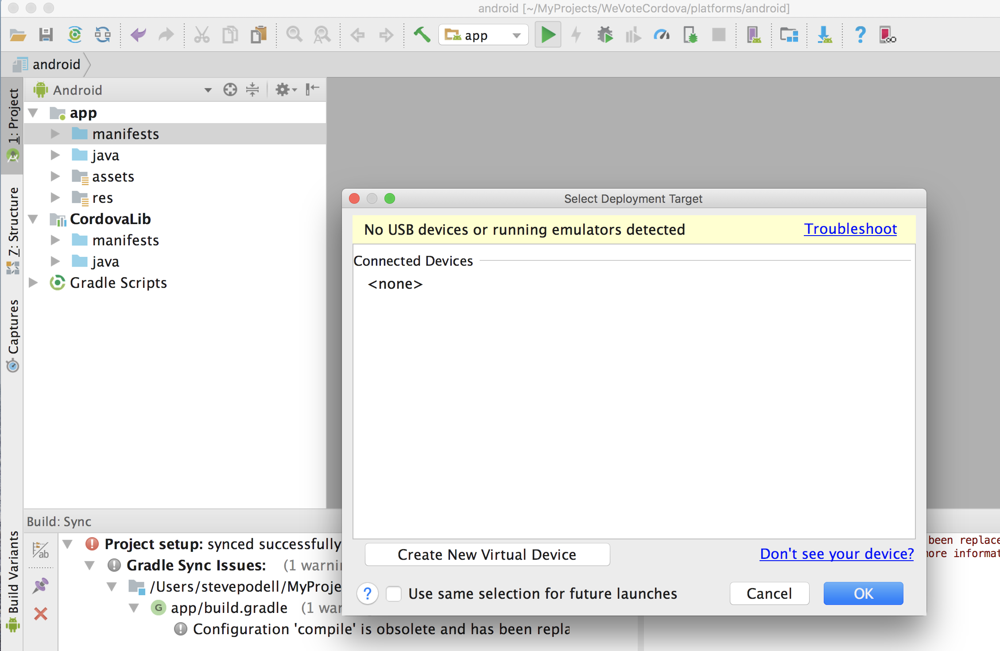
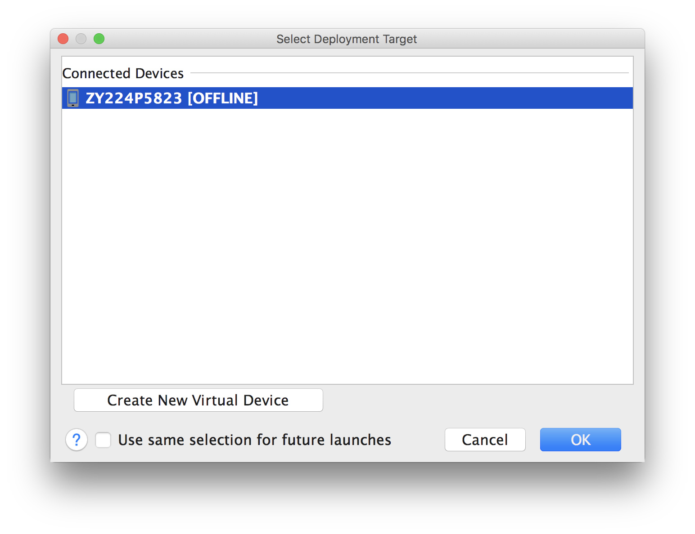
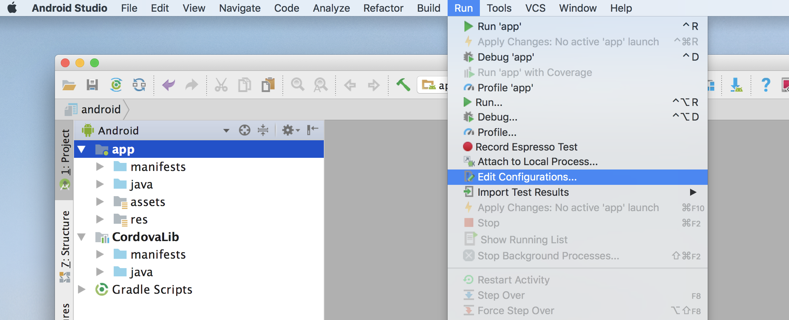
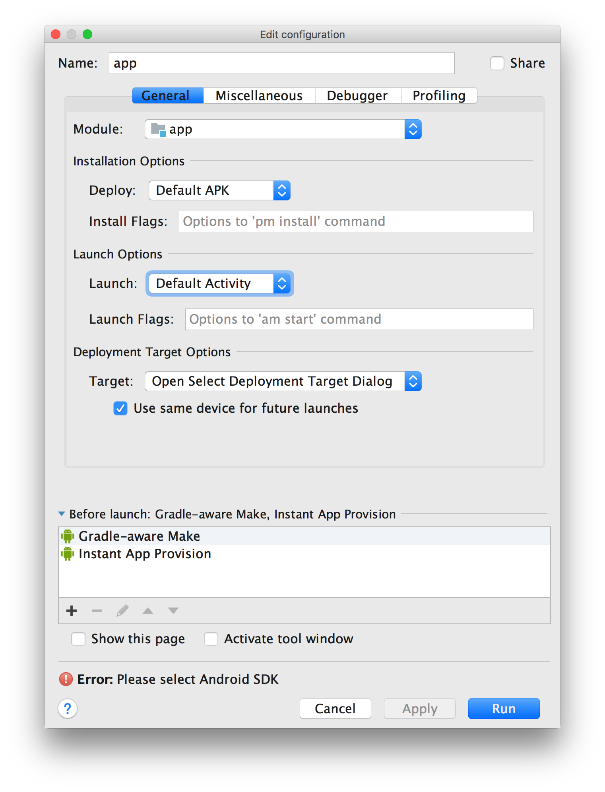
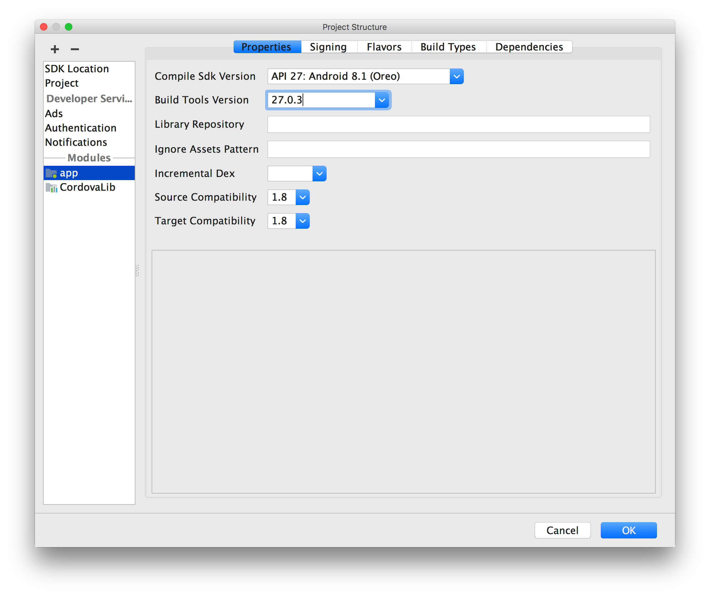
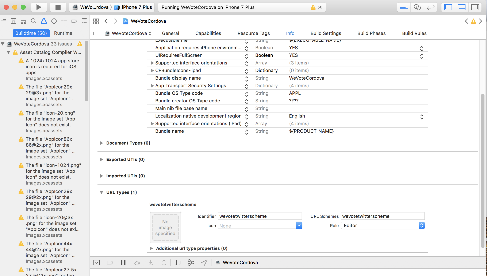

# The WeVoteCordova app for iOS and Android

Apache Cordova allows one to take their pre-existing JavaScript WebApp, bundle it with some additional Cordova JavaScript
and native code, and build an app for iOS or Android that can be released as an app in the App Store or Play Store.  Cordova
works perfectly well with React apps.

For a very simple app, you literally just drop it into Cordova and go, for more complex apps (like ours) there are some
changes to be made.  See [Cordova JavaScript Differences](docs/CordovaJavaScriptDifferences.md).

We use a very thin Apache Cordova wrapper to encapsulate the We Vote React WebApp.  The WeVoteCordova side is so thin, is that
all it contains is Apache Cordova, some Documentation, and the iOS and Android config (and possibly a small amount of 
native code).  All of the JavaScript and React code, and the libraries that they rely on, remains in the WeVote WebApp.

This Cordova App has two build targets, iOS and Android, and they each
wrap an identical `bundle.js` that is compiled by the We Vote WebApp project.

## You need a Mac to develop for iOS

That's Apple's decision, not ours.  So these instructions assume you have a Mac, so if you use Linux or Windows, you will
only be able to develop for Android -- we don't have any install instructions for Linux or Window.

## You need to have the code for the We Vote WebApp setup on your machine

If you haven't done this yet, don't waste your time, go setup the WebApp with current code,
get it to start up at least once, and then return here when you are done.

If you can't find a file called `WebApp/build/js/bundle.js` on your machine, don't proceed
until you can find it.

## Directories

If you followed the instructions for installing the WebApp you put your code at

    /Users/<YOUR NAME HERE>/MyProjects/WebApp

The rest of these instructions assume this specific path.  In the sample instruction substitue your actual user name for 
"your-username".

## Symlinks

This section is a discussion about Symlinks, the detailed install instructions follow in the next
section.

Plan on cloning the WeVoteCordova app into a directory that parallels the We Vote WeApp directory on your computer.
These might be

    /Users/your-username/MyProjects/WeVoteCordova
    /Users/your-username/MyProjects/WebApp

These two directories are joined together with [symlinks/Symbolic links](https://en.wikipedia.org/wiki/Symbolic_link), 
this allows the WebApp setup to "compile" a bundle.js file, and the Cordova setup to access that file (and others) to
have a directory structure setup for running mobile apps with their platform specific IDEs (Xcode for Apple, and Android 
Studio for Android).

<!--
Cordova has a cool command line interface "cordova add" etc.  Adding new plugins should be captured by our Git source control setup, adding platforms
like "windowphone" is messy and will probably take some experimentation.  Lots of Stack Overflow solutions suggest doing something like ...

```
     cordova platform remove android
     cordova platform add android
```

but those are not symlink friendly, and will probably require something like a fresh install.

Someday we should build a script that builds all the links on demand, or even better, a pre-compile hook that handles it all on the fly.
-->

## Install our Code and the Cordova Libraries

1. Change to your base "MyProjects" equivalent directory
    ```
    cd /Users/your-username/MyProjects
    ```

1.  If you are re-installing, remove prior installs
    ```
    rm -fr WeVoteCordovaPopulated
    rm -fr WeVoteCordova
    ```

1.  Clone the WeVoteCordova code

    ```
    git clone https://github.com/wevote/WeVoteCordova.git
    ```

1.  Install the Apache Cordova software

    ```
    npm install -g cordova
    ```
    If you get access errors, repeat the command with sudo ... `sudo npm install -g cordova`
    Please save the path/symlink where cordova is installed. (ex/ `/usr/local/Cellar/node/12.5.0/bin/cordova`)

1.  CD to the www directory and make the first symbolic link for `bundle.js`

    ```
    cd WeVoteCordova
    cd www
    ln -s /Users/your-username/MyProjects/WebApp/build/js/bundle.js bundle.js
    ```

1.  Manually remove a Cordova plugin, for which we have source controlled a modified "Objective-C" file

    ```
    cd /Users/your-username/MyProjects/WeVoteCordova
    rm -fr plugins
    ```

1.  Run (destructive) Cordova CLI commands on the `WeVoteCordova` directory. Please note:

    a. `cordova` is not added automatically to your path. You might need to run from the symlink you saved above (ex/ `/usr/local/Cellar/node/12.5.0/bin/cordova`)
     
    b. You might be asked: `? May Cordova anonymously report usage statistics to improve the tool over time? (Y/n)`
    ```
    cd /Users/your-username/MyProjects/WeVoteCordova
    cordova platform rm ios android
    cordova platform add ios android
    ```
    This step adds all the Cordova libraries, installs up-to-date versions of the Cordova plugins, and sets up directories for iOS and Android,
    but it destroys some of the source controlled configuration files by overwriting them with default scaffolding files.

1.  Rename this code directory to a temporary name: `WeVoteCordovaPopulated`

    ```
    cd /Users/your-username/MyProjects
    mv WeVoteCordova WeVoteCordovaPopulated
    ```
    This step has added all the Cordova libraries, installed up-to-date versions of the Cordova plugins, and set up directories for iOS and Android,
    but it destroyed some of the source controlled configuration files by overwriting them with default scaffolding files.

1.  Clone another copy of the WeVoteCordova code

    ```
    git clone https://github.com/wevote/WeVoteCordova.git
    ```

1.  Copy, recursively with no overwrites, all of the "Populated" Cordova files onto the target WeVoteCordova directory.
    This new directory contains all the source controlled files from git,
    and this step adds all the generated -- non-source controlled files.
    ```
    cp -Rvn WeVoteCordovaPopulated/ WeVoteCordova/
    ```
    At this point you can delete the WeVoteCordovaPopulated directory, it has served its purpose.
    All the code for iOS and Android has been installed on your Mac, and we will now do the platform specific setup, then
    setup the IDEs.
    
    ```
    rm -rf WeVoteCordovaPopulated

    ```
    
1. On github.com, fork WeVoteCordova to your account. Navigate to https://github.com/wevote/WeVoteCordova and then click the "Fork" button in the upper right corner.
    
1. You may need to setup your Github remotes

    ```
    Steves-iMac: MyProjects your-username$ cd /Users/your-username/MyProjects/WeVoteCordova
    Steves-iMac: WeVoteCordova your-username$ git remote -v
    origin  https://github.com/SailingSteve/WeVoteCordova.git (fetch)
    origin  https://github.com/SailingSteve/WeVoteCordova.git (push)
    upstream        https://github.com/wevote/WeVoteCordova.git (fetch)
    upstream        https://github.com/wevote/WeVoteCordova.git (push)
    Steves-iMac: WeVoteCordova your-username$ 
    ```
    If you don't have remotes defined... (remember to substitute your github user name for "SailingSteve")
    (The default setup might have the git origin pointing to https://github.com/wevote/WeVoteCordova.git,
    which you will have to remove, since at We Vote we have the origin/upstream reversed from most other 
    projects on github.)
    ```
    git remote rm origin
    git remote add upstream https://github.com/wevote/WeVoteCordova.git
    git remote add origin https://github.com/SailingSteve/WeVoteCordova.git
    git remote -v
    ```

1. You may need to npm install (it doesn't hurt to do this multiple times!)
    ```
    npm install
    ```

# Platform specific iOS setup

Throughout these instructions, remember to substitute your actual user name for "your-username"!

1.  cd to the iOS specific code area, and the www directory in that area

    iOS serves the bundle.js, the index.html, and other files from `WeVoteCordova/platforms/ios/www`
    ```
    cd /Users/your-username/MyProjects/WeVoteCordova/platforms/ios/www
    ```

1.  bundle.js

    There will be a `bundle.js` file in that www directory, but it would instantly get outdated as you
    update the WebApp in the course of developing the Cordova app, so delete it, and make a symbolic link to where the
    WebApp compile process leaves the new `bundle.js`

    ```
    rm bundle.js
    ln -s /Users/your-username/MyProjects/WebApp/build/js/bundle.js bundle.js
    ```

1.  Make the other symlinks that the iOS cordova app will need while running.  (Remember to substitute your actual user name
    in place of 'your-username'!)

    ```
    rm index.html
    ln -s /Users/your-username/MyProjects/WeVoteCordova/www/index.html index.html
    ln -s /Users/your-username/MyProjects/WebApp/build/css css
    ln -s /Users/your-username/MyProjects/WebApp/build/fonts fonts
    ln -s /Users/your-username/MyProjects/WebApp/build/img img
    ln -s /Users/your-username/MyProjects/WebApp/build/javascript javascript
    ```

    When you are done the ios www directory should look like this

    ```
    Steves-iMac:www your-username$ pwd
    /Users/your-username/WebstormProjects/WeVoteCordova/platforms/ios/www
    Steves-iMac:www your-username$ ls -la
    total 168
    drwxr-xr-x  12 your-username  staff    384 Oct 14 00:11 .
    drwxr-xr-x  14 your-username  staff    448 Nov  8 12:15 ..
    lrwxr-xr-x   1 your-username  staff     61 Jun  5  2018 bundle.js -> /Users/your-username/MyProjects/WebApp/build/js/bundle.js
    drwxr-xr-x   5 your-username  staff    160 Oct 14 00:11 cordova-js-src
    -rw-r--r--   1 your-username  staff  78044 Jun  5  2018 cordova.js
    -rw-r--r--   1 your-username  staff   2122 Nov  5 12:55 cordova_plugins.js
    lrwxr-xr-x   1 your-username  staff     52 Jun  5  2018 css -> /Users/your-username/MyProjects/WebApp/build/css
    lrwxr-xr-x   1 your-username  staff     54 Jun  5  2018 fonts -> /Users/your-username/MyProjects/WebApp/build/fonts
    lrwxr-xr-x   1 your-username  staff     52 Jun  5  2018 img -> /Users/your-username/MyProjects/WebApp/build/img
    lrwxr-xr-x   1 your-username  staff     64 Jun  5  2018 index.html -> /Users/your-username/MyProjects/WeVoteCordova/www/index.html
    lrwxr-xr-x   1 your-username  staff     59 Jun  5  2018 javascript -> /Users/your-username/MyProjects/WebApp/build/javascript
    drwxr-xr-x   9 your-username  staff    288 Nov  5 12:55 plugins
    Steves-iMac:www your-username$
    ```
    
1.  You should test each one of those links, to make sure that they really point to where it needs to. It is much easier 
to test first, rather than making a setup mistake and having to diagnose the problem later on.  Use `stat -L` to confirm 
that the link points to a sizeable file (17856048 bytes in the case of bundle.js), if stat reports a file size of less than 
100 bytes, then the link is probably incorrect.  Use `ls` to make sure that the links for directories, contain a few files.

    ```
    Steves-iMac:www your-username$ pwd
    /Users/your-username/MyProjects/WeVoteCordova/platforms/ios/www
    Steves-iMac:www your-username$ stat -L bundle.js
    16777220 57914434 -rw-r--r-- 1 your-username staff 0 17856048 "Feb 13 13:53:16 2019" "Feb 13 13:53:16 2019" "Feb 13 13:53:16 2019" "Feb 13 13:52:45 2019" 4096 34880 0 bundle.js
    Steves-iMac:www your-username$ ls css
    bootstrap.css           bootstrap.css.map       loading-screen.css      loading-screen.css.map  main.css                main.css.map
    Steves-iMac:www your-username$ls fonts
    FontAwesome.otf                         app-fonts.ttf                           fontawesome-webfont.svg                 fontawesome-webfont.woff2               glyphicons-halflings-regular.ttf
    app-fonts.eot                           app-fonts.woff                          fontawesome-webfont.ttf                 glyphicons-halflings-regular.eot        glyphicons-halflings-regular.woff
    app-fonts.svg                           fontawesome-webfont.eot                 fontawesome-webfont.woff                glyphicons-halflings-regular.svg        glyphicons-halflings-regular.woff2
    Steves-iMac:www your-username$ ls img
    global  tools   welcome
    Steves-iMac:www your-username$ stat -L index.html
    16777220 39211364 -rw-r--r-- 1 your-username staff 0 6393 "Feb 13 12:46:51 2019" "Nov 26 14:08:33 2018" "Nov 26 14:08:33 2018" "Nov 26 14:08:33 2018" 4096 16 0 index.html
    Steves-iMac:www your-username$ ls javascript
    google-analytics-template.js    google-tag-manager-template.js
    Steves-iMac:www your-username$ 
    ```

## Installing the IDEs:

It is possible to develop for Cordova without IDEs, but you are on your own if you take that path.

Install Apple Xcode from the MacOS App Store, you will need a Mac for the iOS part of this project, and a Mac will also be
fine for Android development.

For Android, install the [Android Studio](https://developer.android.com/studio/index.html)
(a free  IDE, from JetBrains, the makers of PyCharm, WebStorm, IntelliJ, etc.)

## iOS specific IDE and Environment setup
1.  Install Xcode

    The easiest way to install Xcode is via the
    <a href="https://itunes.apple.com/us/app/xcode/id497799835?mt=12" target="_blank">Mac App Store.</a>  The Xcode.app download is 10gb in size.

1.  Install Node and Watchman

    We recommend installing node and watchman via Homebrew.
    ```
    brew install node
    brew install watchman
    ```
    
    On a machine where node may already have been installed, we want to have version 10 or heigher:
    ```
    Steves-iMac:WeVoteCordova your-username$ node -v
    v6.12.3
    Steves-iMac:WeVoteCordova your-username$ brew upgrade node
    Updating Homebrew...
    ...
    ```

1.  Install CocoaPods (an MacOS dependency manager).

    You won't need CocoaPods today, but it is worth installing in case you do need it someday.  (Gem is a package Ruby packaging 
    tool, and comes pre-installed on Macs.)
    ```
    Steves-iMac:WeVoteCordova your-username$ sudo gem install cocoapods
    ```

1.  Opening the project with Xcode -- Open xcworkspace, not xcodeproj directories (or else)

    Be sure to open **`/Users/your-username/WebstormProjects/WeVoteCordova/platforms/ios/WeVoteCordova.xcworkspace`** each time, if
    you forget to do this portions of the app will not be in your build, since you won't have referenced the cocopods (a dependency manger,
    that pulls in some iOS specific libraries.)

    Be sure to NOT open ~~`/Users/your-username/WebstormProjects/WeVoteCordova/platforms/ios/WeVoteCordova.xcodeproj`~~ with Xcode,
    and don't pick a choice from the history pane ("Don't click these!") in the Welcome to Xcode dialog.  The history unfortunately only contains contains
    references to .xcodeproj files.  (Hint:  When that Welcome dialog is displayed, **it is** possible to open the xcworkspace from the File/"Open Recent" menu,
    just be sure to open the xcworkspace.)


And in the "Welcome to Xcode" dialog, again, don't pick anything from the history list (those are all xcodeproj files), you have to
click "Open another project..." and navigate to the 'WeVoteReactNative.xcworkspace' item (which is actually a directory).


**Clean Build:**

You probably will run into the need to "Clean Build Folder".  To do this in XCode, go to the Product menu, hold down the Option button
(on your Mac keyboard) and select "Clean Build Folder", after it completes (about 10 seconds), press the triangular
Run (Play) button do to a full rebuild


## Opening the project in Xcode

This is very similar to the way we do it with the WeVoteReactNative iOS development.  
  
Download Xcode from the MacOS App Store, and launch it:

Don't use the last opened list, instead click on "Open another project..." (We use an Apple specific packager
called CocoaPods, which forces us to ignore that handy last opened menu.)


After clicking the "Open another project..." button, select the `WeVoteCordova.xcworkspace` file and press Open.


Select a simulator type from the menu on top (I use iPhone 8p in this example), then press the triangular green play button,
and the app starts in the simulator.

### Updating the art for the Splashscreen (a rarely required step)

In order to handle the 12" iPad Pro I took the image supplied into Photoshop, resized it to 2732x2732, forced it to have no 
transparent pixels, and renamed it to the required(?) name `Default@2x~universal~anyany.png`.  Then (not being an Xcode expert), 
I dropped the image **within the Xcode program** into `WeVoteCordova/Resources//Images.xcassets/LaunchImage` into each 
location in the universal section.


This resulted in these files being created:

    ```
    (WebAppEnv)Steves-iMac:ios your-username$ ls -la ./WeVoteCordova/Images.xcassets/LaunchStoryboard.imageset/*
    -rw-r--r--  1 your-username  staff    3765 Mar 22 08:27 ./WeVoteCordova/Images.xcassets/LaunchStoryboard.imageset/Contents.json
    -rw-r--r--  1 your-username  staff  134330 Mar 22 08:27 ./WeVoteCordova/Images.xcassets/LaunchStoryboard.imageset/Default@2x~universal~anyany-1.png
    -rw-r--r--  1 your-username  staff  134330 Mar 22 08:27 ./WeVoteCordova/Images.xcassets/LaunchStoryboard.imageset/Default@2x~universal~anyany-10.png
    -rw-r--r--  1 your-username  staff  134330 Mar 22 08:27 ./WeVoteCordova/Images.xcassets/LaunchStoryboard.imageset/Default@2x~universal~anyany-11.png
    -rw-r--r--@ 1 your-username  staff  134330 Mar 22 08:27 ./WeVoteCordova/Images.xcassets/LaunchStoryboard.imageset/Default@2x~universal~anyany-2.png
    -rw-r--r--  1 your-username  staff  134330 Mar 22 08:27 ./WeVoteCordova/Images.xcassets/LaunchStoryboard.imageset/Default@2x~universal~anyany-3.png
    -rw-r--r--  1 your-username  staff  134330 Mar 22 08:27 ./WeVoteCordova/Images.xcassets/LaunchStoryboard.imageset/Default@2x~universal~anyany-4.png
    -rw-r--r--  1 your-username  staff  134330 Mar 22 08:27 ./WeVoteCordova/Images.xcassets/LaunchStoryboard.imageset/Default@2x~universal~anyany-5.png
    -rw-r--r--  1 your-username  staff  134330 Mar 22 08:27 ./WeVoteCordova/Images.xcassets/LaunchStoryboard.imageset/Default@2x~universal~anyany-6.png
    -rw-r--r--  1 your-username  staff  134330 Mar 22 08:27 ./WeVoteCordova/Images.xcassets/LaunchStoryboard.imageset/Default@2x~universal~anyany-7.png
    -rw-r--r--  1 your-username  staff  134330 Mar 22 08:27 ./WeVoteCordova/Images.xcassets/LaunchStoryboard.imageset/Default@2x~universal~anyany-8.png
    -rw-r--r--  1 your-username  staff  134330 Mar 22 08:27 ./WeVoteCordova/Images.xcassets/LaunchStoryboard.imageset/Default@2x~universal~anyany-9.png
    -rw-r--r--  1 your-username  staff  134330 Mar 22 08:26 ./WeVoteCordova/Images.xcassets/LaunchStoryboard.imageset/Default@2x~universal~anyany.png
    (WebAppEnv)Steves-iMac:ios your-username$
    ```

So to replace the splash screen, I would take `./WeVoteCordova/Images.xcassets/LaunchStoryboard.imageset/Default@2x~universal~anyany.png` and 
replace it with same sized art, and if you wanted to be safe I would use the Xcode IDE to copy them (and automatically rename them)
over the existing files, if you were feeling adventurous you could go directly to the files, and take the new image and 
use it to replace the original and the 12 numbered copies of the old image.

By the way Xcode stores way too much configuration info in a binary file, and messing with them can take days to fix, going directly to the filesystem to make changes is risky.


## Debugging Cordova Differences
Browsers are single threaded, JavaScript on browsers is also single threaded, but JavaScript running in Cordova is 
multi-threaded.  "JavaScript in the WebView does not run on the UI thread, it also has other threads to execute the 
html component and carry out CSS transitions."  This can cause some confusion when debugging Cordova for the first time.

## Debugging Cordova Apps with the Safari debugger


 

You don't have to actually use Safari for Mac for anything, but launching its remote debugger.  You can see it opened on its
smallest default page in the picture above, it just has to be running so you can get to that "Develop" menu.  Once you
open the "We Vote Cordova" page that is currently being displayed, in the picture it is the "Welcome to We Vote" page. 
One of the symptoms, of this otherwise good thing (multiple-threads) is tha console.log lines in the resolution of promises
often don't make it to the log.


It is easy to get the Safari debugger working, and over time Apple is adding more of the features we are used to
from the Chrome Devtools Debugger.


1. Enable debugging in Safari, [see this article](http://geeklearning.io/apache-cordova-and-remote-debugging-on-ios/)
1. Build your 'compiled' javascript app file `bundle.js`, on my Mac it is at `build/js/bundle.js`.  This file needs to be symlinked
into your www directory (see the section on symlinks above).
    1. On my Mac in WebStorm, I have a Gulp task that has a target "build", when I press the play button for that task, it builds the
bundle.js in 20 seconds (Two seconds to gather all the js scripts together, and 18 seconds to recompile sass).
1. Press the play button in Xcode, which should start the Simulator, load, and then start the WeVote WebApp.
1. In Safari open Develop/Simulator/WeVoteCordova/WeVote and the Safari Web Inspector appears.

## Debugging Cordova Apps with the Chrome dev tools

Chrome devtools is lightyears better than the Safari debugger, but is a bit challenging to get working. See ...

[medium.com article about the remotedebug-ios-webkit-adapter for debugging WebViews](https://medium.com/@auchenberg/hello-remotedebug-ios-webkit-adapter-debug-safari-and-ios-webviews-from-anywhere-2a8553df7465)

[github.com readme about remotedebug-ios-webkit-adapter#getting-started](https://github.com/RemoteDebug/remotedebug-ios-webkit-adapter#getting-started)

Install the remotedebug_ios_webkit_adapter (from a terminal window):


    brew update
    brew install --HEAD libimobiledevice
    brew install --HEAD ios-webkit-debug-proxy
    npm install remotedebug-ios-webkit-adapter -g


Run the remotedebug_ios_webkit_adapter:


    (WebAppEnv)Steves-iMac:WeVoteCordova your-username$ remotedebug_ios_webkit_adapter --port=9000
    remotedebug-ios-webkit-adapter is listening on port 9000
    iosAdapter.getTargets
    iosAdapter.getTargets
    iosAdapter.getTargets
    ...


You may have to restart the remotedebug_ios_webkit_adapter from time to time, to get the
`chrome://inspect/#devices` to see the simulator processes.

After starting the remotedebug_ios_webkit_adapter (hopefully on the first attempt) when you navigate in the Google Chrome
browser to `chrome://inspect` you will see the following screen, with the process to debug on the
list below:


  
Press that little blue 'inspect' to open the debugger, which should look like the following:


If `chrome://inspect` doesn't list your target, then try restarting remotedebug_ios_webkit_adapter and maybe restarting
your Cordova app via Xcode.  This is imperfect, but not too bad once you get the hang of it.

Unfortunately in both the Apple and Chrome debuggers, breakpoints are not maintained between restarts
of the app via Xcode, and also the files where you want to put the breakpoints have to be reopened each time.  (This deficiency
is not the case in React-Native, so hopefully a fix will arrive some day.)

Press ⌘+P to bring up the list of recently opened files -- this can save you a bunch of clicks.

In spite of the previous problem, it is possible to debug a startup behaviour, one that would fly past before you could set the first 
breakpoint -- on the upper left  corner of the chrome debugger, there is a "circular arrow, 
reload button" (see the following image) that will allow you to restart the app within the Chrome Inspector while maintaining
the current breakpoints.


## WebApp code changes needed to support Cordova

In Apache Cordova, all the real app code is in that `bundle.js` we make in the WebApp setup, but there are some code
changes in the WebApp that are necessary to support cordova.

[Cordova JavaScript Differences](docs/CordovaJavaScriptDifferences.md).


## Testing from a physical phone with the API server running on your Mac

If you are developing a Cordova specific feature, that requires access to the API server
running on your Mac, while not using the simulator, some extra setup is required to allow
access to your Mac's localhost.

[Testing with a Physical Phone and a localhost WeVote API Server](docs/TestingWithLocalHostFromPhone.md)


## Git

The Git branching scheme for WeVoteCordova is the same as for the We Vote WebApp


    git checkout develop
    git pull upstream develop
    git push origin develop


otherwise all else in our github workflow is the same.


## If the cordova plugins are not installed

These should be installed by Git, but if not you might see error "-1100" lines in the log.

In WeVoteCordova/platforms/ios/platform_www/cordova_plugins.js


    module.exports.metadata =
    // TOP OF METADATA
    {
      "cordova-plugin-device": "2.0.1",
      "cordova-plugin-statusbar": "2.4.1",
      "cordova-plugin-keyboard": "1.2.0",
      "cordova-plugin-safariviewcontroller": "1.5.2",
      "cordova-plugin-whitelist": "1.3.3",
      "cordova-plugin-inappbrowser": "2.0.2",
      "cordova-plugin-splashscreen": "5.0.2"
    };

If they are not present, the commands to install them (from the WeVoteCordova dir) are:

    cordova plugin add cordova-plugin-whitelist
    cordova plugin add cordova-plugin-device
    cordova plugin add cordova-plugin-statusbar
    cordova plugin add cordova-plugin-keyboard
    cordova plugin add cordova-plugin-splashscreen
    cordova plugin add cordova-plugin-safariviewcontroller
    cordova plugin add https://github.com/apache/cordova-plugin-inappbrowser/pull/263


Note:  Sometimes the setup needs to be re-run

    cordova platform remove android
    cordova platform add android

If you do this, your changes to ```WeVoteCordova/platforms/android/cordova-plugin-safariviewcontroller/cordova-SafariViewController-java18.gradle```
and to ```WeVoteCordova/platforms/android/app/src/main/java/org/apache/cordova/inappbrowser/InAppBrowser.java``` will have to be redone.

For getting the "Run" configuration to work again, you may have select on the file menu "Sync Project With Gradle Files"


## Android Setup

### Install Android Studio

It's free!  It is based on Intellij, so if you have used PyCharm, WebStorm, RubyMine, or IntelliJ it should be instantly familar.

[https://developer.android.com/studio/index.html](https://developer.android.com/studio/index.html)
    
TODO: On a clean machine, capture all the steps it takes to get Android Studio
going, and the Java environment setup.  The Android and [Cordova](https://cordova.apache.org/docs/en/latest/) documentation are a good
start.

### Running Android Cordova for the first time

1.  Download and install Android Studio

    Click "ok" to downloading and installing any jars or packages that the installer recommends.

1.  On the welcome screen, select "open an existing project"

    The existing project is the WeVoteCordova project that you have already pulled down from git.  Our Android project is 
    contained within the WeVoteCordova project. In the open (file selection) dialog, navigate to your WeVoteCordova working 
    directory, then to platforms, then to android and press Open.  `/Users/your-username/MyProjects/WeVoteCordova/platforms/android`

1.  At that point there will be a series of updates and "syncing" options, where you should follow all the default choices.

1.  You will probably be prompted to upgrade Gradle, Genymotion, Cordova plugins, etc.

    Update them all before continuing.  Restart as recommended.

    Don't worry about setting a version control root or remote, all changes that you want to get into 
    git are in the WeVoteCordova enclosing project -- That is where you should do your pull requests,
    not within Android Studio.
    
    

1. Setup the symlinks: start by changing to the android www dir at `android/app/src/main/assets/www`

    ```
    Steves-iMac:android your-username$ cd /Users/your-username/MyProjects/WeVoteCordova/platforms/android/app/src/main/assets/www
    Steves-iMac:www your-username$ ls -la
    total 33624
    drwxr-xr-x  8 your-username  staff       256 Apr 29 13:45 .
    drwxr-xr-x  3 your-username  staff        96 Apr 29 13:45 ..
    -rw-r--r--  1 your-username  staff  17126402 Apr 29 13:45 bundle.js
    drwxr-xr-x  6 your-username  staff       192 Apr 29 13:45 cordova-js-src
    -rw-r--r--  1 your-username  staff     73155 Apr 29 13:45 cordova.js
    -rw-r--r--  1 your-username  staff      1845 Apr 29 13:45 cordova_plugins.js
    -rw-r--r--  1 your-username  staff      5965 Apr 29 13:45 index.html
    drwxr-xr-x  8 your-username  staff       256 Apr 29 13:45 plugins
    Steves-iMac:www your-username$ 
    ```
    
1. Add the rest of the symlinks.  This step removes the bundle.js and index.html that was copied here when you 
ran "cordova platform add android"

    ```
    Steves-iMac:www your-username$ rm bundle.js
    Steves-iMac:www your-username$ ln -s /Users/your-username/MyProjects/WebApp/build/js/bundle.js bundle.js
    Steves-iMac:www your-username$ rm index.html
    Steves-iMac:www your-username$ ln -s /Users/your-username/MyProjects/WeVoteCordova/www/index.html index.html
    Steves-iMac:www your-username$ ln -s /Users/your-username/MyProjects/WebApp/build/css css
    Steves-iMac:www your-username$ ln -s /Users/your-username/MyProjects/WebApp/build/fonts fonts
    Steves-iMac:www your-username$ ln -s /Users/your-username/MyProjects/WebApp/build/img img
    Steves-iMac:www your-username$
    Steves-iMac:www your-username$ ls -la
    total 152
    drwxr-xr-x  12 your-username  staff    384 May  9 20:43 .
    drwxr-xr-x   3 your-username  staff     96 Apr 29 13:45 ..
    lrwxr-xr-x   1 your-username  staff     55 May  9 13:28 bundle.js -> /Users/your-username/MyProjects/WebApp/build/js/bundle.js
    drwxr-xr-x   6 your-username  staff    192 Apr 29 13:45 cordova-js-src
    -rw-r--r--   1 your-username  staff  73155 Apr 29 13:45 cordova.js
    -rw-r--r--   1 your-username  staff   1845 Apr 29 13:45 cordova_plugins.js
    lrwxr-xr-x   1 your-username  staff     46 May  9 20:43 css -> /Users/your-username/MyProjects/WebApp/build/css
    lrwxr-xr-x   1 your-username  staff     48 May  9 20:43 fonts -> /Users/your-username/MyProjects/WebApp/build/fonts
    lrwxr-xr-x   1 your-username  staff     46 May  9 20:43 img -> /Users/your-username/MyProjects/WebApp/build/img
    lrwxr-xr-x   1 your-username  staff     58 May  9 20:42 index.html -> /Users/your-username/MyProjects/WeVoteCordova/www/index.html
    lrwxr-xr-x   1 your-username  staff     53 May  9 20:43 javascript -> /Users/your-username/MyProjects/WebApp/build/javascript
    drwxr-xr-x   8 your-username  staff    256 Apr 29 13:45 plugins
    Steves-iMac:www your-username$ 
    ```
    
1.  Android (Java) projects need a Run configuration to start

    

    Accept the default settings and press "OK"
    
    You might see a warning: "**WARNING:** Configuration 'compile' is obsolete and has been replaced with 'implementation' 
    and 'api'.", but it is safe to ignore

1. Press the green "play" button to attempt to start running

    
    
    If you have an Android phone or tablet, you can plug it in via USB.  Make sure debugging via tethering is 
    enabled (google this. it varies between phone manufacturers).  If it is enabled you will see the name of the 
    connected device (Motorola Moto G, in this example) in the dialog.  Press "OK", and the CordovaApp should start right up on 
    the phone.
    
    


     
     
     


### Modify Build Configuration

1.  As of March 29, 2018, if you get a project compile error in AndroidStudio ```Could not find method jackOptions() for arguments [cordova_SafariViewController_...```
you might have to remove the jack settings in ```WeVoteCordova/platforms/android/cordova-plugin-safariviewcontroller/cordova-SafariViewController-java18.gradle```
this file is source controlled by We Vote, but updating the plugin could expose this problem again. See "Migrate from Jack" at https://developer.android.com/studio/write/java8-support.html.

    ```
    ext.postBuildExtras = {
        android {
            defaultConfig {
    //            jackOptions {
    //                enabled true
    //                additionalParameters('jack.incremental': 'true')
    //            }
            }
            compileOptions {
                sourceCompatibility JavaVersion.VERSION_1_8
                targetCompatibility JavaVersion.VERSION_1_8
            }
        }
    }
    ```

2. The We Vote project has made a pull request against the cordova core plugin cordova-plugin-inappbrowser, which we need
to allow our oAuth flow for Twitter and Facebook to work.

See [https://github.com/SailingSteve/cordova-plugin-inappbrowser](https://github.com/SailingSteve/cordova-plugin-inappbrowser)


### Running Android Cordova for the first time


### Debugging Android Cordova

Just like iOS!  Use the [chrome://inspect/#devices](chrome://inspect/#devices) in Chrome, but no need to start the 
remotedebug_ios_webkit_adapter server, something in Android or Android Studio has done that for us automatically.

### If the Twitter Redirect stops working in iOS

Make sure the custom scheme URL Type is still setup in Xcode


__
### iOS has two config.xml files -- make sure you change both

I think that when you (DON'T DO THIS)

    cordova platform remove ios
    cordova platform add ios

or you will regenerate the iOS specific `config.xml` (platforms/ios/WeVoteCordova/config.xml), and this file will not have config that is
in android specific blocks in the "root" config.xml.  

At run time the only config.xml that matters for iOS is `platforms/ios/WeVoteCordova/config.xml`, so
be sure to manually make the changes in both places (yuck).  If you make the mistake of removing platform for iOS, you will lose
the entire directory for iOS including any configuration you made in XCode -- it might take you a lot of time to recover from
this.

### Moving the spinner upwards on the iOS Splash screen and changing it from grey to white:  Manual step required

In the non-source controlled file `/Users/your-username/MyProjects/WeVoteCordova/platforms/ios/WeVoteCordova/Plugins/cordova-plugin-splashscreen/CDVSplashScreen.m` 
change two lines.  The first at about line 84:

    UIActivityIndicatorViewStyle topActivityIndicatorStyle = UIActivityIndicatorViewStyleGray;
to

    UIActivityIndicatorViewStyle topActivityIndicatorStyle = UIActivityIndicatorViewStyleWhite;

The second at about line 102:


    _activityView.center = CGPointMake(parentView.bounds.size.width / 2, parentView.bounds.size.height / 1 );
to

    _activityView.center = CGPointMake(parentView.bounds.size.width / 2, parentView.bounds.size.height * 1 / 5 );


----------
## Other documentation pages:

**[Setting up your Computer for Android Development](docs/AndroidSetup.md)**

**[Making an iOS Release](docs/MakingAniOSrelease.md)**

**[Making an Android Release](docs/MakingAnAndroidRelease.md)**

**[Cordova JavaScript Differences](docs/CordovaJavaScriptDifferences.md)**

**[Testing with localhost from an actual phone](docs/TestingWithLocalHostFromPhone.md)**

**[Update the icons and splashscreens with new artwork](res/screen/ios)**
