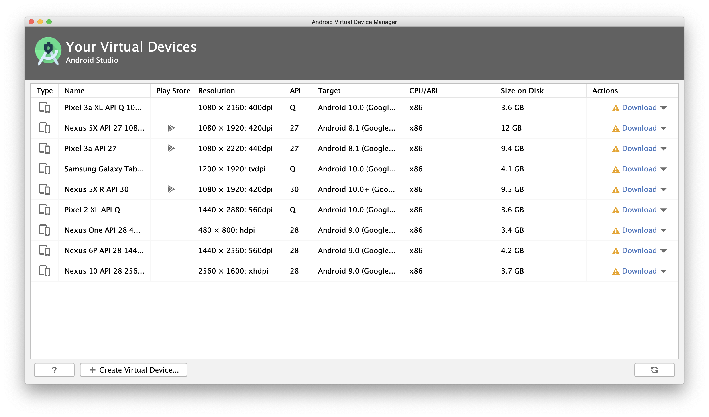
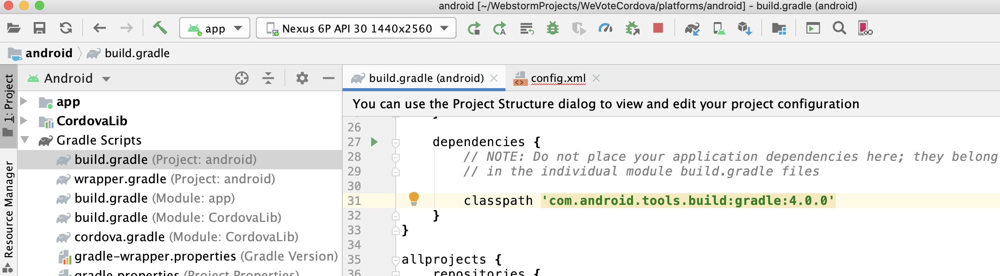

# The WeVoteCordova app for iOS and Android

Apache Cordova allows one to take their pre-existing JavaScript WebApp, bundle it with some additional Cordova JavaScript
and native code, and build an app for iOS or Android that can be released as an app in the App Store or Play Store.
Cordova works perfectly well with React apps.

For a very simple app, you literally just drop it into Cordova and go, for more complex apps (like ours) there are some
changes to be made.  See [Cordova JavaScript Differences](docs/CordovaJavaScriptDifferences.md).

We use a very thin Apache Cordova wrapper to encapsulate the We Vote React WebApp.  The WeVoteCordova side is so thin, that
all it contains is Apache Cordova, some Documentation, and the iOS and Android config (and possibly a small amount of
native code).  All of the JavaScript and React code, and the libraries that they rely on, remains in the WeVote WebApp.

This Cordova App has two build targets, iOS and Android, and they each
wrap an identical `bundle.js` that is compiled by the We Vote WebApp project.

## You need a Mac to develop for iOS

That's Apple's decision, not ours.  So the iOS portions of these instructions assume you have a Mac, so if you use Linux or Windows, you will
only be able to develop for Android -- we currently don't have install instructions specifically for Linux or Windows, but we hope that
the Android install for Mac will be very similar to what you need.

## You need to have the code for the We Vote WebApp setup on your machine

This section refers to the WebApp, not to WeVoteCordova.  These are prerequisite instructions for the WebApp.

To build the bundle.js and associated files in the WebApp that are needed for Cordova, delete the WebApp/build directory, and execute the following
two commands:

    npm run prod-singleBundle
    npm run start-https-singleBundle

If you haven't done this yet, don't waste your time, go setup the WebApp with current code,
and get it to start up at least once, and then return here when you are done.

If you can't find a file called `WebApp/build/bundle.js` on your machine, don't proceed
until you can find it.

Note July 2020:  It is **so much better** if you are using 13.x node.  The latest 14.x node has a minimum version
dependency with node-sass, and there are other unpredictable issues that crop up that occasionally prevent
the app from loading.

### If `npm-install` fails with errors, or succeeds with some c++ errors...

    stevepodell@Steves-MacBook-Pro-32GB-Oct-2109 WebApp % date
    Tue Jul 21 10:49:45 PDT 2020
    stevepodell@Steves-MacBook-Pro-32GB-Oct-2109 WebApp % node -v
    v14.5.0
    stevepodell@Steves-MacBook-Pro-32GB-Oct-2109 WebApp %

If you are above Node 13, you may need to do the following.  (This is not a script, simply
a list of steps that was needed for this configuration.)

You may need to `npm rebuild node-sass`

You may also need to `npm rebuild node-gyp`

I had two different versions of node-gyp installed (v3.x and v6.x), I uninstalled them both and allowed the `npm install`
script to add back in version I needed

    rm package-lock.json
        ... In package.json find  "node-sass": "4.13.1", change it to "node-sass": "4.14.1"
    npm node-gyp -v
    node-gyp -v
    npm uninstall node-gyp
    npm install node-gyp
    sudo npm uninstall -g node-gyp
    npm rebuild node-sass
    npm install
    npm run prod-singleBundle
    npm run start-https-singleBundle


## Directories

These instructions have changed so often as Cordova evolves, that we are going to use the actual directories on one specific computer, you will have
to change all file paths in these instructions to match your computer.  These are the example paths to the
WebApp and to the WeVoteCordova.
```
    /Users/stevepodell/WebstormProjects/WebApp
    /Users/stevepodell/WebstormProjects/WeVoteCordova
```

## Install our Code and the Cordova Libraries

1. Change to your base "MyProjects" directory which on the example computer is at `/Users/stevepodell/WebstormProject`

   ```
   cd  /Users/stevepodell/WebstormProjects
   ```

1.  Clone the WeVoteCordova code

    ```
    git clone https://github.com/wevote/WeVoteCordova.git
    ```

1. Rename the directory you just created which contains the latest WeVoteCordova software
    ```
    stevepodell@Steves-MacBook-Pro-32GB-Oct-2109 WebstormProjects % mv WeVoteCordova WeVoteCordovaSaveoff
    stevepodell@Steves-MacBook-Pro-32GB-Oct-2109 WebstormProjects %
    ```

1.  Install the Apache Cordova software, this is a command line interface (CLI) that is installed globally on your PC or Mac.

    First do an uninstall, since since any earlier install of the Cordova CLI prior to Version 9, will no longer work.  If you have never installed
    cordova, the uninstall will not do anything (and that is not a problem!).

    ```
    sudo npm uninstall -g cordova
    sudo npm install -g cordova
    ```
    On the example machine that looks like...
    ```
    stevepodell@Steves-MacBook-Pro WeVoteCordova % sudo npm install -g cordova
    Password:
    npm WARN deprecated request@2.88.2: request has been deprecated, see https://github.com/request/request/issues/3142
    /usr/local/bin/cordova -> /usr/local/lib/node_modules/cordova/bin/cordova
    + cordova@9.0.0
    added 432 packages from 355 contributors in 14.165s


       ╭────────────────────────────────────────────────────────────────╮
       │                                                                │
       │      New patch version of npm available! 6.14.4 → 6.14.5       │
       │   Changelog: https://github.com/npm/cli/releases/tag/v6.14.5   │
       │               Run npm install -g npm to update!                │
       │                                                                │
       ╰────────────────────────────────────────────────────────────────╯

    stevepodell@Steves-MacBook-Pro WeVoteCordova %
    ```

    You can most likely ignore any warning that installing Cordova might have generated.

    Do not proceed until you are at Cordova V9, or higher.
    ```
    Steves-MacBook-Pro-32GB-Oct-2018:WeVoteCordova stevepodell$ cordova -v
    9.0.0 (cordova-lib@9.0.1)
    Steves-MacBook-Pro-32GB-Oct-2018:WeVoteCordova stevepodell$
    ```

    (The example machine had a symlink in `/usr/local/bin/` that did not point to where the Cordova 9 was installed earlier in this step, and that
    symlink had to be manually fixed.)

    a. `cordova` is not added automatically to your path. You might need to run from the symlink you saved above (ex/ `/usr/local/Cellar/node/12.5.0/bin/cordova`)

    b. You might be asked: `? May Cordova anonymously report usage statistics to improve the tool over time? (Y/n)` -- that is your choice, either choice is fine.
    ```
1. Create a new "empty" instance of the WeVoteCordova (with some minimal scaffolding)

    This will create a "Hello World" Cordova app, named WeVoteCordova -- the scaffolding, which we will throw away, is
    is in two files `/www/index.html` and `/www/us/index.js`
    ```
    stevepodell@Steves-MacBook-Pro-32GB-Oct-2109 WebstormProjects % cordova create  WeVoteCordova us.wevote.wevotecordova WeVoteCordova
    Creating a new cordova project.
    stevepodell@Steves-MacBook-Pro-32GB-Oct-2109 WebstormProjects %
   ```

1. cd the  `WeVoteCordovaSaveoff` directory and run `npm install`
    ```
    stevepodell@Steves-MacBook-Pro-32GB-Oct-2109 WebstormProjects % cd WeVoteCordovaSaveoff
    stevepodell@Steves-MacBook-Pro-32GB-Oct-2109 WeVoteCordovaSaveff % npm install
    npm WARN us.wevote.wevotecordova@1.0.1 No repository field.

    added 84 packages from 65 contributors and audited 84 packages in 2.749s

    2 packages are looking for funding
      run `npm fund` for details

    found 0 vulnerabilities

    stevepodell@Steves-MacBook-Pro-32GB-Oct-2109 WeVoteCordovaSaveoff %
    ```

1. Run the `copyFromSaveoff` script to copy all the source controlled files to WeVoteCordova

    ```
    stevepodell@Steves-MacBook-Pro-32GB-Oct-2109 WeVoteCordovaSaveoff % node copyFromSaveoff
    __dirname /Users/stevepodell/WebstormProjects/WeVoteCordovaSaveoff
    Removed scaffolding directory:  WeVoteCordova/www
    ../WeVoteCordova/www Directory created successfully
    ./.gitignore copied successfully
    ./.npmignore copied successfully
    ./copyFromSaveoff.js copied successfully
    ./buildSymLinks.js copied successfully
    package-lock.json copied successfully
    ./www/index.html copied successfully
    ./config.xml copied successfully
    README.md copied successfully
    ./package.json copied successfully
    Copied the /res dir from ../WeVoteCordovaSaveoff
    Copied the /docs dir from ../WeVoteCordovaSaveoff
    stevepodell@Steves-MacBook-Pro-32GB-Oct-2109 WeVoteCordovaSaveoff %
    ```
1. cd to the `WeVoteCordova` directory and run `npm install`
    ```
    stevepodell@Steves-MacBook-Pro-32GB-Oct-2109 WeVoteCordovaSaveoff % cd ../WeVoteCordova
    stevepodell@Steves-MacBook-Pro-32GB-Oct-2109 WeVoteCordova % npm install
    npm WARN us.wevote.wevotecordova@1.0.1 No repository field.

    added 9 packages from 3 contributors and audited 87 packages in 0.868s

    2 packages are looking for funding
      run `npm fund` for details

    found 0 vulnerabilities

    stevepodell@Steves-MacBook-Pro-32GB-Oct-2109 WeVoteCordova %
    ```

1. Add the Cordova iOS and Android platforms directories
    ```
    cordova platform add ios android
    ```
    Which runs in the terminal like this...
    ```
    stevepodell@Steves-MacBook-Pro-32GB-Oct-2109 WeVoteCordova % cordova platform rm ios android
    Removing ios from cordova.platforms array in package.json
    Removing android from cordova.platforms array in package.json
    stevepodell@Steves-MacBook-Pro-32GB-Oct-2109 WeVoteCordova % cordova platform add ios android
    Using cordova-fetch for cordova-ios@^5.0.0
    Adding ios project...
    Creating Cordova project for the iOS platform:
            Path: platforms/ios
            Package: org.wevote.cordova
            Name: WeVoteCordova
    iOS project created with cordova-ios@5.1.1
    Installing "cordova-plugin-customurlscheme" for ios
    Installing "cordova-plugin-device" for ios
    Installing "cordova-plugin-facebook4" for ios
    Running command: pod install --verbose
    /usr/local/lib/ruby/gems/2.7.0/gems/cocoapods-core-1.8.4/lib/cocoapods-core/cdn_source.rb:326: warning: URI.escape is obsolete
    /usr/local/lib/ruby/gems/2.7.0/gems/cocoapods-core-1.8.4/lib/cocoapods-core/cdn_source.rb:326: warning: URI.escape is obsolete
    /usr/local/lib/ruby/gems/2.7.0/gems/cocoapods-core-1.8.4/lib/cocoapods-core/cdn_source.rb:326: warning: URI.escape is obsolete
    /usr/local/lib/ruby/gems/2.7.0/gems/cocoapods-core-1.8.4/lib/cocoapods-core/cdn_source.rb:326: warning: URI.escape is obsolete
    /usr/local/lib/ruby/gems/2.7.0/gems/cocoapods-core-1.8.4/lib/cocoapods-core/cdn_source.rb:326: warning: URI.escape is obsolete
    /usr/local/lib/ruby/gems/2.7.0/gems/cocoapods-core-1.8.4/lib/cocoapods-core/cdn_source.rb:326: warning: URI.escape is obsolete
    /usr/local/lib/ruby/gems/2.7.0/gems/cocoapods-core-1.8.4/lib/cocoapods-core/cdn_source.rb:326: warning: URI.escape is obsolete
    /usr/local/lib/ruby/gems/2.7.0/gems/cocoapods-core-1.8.4/lib/cocoapods-core/cdn_source.rb:326: warning: URI.escape is obsolete
    /usr/local/lib/ruby/gems/2.7.0/gems/cocoapods-core-1.8.4/lib/cocoapods-core/cdn_source.rb:326: warning: URI.escape is obsolete
    /usr/local/lib/ruby/gems/2.7.0/gems/cocoapods-core-1.8.4/lib/cocoapods-core/cdn_source.rb:326: warning: URI.escape is obsolete
    /usr/local/lib/ruby/gems/2.7.0/gems/cocoapods-core-1.8.4/lib/cocoapods-core/cdn_source.rb:326: warning: URI.escape is obsolete
    /usr/local/lib/ruby/gems/2.7.0/gems/cocoapods-core-1.8.4/lib/cocoapods-core/cdn_source.rb:326: warning: URI.escape is obsolete
    /usr/local/lib/ruby/gems/2.7.0/gems/cocoapods-core-1.8.4/lib/cocoapods-core/cdn_source.rb:326: warning: URI.escape is obsolete
    /usr/local/lib/ruby/gems/2.7.0/gems/cocoapods-core-1.8.4/lib/cocoapods-core/cdn_source.rb:326: warning: URI.escape is obsolete
    /usr/local/lib/ruby/gems/2.7.0/gems/cocoapods-core-1.8.4/lib/cocoapods-core/cdn_source.rb:326: warning: URI.escape is obsolete
    /usr/local/lib/ruby/gems/2.7.0/gems/cocoapods-1.8.4/lib/cocoapods/downloader/cache.rb:114: warning: Using the last argument as keyword parameters is deprecated; maybe ** should be added to the call
    /usr/local/lib/ruby/gems/2.7.0/gems/cocoapods-1.8.4/lib/cocoapods/downloader/request.rb:61: warning: The called method `slug' is defined here
    /usr/local/lib/ruby/gems/2.7.0/gems/cocoapods-1.8.4/lib/cocoapods/downloader/cache.rb:100: warning: Using the last argument as keyword parameters is deprecated; maybe ** should be added to the call
    /usr/local/lib/ruby/gems/2.7.0/gems/cocoapods-1.8.4/lib/cocoapods/downloader/request.rb:61: warning: The called method `slug' is defined here
    /usr/local/lib/ruby/gems/2.7.0/gems/nanaimo-0.2.6/lib/nanaimo/writer/pbxproj.rb:13: warning: Using the last argument as keyword parameters is deprecated; maybe ** should be added to the call
    /usr/local/lib/ruby/gems/2.7.0/gems/nanaimo-0.2.6/lib/nanaimo/writer.rb:35: warning: The called method `initialize' is defined here
    /usr/local/lib/ruby/gems/2.7.0/gems/cocoapods-core-1.8.4/lib/cocoapods-core/cdn_source.rb:326: warning: URI.escape is obsolete
    
    [!] The `WeVoteCordova [Debug]` target overrides the `LD_RUNPATH_SEARCH_PATHS` build setting defined in `Pods/Target Support Files/Pods-WeVoteCordova/Pods-WeVoteCordova.debug.xcconfig'. This can lead to problems with the CocoaPods installation
    
    [!] The `WeVoteCordova [Release]` target overrides the `LD_RUNPATH_SEARCH_PATHS` build setting defined in `Pods/Target Support Files/Pods-WeVoteCordova/Pods-WeVoteCordova.release.xcconfig'. This can lead to problems with the CocoaPods installation
    
    Installing "cordova-plugin-keyboard" for ios
    Installing "cordova-plugin-safariviewcontroller" for ios
    Installing "cordova-plugin-screensize" for ios
    Installing "cordova-plugin-sign-in-with-apple" for ios
    Installing "cordova-plugin-statusbar" for ios
    Installing "cordova-plugin-taptic-engine" for ios
    Installing "cordova-plugin-whitelist" for ios
    Using cordova-fetch for cordova-android@^8.0.0
    Adding android project...
    Creating Cordova project for the Android platform:
            Path: platforms/android
            Package: org.wevote.cordova
            Name: WeVoteCordova
            Activity: MainActivity
            Android target: android-28
    Subproject Path: CordovaLib
    Subproject Path: app
    Android project created with cordova-android@8.1.0
    Installing "cordova-plugin-customurlscheme" for android
    Installing "cordova-plugin-device" for android
    Installing "cordova-plugin-facebook4" for android
    Subproject Path: CordovaLib
    Subproject Path: app
    Installing "cordova-plugin-keyboard" for android
    Installing "cordova-plugin-safariviewcontroller" for android
    Subproject Path: CordovaLib
    Subproject Path: app
    Installing "cordova-plugin-screensize" for android
    Installing "cordova-plugin-sign-in-with-apple" for android
    Installing "cordova-plugin-statusbar" for android
    Installing "cordova-plugin-taptic-engine" for android
    Installing "cordova-plugin-whitelist" for android
    stevepodell@Steves-MacBook-Pro-32GB-Oct-2109 WeVoteCordova % 
    ```

1. Set up the sym links for iOS and Android
    ```
    node buildSymLinks /Users/stevepodell/WebstormProjects/WebApp/build
    ```
    These symlinks allow us to compile the WebApp and have all the necessary components available for the Cordova builds
    ```
    stevepodell@Steves-MacBook-Pro-32GB-Oct-2109 WeVoteCordova % pwd
    /Users/stevepodell/WebstormProjects/WeVoteCordova
    stevepodell@Steves-MacBook-Pro-32GB-Oct-2109 WeVoteCordova % node buildSymLinks /Users/stevepodell/WebstormProjects/WebApp/build
    __dirname /Users/stevepodell/WebstormProjects/WeVoteCordova
    unlink: android index.html
    unlink: ios index.html
    rmdir: /Users/stevepodell/WebstormProjects/WeVoteCordova/platforms/android/app/src/main/assets/www/css
    rmdir: /Users/stevepodell/WebstormProjects/WeVoteCordova/platforms/android/app/src/main/assets/www/img
    rmdir: /Users/stevepodell/WebstormProjects/WeVoteCordova/platforms/ios/www/img
    rmdir: /Users/stevepodell/WebstormProjects/WeVoteCordova/platforms/ios/www/css
    ln android css successful
    ln ios bundle.js successful
    ln android bundle.js successful
    ln ios css successful
    ln ios img successful
    ln android img successful
    ln ios index.html successful
    ln android index.html successful
    stevepodell@Steves-MacBook-Pro-32GB-Oct-2109 WeVoteCordova %
    ```

1. Check that cordova requirements have been met (No errors means success)
    ```
    stevepodell@Steves-MacBook-Pro-32GB-Oct-2109 www % cordova requirements

    Requirements check results for android:
    Java JDK: installed 1.8.0
    Android SDK: installed true
    Android target: installed android-Q,android-28,android-27,android-26,android-25,android-24,android-23
    Gradle: installed /usr/local/Cellar/gradle/6.3/bin/gradle

    Requirements check results for ios:
    Apple macOS: installed darwin
    Xcode: installed 11.5
    ios-deploy: installed 1.10.0
    CocoaPods: installed 1.8.4
    stevepodell@Steves-MacBook-Pro-32GB-Oct-2109 www %
    ```
1.  Run the WeVoteCordova app from XCode.

    In Xcode, Click File/Open and select `/Users/stevepodell/WebstormProjects/WeVoteCordova/platforms/ios/` and press the Play (Triagular) button, and
    a minute or two later you should get a rough version of the Cordova app running in a simulator.  The startup
    screens and icons will not be correct, but the WebApp running within Cordova should look good.
    

    At this point you have a working Cordova iOS build, next we will fix up the icons and splashcreens.

1. We hope this is not necessary.  ONLY IF NEEDED:  If the Cordova iOS app loads the html page (White "Loading We Vote" on blue, but crashes in JQuery regex), logs `SyntaxError: Invalid regular expression: range out of order in character class`
 and never advances to the first js page in the WebApp:

    In the WebApp, delete
    ```
    /build
    /node_modules
    /package-lock.json
    ```
   Then (Still in the WebApp!)

    ```
    npm install
    npm rebuild node-gyp
    npm rebuild node-sass
    npm install
    npm run prod-singleBundle
    npm run start-https-singleBundle
    ```

1. Once you have the basic working Cordova iOS app going...  Copy the icons from `WeVoteCordova/res/` to the `LaunchStoryboard` `Images.xcassets` in the Xcode IDE

    If you have two monitors, they will be very handy for this step.  Open Xcode in one monitor, and your IDE in
    the other.  If you use PyCharm or WebStorm these pictures will show you exactly what to do.

    In Xcode, click on the file folder icon in the upper right corner
    
    Then navigate to WeVoteCordova/Resources/images.xcassets and within the edit window select AppIcon.  All of the application icons
    that are displayed are the default cordova icons from the scaffolding.  Replace then all from WeVoteCordova/res/icon/ios
    
    Replace then all from WeVoteCordova/res/icon/ios in your IDE (or finder!)
    
    The very first icon in XCode is the '2x' 'iPhone Notification for iOS 7-13' '20pt', so drag
    `icon_20pt@2x.png` from your IDE and drop it on the image in Xcode.
    
    Repeat this for all of the icons on the AppIcon editor page up to 'App Store IOS 1024pt'.  There is no need to
    do anything for the 'Apple Watch' icons.  If you drop the wrong size in a configuration, the XCode IDE will tell
    you and you can try again.

1. Setup the LaunchStoryboard
    As of iOS 13, we can no longer have the hand crafted launch images "View your ballot for the next election..." Apple now
    recommends simply a icon, or a mockup of the first screen (which would not work well for our app).
    Change your IDE to show the pngs in `WeVoteCordova/res/screen/ios` and in XCode selecct LaunchStoryBoard in the edit
    window.  For each LaunchStoryBoard image configuration, drop the `WeVoteCordova/res/screen/ios/June2020LaunchScreen.png` onto each.
    Yes, drop the same image 40 times into the different configurations.  XCode stores this setup in a binary file, so maybe we can do something
    fancier later, but this works well enough for now.
    

1. Configure the Cordova CDVLaunchScreen to use the LaunchStoryboard

    In Xcode, click on the WeVoteCordova path in the left pane, which displays the 'General' editor.

    a) Under 'Identity', 'Display Name', change the name from `WeVoteCordova` to `We Vote`

    b) Under 'Identity', 'Version' and 'Build, change the number for Version to the appropriate next release number, and Build must
    be incremented and unique for every new Archive that is uploaded to Test Flight as a potential
    release candidate. 

    c) Under 'Deployment Info', 'Main Interface', select `CDVLaunchScreen.storyboard`

    d) Under 'App Icons and LaunchImages' click on the pulldown for 'Launch File Screen' and select the only option that is available:
    `CDVLaunchScreen`.

    

1. Define the `wevotetwitterscheme` in XCode

    The `wevotetwitterscheme` allows Safari to respond to our `wevotetwitterscheme://` custom scheme on the OAuth response
    when logging into Twitter.  This has to be manually configured in Xcode.  The scripted installation of the Cordova plugin
    for Facebook has already defined one custom scheme by this point, but we need to manually configure the scheme that is needed
    for Twitter.
    
    If the `wevotetwitterscheme` is already defined, even if under a different 'Item', then skip this step.

    In Xcode, select under Resources, the WeVoteCordova-info.plist, then under 'URL Types'/'Item 0'/'URL Schemes' you
    press the + button on 'Item 0' (the facebook oauth scheme) which opens an
    entry field for 'Item 1' where you enter `wevotetwitterscheme` and press Enter or click somewhere else to save,

    

    You can test the custom scheme if you want to, by opening Safari in the simulator and typing in
    `wevotetwitterscheme://` in a URL and it should open the WeVoteCordova app.

    No need to save in the Xcode IDE.  Next time the app starts, all these images should be in place.

    You have a fully configured WeVoteCordova app running in your simulator!  Next step is to connect your new
    WeVoteCordova directory to Git.

## Git setup
1. On github.com, fork WeVoteCordova to your account. Navigate to https://github.com/wevote/WeVoteCordova and then click the "Fork" button in the upper right corner.

1. Execute the following commands from your WeVoteCordova directory

    **Be sure to substitute your forked remote for the one for SailingSteve !**
    ```
    git init
    git checkout -b develop
    git add --all
    git commit --allow-empty -m "initial commit"
    git remote add upstream https://github.com/wevote/WeVoteCordova.git
    git remote add origin https://github.com/SailingSteve/WeVoteCordova.git
    git remote -v
    git fetch --all
    git reset --hard upstream/develop
    git pull upstream develop
    git push origin develop --force
    ```
    What it looks like in the terminal:

    ```
    stevepodell@Steves-MacBook-Pro-32GB-Oct-2109 WeVoteCordova % git init
    Initialized empty Git repository in /Users/stevepodell/WebstormProjects/WeVoteCordova/.git/
    stevepodell@Steves-MacBook-Pro-32GB-Oct-2109 WeVoteCordova % git checkout -b develop
    Switched to a new branch 'develop'
    stevepodell@Steves-MacBook-Pro-32GB-Oct-2109 WeVoteCordova % git commit --allow-empty -m "initial commit"
    [develop (root-commit) 192a375] initial commit
    stevepodell@Steves-MacBook-Pro-32GB-Oct-2109 WeVoteCordova % git remote add upstream https://github.com/wevote/WeVoteCordova.git
    stevepodell@Steves-MacBook-Pro-32GB-Oct-2109 WeVoteCordova % git remote add origin https://github.com/SailingSteve/WeVoteCordova.git
    stevepodell@Steves-MacBook-Pro-32GB-Oct-2109 WeVoteCordova % git remote -v
    origin  https://github.com/SailingSteve/WeVoteCordova.git (fetch)
    origin  https://github.com/SailingSteve/WeVoteCordova.git (push)
    upstream        https://github.com/wevote/WeVoteCordova.git (fetch)
    upstream        https://github.com/wevote/WeVoteCordova.git (push)
    stevepodell@Steves-MacBook-Pro-32GB-Oct-2109 WeVoteCordova % git fetch --all
    Fetching upstream
    remote: Enumerating objects: 31, done.
    remote: Counting objects: 100% (31/31), done.
    remote: Compressing objects: 100% (22/22), done.
    remote: Total 3576 (delta 15), reused 15 (delta 9), pack-reused 3545
    Receiving objects: 100% (3576/3576), 87.38 MiB | 20.67 MiB/s, done.
    Resolving deltas: 100% (1570/1570), done.
    From https://github.com/wevote/WeVoteCordova
     * [new branch]      develop                                   -> upstream/develop
     * [new branch]      master                                    -> upstream/master
     * [new branch]      revert-138-steveCordovaJuly24-340pm       -> upstream/revert-138-steveCordovaJuly24-340pm
     * [new branch]      snyk-fix-e50f77af404aad0d747f31f0eb85c3ba -> upstream/snyk-fix-e50f77af404aad0d747f31f0eb85c3ba
    Fetching origin
    remote: Enumerating objects: 47, done.
    remote: Counting objects: 100% (47/47), done.
    remote: Compressing objects: 100% (4/4), done.
    remote: Total 60 (delta 44), reused 46 (delta 43), pack-reused 13
    Unpacking objects: 100% (60/60), 1.17 MiB | 4.60 MiB/s, done.
    From https://github.com/SailingSteve/WeVoteCordova
     * [new branch]      develop                                  -> origin/develop
     * [new branch]      master                                   -> origin/master
     * [new branch]      steveCordovaJul22-835pm                  -> origin/steveCordovaJul22-835pm
     * [new branch]      steveCordovaJuly15-10am                  -> origin/steveCordovaJuly15-10am
     * [new branch]      steveCordovaJuly22-1005am                -> origin/steveCordovaJuly22-1005am
     * [new branch]      steveCordovaJuly22-541pm                 -> origin/steveCordovaJuly22-541pm
     * [new branch]      steveCordovaJuly24-1250                  -> origin/steveCordovaJuly24-1250
     * [new branch]      steveCordovaJuly24-235pm                 -> origin/steveCordovaJuly24-235pm
     * [new branch]      steveCordovaJuly24-340pm                 -> origin/steveCordovaJuly24-340pm
     * [new branch]      steveCordovaJuly24-noon                  -> origin/steveCordovaJuly24-noon
     * [new branch]      steveCordovaJune28                       -> origin/steveCordovaJune28
     * [new branch]      steveCordovaJune28-3                     -> origin/steveCordovaJune28-3
     * [new branch]      steveCordovaJusly24150pm                 -> origin/steveCordovaJusly24150pm
     * [new branch]      steveCordovaRemovePlatformsPluginsJuly14 -> origin/steveCordovaRemovePlatformsPluginsJuly14
     * [new branch]      steveCordovaUpdateFromScratchJune23      -> origin/steveCordovaUpdateFromScratchJune23
     * [new branch]      steveCorovaJune29-10                     -> origin/steveCorovaJune29-10
     * [new branch]      steveJul23-135pm                         -> origin/steveJul23-135pm
    stevepodell@Steves-MacBook-Pro-32GB-Oct-2109 WeVoteCordova % git reset --hard upstream/develop
    Updating files: 100% (219/219), done.
    HEAD is now at b1a1334 Merge pull request #139 from wevote/revert-138-steveCordovaJuly24-340pm
    stevepodell@Steves-MacBook-Pro-32GB-Oct-2109 WeVoteCordova % git pull upstream develop
    From https://github.com/wevote/WeVoteCordova
     * branch            develop    -> FETCH_HEAD
    Already up to date.
    stevepodell@Steves-MacBook-Pro-32GB-Oct-2109 WeVoteCordova %
    ```
    You will a have different branch list than in this example.

<!--1. Now get the remotes in sync
    ```
    git checkout HEAD
    git pull upstream develop --allow-unrelated-histories
    git push origin develop --force
    ```
    As seen in the terminal
    ```
    stevepodell@Steves-MacBook-Pro-32GB-Oct-2109 WeVoteCordova % git checkout HEAD
    stevepodell@Steves-MacBook-Pro-32GB-Oct-2109 WeVoteCordova % git pull upstream develop --allow-unrelated-histories
    From https://github.com/wevote/WeVoteCordova
     * branch            develop    -> FETCH_HEAD
    Already up to date.
    stevepodell@Steves-MacBook-Pro-32GB-Oct-2109 WeVoteCordova % git push origin develop --force
    Enumerating objects: 228, done.
    Counting objects: 100% (228/228), done.
    Delta compression using up to 12 threads
    Compressing objects: 100% (195/195), done.
    Writing objects: 100% (228/228), 63.47 MiB | 551.00 KiB/s, done.
    Total 228 (delta 19), reused 205 (delta 15), pack-reused 0
    remote: Resolving deltas: 100% (19/19), done.
    To https://github.com/SailingSteve/WeVoteCordova.git
     + 1ed1d3b...de7a1d4 develop -> develop (forced update)
    stevepodell@Steves-MacBook-Pro-32GB-Oct-2109 WeVoteCordova %
    ```
    git fetch --all
    git reset --hard upstream/develop
    git pull upstream develop
    ```
   This will give you an absolutely "related history" local develop that you can build from.
-->

**That's it!  Cordova iOS Installed from scratch in about an hour.**

# Platform specific Android setup (Everyone should install the Android software)

1. Confim that buildSymLinks setup the iOS www directory properly
   ```
   stevepodell@Steves-MacBook-Pro-32GB-Oct-2109 WeVoteCordova % ls -la platforms/android/app/src/main/assets/www
   total 136
   drwxr-xr-x  11 stevepodell  staff    352 Jun 25 14:52 .
   drwxr-xr-x   3 stevepodell  staff     96 Jun 25 14:01 ..
   lrwxr-xr-x   1 stevepodell  staff     58 Jun 25 14:52 bundle.js -> /Users/stevepodell/WebstormProjects/WebApp/build/bundle.js
   drwxr-xr-x   6 stevepodell  staff    192 Jun 25 14:01 cordova-js-src
   -rw-r--r--   1 stevepodell  staff  65029 Jun 25 14:01 cordova.js
   -rw-r--r--   1 stevepodell  staff   3110 Jun 25 14:01 cordova_plugins.js
   lrwxr-xr-x   1 stevepodell  staff     52 Jun 25 14:52 css -> /Users/stevepodell/WebstormProjects/WebApp/build/css
   lrwxr-xr-x   1 stevepodell  staff     52 Jun 25 14:52 img -> /Users/stevepodell/WebstormProjects/WebApp/build/img
   lrwxr-xr-x   1 stevepodell  staff     64 Jun 25 14:52 index.html -> /Users/stevepodell/WebstormProjects/WeVoteCordova/www/index.html
   drwxr-xr-x   3 stevepodell  staff     96 Jun 25 14:01 js
   drwxr-xr-x  12 stevepodell  staff    384 Jun 25 14:01 plugins
   stevepodell@Steves-MacBook-Pro-32GB-Oct-2109 WeVoteCordova %
   ```

**You are now done with the Android specific setup.**


## Installing the IDEs:

It is possible to develop for Cordova without IDEs, but you are on your own if you take that path.
An important note about both IDEs, is that they are "needed" for running and debugging iOS and Android apps, but there
is no need to setup GIT in either of them, all the changes that you make within the IDEs affect files that are in the WeVoteCordova
directory that you just made.  Checkin any changes from the WeVoteCordova directory with the same tools you use to develope
the webapp.  Most Cordova changes in this mature app, are version upgrades of included packages, and version changes for the
apps we deploy in the Apple iOS App Store and the Google Android Play Store.

Install Apple Xcode from the MacOS App Store, you will need a Mac for the iOS part of this project, and a Mac will also be
fine for Android development.

For Android, install the [Android Studio](https://developer.android.com/studio/index.html)
(a free  IDE, from JetBrains, the makers of PyCharm, WebStorm, IntelliJ, etc.)

## iOS specific IDE and Environment setup (Only follow these instructions if your computer is a Mac)
1.  Install Xcode

    The easiest way to install Xcode is via the
    <a href="https://itunes.apple.com/us/app/xcode/id497799835?mt=12" target="_blank">Mac App Store.</a>  The Xcode.app download is approximately 10gb in size.

1.  Install Node and Watchman

    We recommend installing node and watchman via Homebrew.
    ```
    brew install node
    brew install watchman
    ```

    On a machine where node may already have been installed, we want to have version 10 or heigher:
    ```
    Steves-MacBook-Pro-32GB-Oct-2018:WeVoteCordova stevepodell$ node -v
    v11.14.0
    Steves-MacBook-Pro-32GB-Oct-2018:WeVoteCordova stevepodell$
    Steves-MacBook-Pro-32GB-Oct-2018:WeVoteCordova stevepodell$ brew upgrade node
    Updating Homebrew...
    Steves-MacBook-Pro-32GB-Oct-2018:WeVoteCordova stevepodell$ node -v
    v12.12.0
    Steves-MacBook-Pro-32GB-Oct-2018:WeVoteCordova stevepodell$
    ```

1.  Opening the project with Xcode -- Open xcworkspace, not xcodeproj directories (or else)

    Be sure to open **`/Users/your-username/MyProjects/WeVoteCordova/platforms/ios/WeVoteCordova.xcworkspace`** each time, if
    you forget to do this portions of the app will not be in your build, since you won't have referenced the cocopods (a dependency manger,
    that pulls in some iOS specific libraries.)

    Be sure **not to open** ~~`/Users/your-username/MyProjects/WeVoteCordova/platforms/ios/WeVoteCordova.xcodeproj`~~ with Xcode,
    and don't pick a choice from the history pane ("Don't click these!") in the Welcome to Xcode dialog.  The history unfortunately will contain
    references to `.xcodeproj` **and** `.xcworkspace` files, but the descriptions are too short to tell the difference.  (Hint:  When that Welcome dialog is displayed, **it is** possible to open the xcworkspace from the File/"Open Recent" menu,
    just be sure to open the xcworkspace.)

![ScreenShot]

And in the "Welcome to Xcode" dialog, again, don't pick anything from the history list (those are all xcodeproj files), you have to
click "Open another project..." and navigate to the 'WeVoteReactNative.xcworkspace' item (which is actually a directory).


**Clean Build:**

You probably will run into the need to "Clean Build Folder".  To do this in XCode, go to the Product menu, hold down the Option button
(on your Mac keyboard) and select "Clean Build Folder", after it completes (about 10 seconds), press the triangular
Run (Play) button do to a full rebuild


## Opening the project in Xcode

This is very similar to the way we do it with the WeVoteReactNative iOS development.

Download Xcode from the MacOS App Store, and launch it:

Don't use the last opened list, instead click on "Open another project..." (We use an Apple specific packager
called CocoaPods, which forces us to ignore that handy last opened menu.)

After clicking the "Open another project..." button, select the `WeVoteCordova.xcworkspace` file and press Open.


Select a simulator type from the menu on top (I use iPhone 8p in this example), then press the triangular green play button,
and the app starts in the simulator.

## Debugging Cordova Differences
Browsers are single threaded, JavaScript on browsers is also single threaded, but JavaScript running in Cordova is
multi-threaded.  "JavaScript in the WebView does not run on the UI thread, it also has other threads to execute the
html component and carry out CSS transitions."  This can cause some confusion when debugging Cordova for the first time.

## Debugging Cordova Apps with the Safari debugger


You don't have to actually use Safari for Mac for anything, but launching its remote debugger.  You can see it opened on its
smallest default page in the picture above, it just has to be running so you can get to that "Develop" menu.  Once you
open the "We Vote Cordova" page that is currently being displayed, in the picture it is the "Welcome to We Vote" page.
One of the symptoms, of this otherwise good thing (multiple-threads) is tha console.log lines in the resolution of promises
often don't make it to the log.


It is easy to get the Safari debugger working, and over time Apple is adding more of the features we are used to
from the Chrome Devtools Debugger.


1. Enable debugging in Safari, [see this article](http://geeklearning.io/apache-cordova-and-remote-debugging-on-ios/)
1. Build your 'compiled' javascript app file `bundle.js`, on my Mac it is at `build/bundle.js`.  This file needs to be symlinked
into your www directory (see the section on symlinks above).
    1. On my Mac in WebStorm, I have a Gulp task that has a target "build", when I press the play button for that task, it builds the
bundle.js in 20 seconds (Two seconds to gather all the js scripts together, and 18 seconds to recompile sass).
1. Press the play button in Xcode, which should start the Simulator, load, and then start the WeVote WebApp.
1. In Safari open Develop/Simulator/WeVoteCordova/WeVote and the Safari Web Inspector appears.


## WebApp code changes needed to support Cordova

In Apache Cordova, all the real app code is in that `bundle.js` we make in the WebApp setup, but there are some code
changes in the WebApp that are necessary to support cordova.

[Cordova JavaScript Differences](docs/CordovaJavaScriptDifferences.md).


## Testing from a physical phone with the API server running on your Mac

If you are developing a Cordova specific feature, that requires access to the API server
running on your Mac, while not using the simulator, some extra setup is required to allow
access to your Mac's localhost.

[Testing with a Physical Phone and a localhost WeVote API Server](docs/TestingWithLocalHostFromPhone.md)


## Making a movie recording of the simulator

[See the article](https://sarunw.com/posts/take-screenshot-and-record-video-in-ios-simulator/)

Start recording:

    stevepodell@Steves-MacBook-Pro www % xcrun simctl io booted recordVideo myVideo.mov

End the recording with Ctrl-c in the terminal window.

Just change myVideo.mov to a unique name of your choosing, and run the command to make a recording.


## Android Setup

### Install Android Studio

It's free!  It is based on Intellij, so if you have used PyCharm, WebStorm, RubyMine, or IntelliJ it should be instantly familar.

[https://developer.android.com/studio/index.html](https://developer.android.com/studio/index.html)

TODO: On a clean machine, capture all the steps it takes to get Android Studio
going, and the Java environment setup.  The Android and [Cordova](https://cordova.apache.org/docs/en/latest/) documentation are a good
start.

### Running Android Cordova for the first time

1.  Download and install [Android Studio](https://developer.android.com/studio)

    Click "ok" to downloading and installing any jars or packages that the installer recommends.

1.  On the welcome screen, select "open an existing project"

    The existing project is the WeVoteCordova project that you have already pulled down from git.  Our Android project is
    contained within the WeVoteCordova project. In the open (file selection) dialog, navigate to your WeVoteCordova working
    directory, then to platforms, then to android and press Open.  `/Users/your-username/MyProjects/WeVoteCordova/platforms/android`

1.  At that point there will be a series of updates and "syncing" options, where you should follow all the default choices.
    

1.  You will probably be prompted to upgrade Gradle, Genymotion, Cordova plugins, etc.

    Update them all before continuing.  Restart as recommended.

    Don't worry about setting a version control root or remote, all changes that you want to get into
    git are in the WeVoteCordova enclosing project -- That is where you should do your pull requests,
    not within Android Studio.

    

1.  Android (Java) projects need a Run configuration to start

    

    Accept the default settings and press "OK"

    You might see a warning: "**WARNING:** Configuration 'compile' is obsolete and has been replaced with 'implementation'
    and 'api'.", but it is safe to ignore
    
1.  If you get an error relating to accepting the Android SDK license

    Run the sdkmanager and accept all the licenses (feel free to read them first)
    ```
    stevepodell@Steves-MacBook-Pro-32GB-Oct-2109 android % pwd
    /Users/stevepodell/WebstormProjects/WeVoteCordova/platforms/android
    stevepodell@Steves-MacBook-Pro-32GB-Oct-2109 android % cd /Users/stevepodell/Library/Android/sdk/tools/bin           
    stevepodell@Steves-MacBook-Pro-32GB-Oct-2109 bin % ./sdkmanager --licenses
    Warning: File /Users/stevepodell/.android/repositories.cfg could not be loaded. 
    7 of 7 SDK package licenses not accepted. 100% Computing updates...             
    Review licenses that have not been accepted (y/N)? y
    ...
    10.8 Open Source Software. In the event Open Source software is included with Evaluation Software, such Open Source software is licensed pursuant to the applicable Open Source software license agreement identified in the Open Source software comments in the applicable source code file(s) and/or file header as indicated in the Evaluation Software. Additional detail may be available (where applicable) in the accompanying on-line documentation. With respect to the Open Source software, nothing in this Agreement limits any rights under, or grants rights that supersede, the terms of any applicable Open Source software license agreement.
    ---------------------------------------
    Accept? (y/N): y
    All SDK package licenses accepted
    
    stevepodell@Steves-MacBook-Pro-32GB-Oct-2109 bin % 
    ```
    Then run File/Sync Project with Gradle Files and you "should" see the following success message in the Sync status pane at the lower right corner of the IDE.
    ```
    KotlinDslScriptsParameter(correlationId=102692066094524, scriptFiles=[]) => StandardKotlinDslScriptsModel(scripts=[], commonModel=CommonKotlinDslScriptModel(classPath=[], sourcePath=[], implicitImports=[]), dehydratedScriptModels={}) - took 0.0 secs
    Checking the license for package Android SDK Platform 28 in /Users/stevepodell/Library/Android/sdk/licenses
    License for package Android SDK Platform 28 accepted.
    Preparing "Install Android SDK Platform 28 (revision: 6)".
    "Install Android SDK Platform 28 (revision: 6)" ready.
    Installing Android SDK Platform 28 in /Users/stevepodell/Library/Android/sdk/platforms/android-28
    "Install Android SDK Platform 28 (revision: 6)" complete.
    "Install Android SDK Platform 28 (revision: 6)" finished.
    
    CONFIGURE SUCCESSFUL in 24s
    ```
    
    <!--If you have trouble look at the [Cordova Android Platform Guide](https://cordova.apache.org/docs/en/latest/guide/platforms/android/)-->

1. You will then need to download some simulator Virtual Devices to test with.  Go to Tools/AVD Manager
    
    Download those that you can, some will have API versions that need to be increased to the minimum that is configured.  These simulators are huge
    and contain most of the commercial boot image for the phone that you will be simulating.  
    you probably will need to come back here later to add more, but at least get one
    downloaded so you can do a test run in the Simulator.
    
1. Invalidate Caches are restart

   Go to File/"Invalidate Caches / Restart" and choose the option to restart. 
    
1. Increase the minimum SDK version to what is recommended
   
   When I tried to run the app, I got the following output in the Build Output window     
    ```
    Manifest merger failed : uses-sdk:minSdkVersion 15 cannot be smaller than version 19 declared in library [:CordovaLib] /Users/stevepodell/WebstormProjects/WeVoteCordova/platforms/android/CordovaLib/build/intermediates/library_manifest/debug/AndroidManifest.xml as the library might be using APIs not available in 15
    	Suggestion: use a compatible library with a minSdk of at most 15,
    		or increase this project's minSdk version to at least 19,
    		or use tools:overrideLibrary="org.apache.cordova" to force usage (may lead to runtime failures)
    ```
   
   So in the IDE I did a global search for `minSdkVersion` (Click in the editor and press Command+Shift+F)
   and replace the instance in android.json from 15 to 19 
    ```
   "xml": "<preference name=\"android-minSdkVersion\" value=\"15\" />",
    ```
    and replace the instance in config.xml from 15 to 19 
    ```
    <preference name="android-minSdkVersion" value="19" />
    ```
    The source controlled WeVoteCordova/config.xml as of July 30, 2020 has a minimum version
    set of "19", so you may not need to do this.  At 'cordova platform add android', the root config.xml
    is process and a `WeVoteCordova/platforms/android/app/src/main/res/xml/config.xml` is created on
    the fly.
    
1. The gradle run that is automatically launched failed for me so I had to upgrade the [Android Gradle plugin](https://developer.android.com/studio/releases/gradle-plugin.html#revisions)

   [Gradle](https://gradle.org/) is a build tool for Java, that serves the same purpose as Ant, or Make, or Webpack.
   
   Since the Gradle version that came with Android Studio was `6.1.1`, edited android/build.gradle to load version 4.00 instead of the version `3.0.0` that came
   preinstalled.

    
    
    After making that edit, simply click file/"Sync Project with Gradle Files" which forces a reload of the the Andorid Gradle plugin, and 
    rebuilds the app.     

1. Press the green "play" button to attempt to start running

    

    If you have an Android phone or tablet, you can plug it in via USB.  Make sure debugging via tethering is
    enabled (google this. it varies between phone manufacturers).  If it is enabled you will see the name of the
    connected device (Motorola Moto G, in this example) in the dialog.  Press "OK", and the CordovaApp should start right up on
    the phone.

    
    
    
    

<!-- November 12, 2019 The Jack change seems to be no longer needed.  The We Vote project has  pull request against the cordova core plugin cordova-plugin-inappbrowser,
has been adopted and relased by the Apache Cordova team, so no special intervention is needed in this area anymore.
### Modify Build Configuration

1.  As of March 29, 2018, if you get a project compile error in AndroidStudio ```Could not find method jackOptions() for arguments [cordova_SafariViewController_...```
you might have to remove the jack settings in ```WeVoteCordova/platforms/android/cordova-plugin-safariviewcontroller/cordova-SafariViewController-java18.gradle```
this file is source controlled by We Vote, but updating the plugin could expose this problem again. See "Migrate from Jack" at https://developer.android.com/studio/write/java8-support.html.

    ```
    ext.postBuildExtras = {
        android {
            defaultConfig {
    //            jackOptions {
    //                enabled true
    //                additionalParameters('jack.incremental': 'true')
    //            }
            }
            compileOptions {
                sourceCompatibility JavaVersion.VERSION_1_8
                targetCompatibility JavaVersion.VERSION_1_8
            }
        }
    }
    ```

2. The We Vote project has made a pull request against the cordova core plugin cordova-plugin-inappbrowser, which we need
to allow our oAuth flow for Twitter and Facebook to work.

See [https://github.com/SailingSteve/cordova-plugin-inappbrowser](https://github.com/SailingSteve/cordova-plugin-inappbrowser)
-->

### Running Android Cordova for the first time


### Debugging Android Cordova

Just like iOS!  Use the [chrome://inspect/#devices](chrome://inspect/#devices) in Chrome, but no need to start the
remotedebug_ios_webkit_adapter server, something in Android or Android Studio has done that for us automatically.

### If the Twitter Redirect stops working in iOS

Make sure the custom scheme URL Type is still setup in Xcode


### Moving the spinner upwards on the iOS Splash screen and changing it from grey to white:  Manual step required

In the non-source controlled file `/Users/your-username/MyProjects/WeVoteCordova/platforms/ios/WeVoteCordova/Plugins/cordova-plugin-splashscreen/CDVSplashScreen.m`
change the line at about line 102:

<!--
July 2019:  Don't do this for now, since we now have a white background to the splash screen (again).
two lines.  The first at about line 84:

    UIActivityIndicatorViewStyle topActivityIndicatorStyle = UIActivityIndicatorViewStyleGray;
to

    UIActivityIndicatorViewStyle topActivityIndicatorStyle = UIActivityIndicatorViewStyleWhite;

The second at about line 102:
-->

    _activityView.center = CGPointMake(parentView.bounds.size.width / 2, parentView.bounds.size.height / 1 );
to

    _activityView.center = CGPointMake(parentView.bounds.size.width / 2, parentView.bounds.size.height * 1 / 5 );

## WeVoteCordova/config.xml and WeVoteCordova/package.json background

The Cordova project used to have all configuration for platforms, plugins installed, and plugin variables stored in their proprietary config.xml.  The `WeVoteCordova/config.xml` file is
parsed at build time and rewritten to WeVoteCordova/platforms/ios/WeVoteCordova/config.xml and is used somewhere in Android.

In 2019 it appears that Cordova started using WeVoteCordova/package.json as the
authoritative source of versions of the platform components and plugins
that are used to build the app.  For pulling in libraries (plugins, platforms and Cordova core compoents)Cordova first looks in packages.json, then in config.xml, and
finally it will load plugins that are not configured, but are present in the
plugins directories:  `WeVoteCordova/platforms/ios/WeVoteCordova/Plugins `and `WeVoteCordova/platforms/android/app/src/main/assets/www/plugins` and 
`WeVoteCordova/Plugins`
 
 The safest way to remove a plugin is, for example `cordova plugin remove cordova-plugin-foo` which adjusts all the
 configuration files, and physically removes the plugin code.   `cordova plugin add cordova-plugin-foo --save` will add it back in,
 and might add the configuration for the plugin version in `WeVoteCordova/config.xml`.  If it doesn't you
 can add it into the `WeVoteCordova/config.xml` manually, or just not worry about it and have
 the code version picked up from `package.json`

Running ...
 
    cordova platform remove ios android
    cordova platform add ios android
  
will remove everything from the platforms directory, and rebuild all the config files in the platforms directory, but will
also remove all the manual configuration and symlinks that you add.  This is a powerful last resort if all else is going wrong.


----------
## Other documentation pages:

**[Setting up your Computer for Android Development](docs/AndroidSetup.md)**

**[Making an iOS Release](docs/MakingAniOSrelease.md)**

**[Making an Android Release](docs/MakingAnAndroidRelease.md)**

**[Cordova JavaScript Differences](docs/CordovaJavaScriptDifferences.md)**

**[Testing with localhost from an actual phone](docs/TestingWithLocalHostFromPhone.md)**

**[Update the icons and splashscreens with new artwork](res/screen/ios)**

<!--
Notes 7/27/20:
cordova plugin add https://github.com/EddyVerbruggen/Custom-URL-scheme.git --variable URL_SCHEME=wevotetwitterscheme --save
// nono cordova plugin add cordova-plugin-wkwebview-engine --save
// NONO cordova plugin add cordova-plugin-wkwebview-file-xhr --save
cordova platform add ios@6.1.0 android@9.0.0
cordova plugin add cordova-plugin-inappbrowser --save
cordova plugin add cordova-plugin-splashscreen --save
-->
