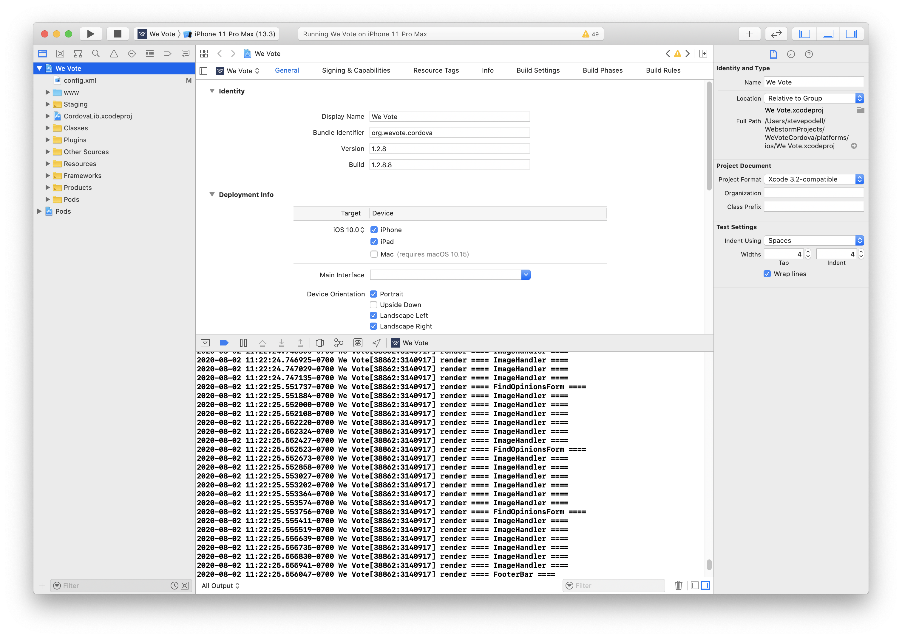
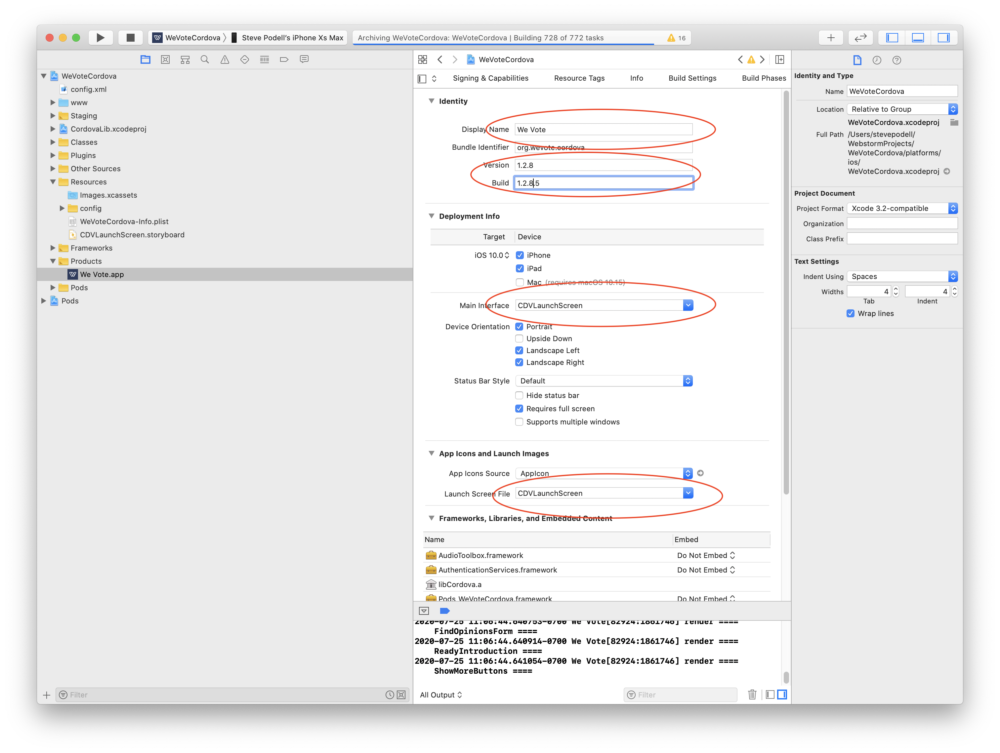
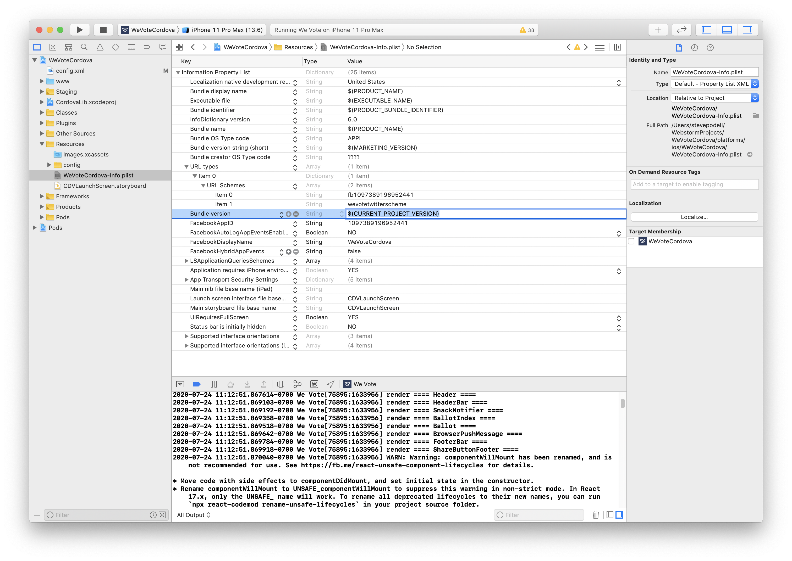

# The WeVoteCordova app for iOS and Android

Apache Cordova allows one to take their pre-existing JavaScript WebApp, bundle it with some additional Cordova JavaScript
and native code, and build an app for iOS or Android that can be released as an app in the App Store or Play Store.  
Cordova works perfectly well with React apps.

For a very simple app, you literally just drop it into Cordova and go, for more complex apps (like ours) there are some
changes to be made.  See [Cordova JavaScript Differences](docs/CordovaJavaScriptDifferences.md).

We use a very thin Apache Cordova wrapper to encapsulate the We Vote React WebApp.  The WeVoteCordova side is so thin, that
all it contains is Apache Cordova, some Documentation, and the iOS and Android config (and possibly a small amount of 
native code).  All of the JavaScript and React code, and the libraries that they rely on, remains in the WeVote WebApp.

This Cordova App has two build targets, iOS and Android, and they each
wrap an identical `bundle.js` that is compiled by the We Vote WebApp project.

## You need a Mac to develop for iOS

That's Apple's decision, not ours.  So the iOS portions of these instructions assume you have a Mac, so if you use Linux or Windows, you will
only be able to develop for Android -- we currently don't have install instructions specifically for Linux or Windows, but we hope that
the Android install for Mac will be very similar to what you need.

## You need to have the code for the We Vote WebApp setup on your machine

This section refers to the WebApp, not to WeVoteCordova.  These are prerequisite instructions for the WebApp.

To build the bundle.js and associated files in the WebApp that are needed for Cordova, delete the WebApp/build directory, and execute the following
two commands:

    npm run prod-singleBundle
    npm run start-https-singleBundle

If you haven't done this yet, don't waste your time, go setup the WebApp with current code,
and get it to start up at least once, and then return here when you are done.

If you can't find a file called `WebApp/build/bundle.js` on your machine, don't proceed
until you can find it.

Note July 2020:  If you are using the latest node `v14.5.0` you will need later versions of
node-sass,

    "node-sass": "^4.14.1",

but if you check in that version, you will break the production build.  So you will have to
manually change the package.json, and remember to not check in that change.

### If `npm-install` fails with errors, or succeeds with some c++ errors...

    stevepodell@Steves-MacBook-Pro-32GB-Oct-2109 WebApp % date
    Tue Jul 21 10:49:45 PDT 2020
    stevepodell@Steves-MacBook-Pro-32GB-Oct-2109 WebApp % node -v
    v14.5.0
    stevepodell@Steves-MacBook-Pro-32GB-Oct-2109 WebApp %

If you are above Node 13, you may need to do the following.  (This is not a script, simply
a list of steps that was needed for this configuration.)

You may need to `npm rebuild node-sass`

You may also need to `npm rebuild node-gyp`

I had two different versions of node-gyp installed (v3.x and v6.x), I uninstalled them both and allowed the `npm install`
script to add back in version I needed

    rm package-lock.json
        ... In package.json find  "node-sass": "4.13.1", change it to "node-sass": "4.14.1"
    npm node-gyp -v
    node-gyp -v
    npm uninstall node-gyp
    npm install node-gyp
    sudo npm uninstall -g node-gyp
    npm rebuild node-sass
    npm install
    npm run prod-singleBundle
    npm run start-https-singleBundle


## Directories

These instructions change so often, that we are going to use the actual directories on one specific computer, you will have 
to change all file paths in these instructions to match your computer.  These are the example paths to the
WebApp and to the WeVoteCordova.
```
    /Users/stevepodell/WebstormProjects/WebApp
    /Users/stevepodell/WebstormProjects/WeVoteCordova
```

## Install our Code and the Cordova Libraries

1. Change to your base "MyProjects" directory which on the example computer is at `/Users/stevepodell/WebstormProject`

   ```
   cd  /Users/stevepodell/WebstormProjects/WeVoteCordova
   ```

1.  Clone the WeVoteCordova code

    ```
    git clone https://github.com/wevote/WeVoteCordova.git
    ```

1. Rename the directory you just created which contains the latest WeVoteCordova software
    ```
    stevepodell@Steves-MacBook-Pro-32GB-Oct-2109 WebstormProjects % mv WeVoteCordova WeVoteCordovaSaveoff
    stevepodell@Steves-MacBook-Pro-32GB-Oct-2109 WebstormProjects %
    ```

1.  Install the Apache Cordova software, this is a command line interface (CLI) that is installed globally on your PC or Mac.

    First do an uninstall, since since any earlier install of the Cordova CLI prior to Version 9, will no longer work.  If you have never installed
    cordova, the uninstall will not do anything (and that is not a problem!).

    ```
    sudo npm uninstall -g cordova
    sudo npm install -g cordova
    ```
    On the example machine that looks like...
    ```
    stevepodell@Steves-MacBook-Pro WeVoteCordova % sudo npm install -g cordova
    Password:
    npm WARN deprecated request@2.88.2: request has been deprecated, see https://github.com/request/request/issues/3142
    /usr/local/bin/cordova -> /usr/local/lib/node_modules/cordova/bin/cordova
    + cordova@9.0.0
    added 432 packages from 355 contributors in 14.165s
    
    
       ╭────────────────────────────────────────────────────────────────╮
       │                                                                │
       │      New patch version of npm available! 6.14.4 → 6.14.5       │
       │   Changelog: https://github.com/npm/cli/releases/tag/v6.14.5   │
       │               Run npm install -g npm to update!                │
       │                                                                │
       ╰────────────────────────────────────────────────────────────────╯
    
    stevepodell@Steves-MacBook-Pro WeVoteCordova % 
    ```    

    You can most likely ignore any warning that installing Cordova might have generated.

    Do not proceed until you are at Cordova V9, or higher.  
    ```    
    Steves-MacBook-Pro-32GB-Oct-2018:WeVoteCordova stevepodell$ cordova -v
    9.0.0 (cordova-lib@9.0.1)
    Steves-MacBook-Pro-32GB-Oct-2018:WeVoteCordova stevepodell$ 
    ```
    
    (The example machine had a symlink in `/usr/local/bin/` that did not point to where the Cordova 9 was installed earlier in this step, and that 
    symlink had to be manually fixed.)

    a. `cordova` is not added automatically to your path. You might need to run from the symlink you saved above (ex/ `/usr/local/Cellar/node/12.5.0/bin/cordova`)
     
    b. You might be asked: `? May Cordova anonymously report usage statistics to improve the tool over time? (Y/n)` -- that is your choice, either choice is fine.

    ```
1. Create a new "empty" instance of the WeVoteCordova (with some minimal scaffolding)

    This will create a "Hello World" Cordova app, named WeVoteCordova -- the scaffolding, which we will throw away, is
    is in two files `/www/index.html` and `/www/us/index.js`
    ```
    stevepodell@Steves-MacBook-Pro-32GB-Oct-2109 WebstormProjects % cordova create  WeVoteCordova us.wevote.wevotecordova WeVoteCordova
    Creating a new cordova project.
    stevepodell@Steves-MacBook-Pro-32GB-Oct-2109 WebstormProjects %
   ```

1. cd to the newly created WeVoteCordova directory
    ```
    stevepodell@Steves-MacBook-Pro-32GB-Oct-2109 WebstormProjects % cd WeVoteCordova
    stevepodell@Steves-MacBook-Pro-32GB-Oct-2109 WeVoteCordova %
    ```

1. Overwrite `WeVoteCordova/www/index.html` with `WeVoteCordovaSaveoff/www/index.html`
    
    This introduces the source controlled index.html, that loads a Cordova specific loading screen
    while loading the WebApp code within Cordova.  

1. Overwrite `WeVoteCordova/config.xml` with `WeVoteCordovaSaveoff/config.xml`
    
    This introduces the source controlled config.xml file, that contains the list of Cordova Plugins
    that add various features and capabilities.
    
1. Add the Cordova iOS and Android platforms directories
    ```
    stevepodell@Steves-MacBook-Pro-32GB-Oct-2109 WeVoteCordova % cordova platform add ios android
    Using cordova-fetch for cordova-ios@^5.0.0
    (node:16212) Warning: Accessing non-existent property 'ios' of module exports inside circular dependency
    (Use `node --trace-warnings ...` to show where the warning was created)
    (node:16212) Warning: Accessing non-existent property 'android' of module exports inside circular dependency
    Adding ios project...
    Creating Cordova project for the iOS platform:
            Path: platforms/ios
            Package: us.wevote.wevotecordova
            Name: WeVoteCordova
    iOS project created with cordova-ios@5.1.1
    Installing "cordova-plugin-customurlscheme" for ios
    Installing "cordova-plugin-device" for ios
    Installing "cordova-plugin-facebook4" for ios
    Running command: pod install --verbose
    /usr/local/lib/ruby/gems/2.7.0/gems/cocoapods-core-1.8.4/lib/cocoapods-core/cdn_source.rb:326: warning: URI.escape is obsolete
    /usr/local/lib/ruby/gems/2.7.0/gems/cocoapods-core-1.8.4/lib/cocoapods-core/cdn_source.rb:326: warning: URI.escape is obsolete
    /usr/local/lib/ruby/gems/2.7.0/gems/cocoapods-core-1.8.4/lib/cocoapods-core/cdn_source.rb:326: warning: URI.escape is obsolete
    /usr/local/lib/ruby/gems/2.7.0/gems/cocoapods-core-1.8.4/lib/cocoapods-core/cdn_source.rb:326: warning: URI.escape is obsolete
    /usr/local/lib/ruby/gems/2.7.0/gems/cocoapods-core-1.8.4/lib/cocoapods-core/cdn_source.rb:326: warning: URI.escape is obsolete
    /usr/local/lib/ruby/gems/2.7.0/gems/cocoapods-core-1.8.4/lib/cocoapods-core/cdn_source.rb:326: warning: URI.escape is obsolete
    /usr/local/lib/ruby/gems/2.7.0/gems/cocoapods-core-1.8.4/lib/cocoapods-core/cdn_source.rb:326: warning: URI.escape is obsolete
    /usr/local/lib/ruby/gems/2.7.0/gems/cocoapods-core-1.8.4/lib/cocoapods-core/cdn_source.rb:326: warning: URI.escape is obsolete
    /usr/local/lib/ruby/gems/2.7.0/gems/cocoapods-core-1.8.4/lib/cocoapods-core/cdn_source.rb:326: warning: URI.escape is obsolete
    /usr/local/lib/ruby/gems/2.7.0/gems/cocoapods-core-1.8.4/lib/cocoapods-core/cdn_source.rb:326: warning: URI.escape is obsolete
    /usr/local/lib/ruby/gems/2.7.0/gems/cocoapods-core-1.8.4/lib/cocoapods-core/cdn_source.rb:326: warning: URI.escape is obsolete
    /usr/local/lib/ruby/gems/2.7.0/gems/cocoapods-core-1.8.4/lib/cocoapods-core/cdn_source.rb:326: warning: URI.escape is obsolete
    /usr/local/lib/ruby/gems/2.7.0/gems/cocoapods-core-1.8.4/lib/cocoapods-core/cdn_source.rb:326: warning: URI.escape is obsolete
    /usr/local/lib/ruby/gems/2.7.0/gems/cocoapods-core-1.8.4/lib/cocoapods-core/cdn_source.rb:326: warning: URI.escape is obsolete
    /usr/local/lib/ruby/gems/2.7.0/gems/cocoapods-core-1.8.4/lib/cocoapods-core/cdn_source.rb:326: warning: URI.escape is obsolete
    /usr/local/lib/ruby/gems/2.7.0/gems/cocoapods-1.8.4/lib/cocoapods/downloader/cache.rb:114: warning: Using the last argument as keyword parameters is deprecated; maybe ** should be added to the call
    /usr/local/lib/ruby/gems/2.7.0/gems/cocoapods-1.8.4/lib/cocoapods/downloader/request.rb:61: warning: The called method `slug' is defined here
    /usr/local/lib/ruby/gems/2.7.0/gems/cocoapods-1.8.4/lib/cocoapods/downloader/cache.rb:100: warning: Using the last argument as keyword parameters is deprecated; maybe ** should be added to the call
    /usr/local/lib/ruby/gems/2.7.0/gems/cocoapods-1.8.4/lib/cocoapods/downloader/request.rb:61: warning: The called method `slug' is defined here
    /usr/local/lib/ruby/gems/2.7.0/gems/nanaimo-0.2.6/lib/nanaimo/writer/pbxproj.rb:13: warning: Using the last argument as keyword parameters is deprecated; maybe ** should be added to the call
    /usr/local/lib/ruby/gems/2.7.0/gems/nanaimo-0.2.6/lib/nanaimo/writer.rb:35: warning: The called method `initialize' is defined here
    /usr/local/lib/ruby/gems/2.7.0/gems/cocoapods-core-1.8.4/lib/cocoapods-core/cdn_source.rb:326: warning: URI.escape is obsolete
    [!] The `WeVoteCordova [Debug]` target overrides the `LD_RUNPATH_SEARCH_PATHS` build setting defined in `Pods/Target Support Files/Pods-WeVoteCordova/Pods-WeVoteCordova.debug.xcconfig'. This can lead to problems with the CocoaPods installation
    [!] The `WeVoteCordova [Release]` target overrides the `LD_RUNPATH_SEARCH_PATHS` build setting defined in `Pods/Target Support Files/Pods-WeVoteCordova/Pods-WeVoteCordova.release.xcconfig'. This can lead to problems with the CocoaPods installation
    Installing "cordova-plugin-inappbrowser" for ios
    Installing "cordova-plugin-keyboard" for ios
    Installing "cordova-plugin-safariviewcontroller" for ios
    Installing "cordova-plugin-screensize" for ios
    Installing "cordova-plugin-sign-in-with-apple" for ios
    Installing "cordova-plugin-splashscreen" for ios
    Installing "cordova-plugin-statusbar" for ios
    Installing "cordova-plugin-taptic-engine" for ios
    Installing "cordova-plugin-whitelist" for ios
    Using cordova-fetch for cordova-android@^8.0.0
    Adding android project...
    Creating Cordova project for the Android platform:
            Path: platforms/android
            Package: us.wevote.wevotecordova
            Name: WeVoteCordova
            Activity: MainActivity
            Android target: android-28
    Subproject Path: CordovaLib
    Subproject Path: app
    Android project created with cordova-android@8.1.0
    Installing "cordova-plugin-customurlscheme" for android
    Installing "cordova-plugin-device" for android
    Installing "cordova-plugin-facebook4" for android
    Subproject Path: CordovaLib
    Subproject Path: app
    Installing "cordova-plugin-keyboard" for android
    Installing "cordova-plugin-safariviewcontroller" for android
    Subproject Path: CordovaLib
    Subproject Path: app
    Installing "cordova-plugin-screensize" for android
    Installing "cordova-plugin-splashscreen" for android
    Installing "cordova-plugin-statusbar" for android
    Installing "cordova-plugin-taptic-engine" for android
    Installing "cordova-plugin-whitelist" for android
    stevepodell@Steves-MacBook-Pro-32GB-Oct-2109 WeVoteCordova %

    ```
1. Copy source controlled files from the `WeVoteCordovaSaveoff` dir you made earlier to the `WeVoteCordova` dir

    You can do this with your IDE, or in Finder

    First copy two directories:
    ```
    /docs
    /res
    ```
    Then copy some files in the root directory
    ```
    .gitignore
    .npmignore
    buildSymLinks.js
    README.MD
    ```
    At this point we are done with the `WeVoteCordovaSaveoff` dir, and will only be working on the `WeVoteCordova` dir

1. Set up the sym links for iOS and Android
    ```
    node buildSymLinks /Users/stevepodell/WebstormProjects/WebApp/build
    ```
    These symlinks allow us to compile the WebApp and have all the necessary components available for the Cordova builds
    ```
    stevepodell@Steves-MacBook-Pro-32GB-Oct-2109 WeVoteCordova % pwd
    /Users/stevepodell/WebstormProjects/WeVoteCordova
    stevepodell@Steves-MacBook-Pro-32GB-Oct-2109 WeVoteCordova % node buildSymLinks /Users/stevepodell/WebstormProjects/WebApp/build
    __dirname /Users/stevepodell/WebstormProjects/WeVoteCordova
    unlink: android index.html
    unlink: ios index.html
    rmdir: /Users/stevepodell/WebstormProjects/WeVoteCordova/platforms/android/app/src/main/assets/www/css
    rmdir: /Users/stevepodell/WebstormProjects/WeVoteCordova/platforms/android/app/src/main/assets/www/img
    rmdir: /Users/stevepodell/WebstormProjects/WeVoteCordova/platforms/ios/www/img
    rmdir: /Users/stevepodell/WebstormProjects/WeVoteCordova/platforms/ios/www/css
    ln android css successful
    ln ios bundle.js successful
    ln android bundle.js successful
    ln ios css successful
    ln ios img successful
    ln android img successful
    ln ios index.html successful
    ln android index.html successful
    stevepodell@Steves-MacBook-Pro-32GB-Oct-2109 WeVoteCordova %
    ```

1. Install the node packages (this really just confirms that they are installed)
    ```
    stevepodell@Steves-MacBook-Pro-32GB-Oct-2109 WeVoteCordova % npm install
    npm WARN us.wevote.wevotecordova@1.0.2 No repository field.

    audited 82 packages in 0.51s

    1 package is looking for funding
      run `npm fund` for details

    found 0 vulnerabilities

    stevepodell@Steves-MacBook-Pro-32GB-Oct-2109 WeVoteCordova %
    ```

1. Check that cordova requirements have been met (No errors means success)
    ```
    stevepodell@Steves-MacBook-Pro-32GB-Oct-2109 www % cordova requirements

    Requirements check results for android:
    Java JDK: installed 1.8.0
    Android SDK: installed true
    Android target: installed android-Q,android-28,android-27,android-26,android-25,android-24,android-23
    Gradle: installed /usr/local/Cellar/gradle/6.3/bin/gradle

    Requirements check results for ios:
    Apple macOS: installed darwin
    Xcode: installed 11.5
    ios-deploy: installed 1.10.0
    CocoaPods: installed 1.8.4
    stevepodell@Steves-MacBook-Pro-32GB-Oct-2109 www %
    ```
1.  Run the WeVoteCordova app from XCode.

    In Xcode, Click File/Open and select `/Users/stevepodell/WebstormProjects/WeVoteCordova/platforms/ios/` and press the Play (Triagular) button, and
    a minute or two later you should get a rough version of the Cordova app running in a simulator.  The startup
    screens and icons will not be correct, but the WebApp running within Cordova should look good.
    

1. We hope this is not necessary.  Optional:  If the Cordova iOS app loads the html page (White "Loading We Vote" on blue, but crashes in JQuery regex), logs `SyntaxError: Invalid regular expression: range out of order in character class`
 and never advances to the first js page in the WebApp:

    In the WebApp, delete
    ```
    /build
    /node_modules
    /package-lock.json
    ```
   Then (Still in the WebApp!)

    ```
    npm install
    npm rebuild node-gyp
    npm rebuild node-sass
    npm install
    npm run prod-singleBundle
    npm run start-https-singleBundle
    ```
   
1. From now on, we will be working exclusively in the WeVoteCordova directory. Copy the icons from `res/` to the `LaunchStoryboard` `Images.xcassets` in Xcode

    If you have two monitors, they will be very handy for this step.  Open Xcode in one monitor, and your IDE in
    the other.  If you use PyCharm or WebStorm these pictures will show you exactly what to do.

    In Xcode, click on the file folder icon in the upper right corner
    
    Then navigate to WeVoteCordova/Resources/images.xcassets and within the edit window select AppIcon.  All of the application icons
    that are displayed are the default cordova icons from the scaffolding.  Replace then all from WeVoteCordova/res/icon/ios
    
    Replace then all from WeVoteCordova/res/icon/ios in your IDE (or finder!)
    
    The very first icon in XCode is the '2x' 'iPhone Notification for iOS 7-13' '20pt', so drag
    `icon_20pt@2x.png` from your IDE and drop it on the image in Xcode.
    
    Repeat this for all of the icons on the AppIcon editor page up to 'App Store IOS 1024pt'.  There is no need to
    do anything for the 'Apple Watch' icons.  If you drop the wrong size in a configuration, the XCode IDE will tell
    you and you can try again.

1. Setup the LaunchStoryboard
    As of iOS 13, we can no longer have the hand crafted launch images "View your ballot for the next election..." Apple now
    recommends simply a icon, or a mockup of the first screen (which would not work well for our app).
    Change your IDE to show the pngs in `WeVoteCordova/res/screen/ios` and in XCode selecct LaunchStoryBoard in the edit
    window.  For each LaunchStoryBoard image configuration, drop the `WeVoteCordova/res/screen/ios/June2020LaunchScreen.png` onto each.
    Yes, drop the same image 40 times into the different configurations.  We can do something
    fancier later, but this works well enough for now.
    

1. Configure the Cordova CDVLaunchScreen to use the LaunchStoryboard

    In Xcode, click on the WeVoteCordova path in the left pane, which displays the 'General' editor.
    
    Under 'Deployment Info', 'Main Interface', select `CDVLaunchScreen.storyboard`
    
    Under 'App Icons and LaunchImages' click on the pulldown for 'Launch File Screen' and select the only option that is available:
    `CDVLaunchScreen`.
    
    

1. Define the `wevotetwitterscheme` in XCode

    The `wevotetwitterscheme` allows Safari to respond to our `wevotetwitterscheme://` custom scheme on the OAuth response
    when logging into Twitter.  This has to be manually configured in Xcode.  The scripted installation of the Cordova plugin 
    for Facebook has already defined one custom scheme by this point, but we need to manually configure the scheme that is needed
    for Twitter.
    
    In Xcode, select under Resources, the WeVoteCordova-info.plist, then under 'URL Types'/'Item 0'/'URL Schemes' you 
    press the + button on 'Item 0' (the facebook oauth scheme) which opens an
    entry field for 'Item 1' where you enter `wevotetwitterscheme` and press Enter or click somewhere else to save,

    
    
    You can test the custom scheme if you want to, by opening Safari in the simulator and typing in
    `wevotetwitterscheme://` in a URL and it should open the WeVoteCordova app.

    No need to save in the Xcode IDE.  Next time the app starts, all these images should be in place.
   
## Git setup
1. Execute the following commands from your WeVoteCordova directory
    ```
    git init
    git checkout -b develop
    git commit --allow-empty -m "initial commit"
    git remote add upstream https://github.com/wevote/WeVoteCordova.git
    git remote add origin https://github.com/SailingSteve/WeVoteCordova.git
    git remote -v
    git fetch
    ```
    What it looks like in the terminal:

    ```
    stevepodell@Steves-MacBook-Pro-32GB-Oct-2109 WeVoteCordova % git init
    Initialized empty Git repository in /Users/stevepodell/WebstormProjects/WeVoteCordova/.git/
    stevepodell@Steves-MacBook-Pro-32GB-Oct-2109 WeVoteCordova % git checkout -b develop
    Switched to a new branch 'develop'
    stevepodell@Steves-MacBook-Pro-32GB-Oct-2109 WeVoteCordova % git commit --allow-empty -m "initial commit"
    [develop (root-commit) 2b7aa39] initial commit
    stevepodell@Steves-MacBook-Pro-32GB-Oct-2109 WeVoteCordova %
    stevepodell@Steves-MacBook-Pro-32GB-Oct-2109 WeVoteCordova % git remote add upstream https://github.com/wevote/WeVoteCordova.git
    stevepodell@Steves-MacBook-Pro-32GB-Oct-2109 WeVoteCordova % git remote add origin https://github.com/SailingSteve/WeVoteCordova.git
    stevepodell@Steves-MacBook-Pro-32GB-Oct-2109 WeVoteCordova % git remote -v
    origin  https://github.com/SailingSteve/WeVoteCordova.git (fetch)
    origin  https://github.com/SailingSteve/WeVoteCordova.git (push)
    upstream        https://github.com/wevote/WeVoteCordova.git (fetch)
    upstream        https://github.com/wevote/WeVoteCordova.git (push)
    stevepodell@Steves-MacBook-Pro-32GB-Oct-2109 WeVoteCordova % git fetch
    remote: Enumerating objects: 13, done.
    remote: Counting objects: 100% (13/13), done.
    remote: Compressing objects: 100% (13/13), done.
    remote: Total 3539 (delta 4), reused 2 (delta 0), pack-reused 3526
    Receiving objects: 100% (3539/3539), 80.16 MiB | 5.14 MiB/s, done.
    Resolving deltas: 100% (1557/1557), done.
    From https://github.com/SailingSteve/WeVoteCordova
     * [new branch]      develop                                  -> origin/develop
     * [new branch]      master                                   -> origin/master
     * [new branch]      steveCordovaJuly15-10am                  -> origin/steveCordovaJuly15-10am
     * [new branch]      steveCordovaJune28                       -> origin/steveCordovaJune28
     * [new branch]      steveCordovaJune28-3                     -> origin/steveCordovaJune28-3
     * [new branch]      steveCordovaRemovePlatformsPluginsJuly14 -> origin/steveCordovaRemovePlatformsPluginsJuly14
     * [new branch]      steveCordovaUpdateFromScratchJune23      -> origin/steveCordovaUpdateFromScratchJune23
     * [new branch]      steveCorovaJune29-10                     -> origin/steveCorovaJune29-10
    stevepodell@Steves-MacBook-Pro-32GB-Oct-2109 WeVoteCordova %
    ```
    You will a have different branch list than in this example.

1. Add the bits you manually copied in to git, so that they will match develop (plus any changes you might have made)

    ```
    /docs
    /res
    /www/index.html
    .gitignore
    .npmignore
    buildSymLinks.js
    package.json
    package-lock.json
    README.MD
    ```

1. Now make a new branch (I used my IDE to do this), and called it steveCordovaJuly16-2pm
Your develop branch might not be exactly matching upstream/develop but it should be very close -- close
enougth not to worry about any differences.  Once you stash your changes, change branch to develop, `pull upstream develop`
you should be working with the correct base, and you can go back to your working branch ... `steveCordovaJuly16-2pm` in
my case, and make your pull request.

That's it!  Installed from scratch in about an hour.

   
   
1. On github.com, fork WeVoteCordova to your account. Navigate to https://github.com/wevote/WeVoteCordova and then click the "Fork" button in the upper right corner.
    
1. You may need to setup your Github remotes

    ```
    Example:
    Steves-iMac: MyProjects your-username$ cd /Users/your-username/MyProjects/WeVoteCordova
    Steves-iMac: WeVoteCordova your-username$ git remote -v
    origin  https://github.com/SailingSteve/WeVoteCordova.git (fetch)
    origin  https://github.com/SailingSteve/WeVoteCordova.git (push)
    upstream        https://github.com/wevote/WeVoteCordova.git (fetch)
    upstream        https://github.com/wevote/WeVoteCordova.git (push)
    Steves-iMac: WeVoteCordova your-username$ 
    ```
    If you don't have remotes defined... (remember to substitute your github user name for "SailingSteve")
    (The default setup might have the git origin pointing to https://github.com/wevote/WeVoteCordova.git,
    which you will have to remove, since at We Vote we have the origin/upstream reversed from most other 
    projects on github.)
    ```
    git remote rm origin
    git remote add upstream https://github.com/wevote/WeVoteCordova.git
    git remote add origin https://github.com/SailingSteve/WeVoteCordova.git
    git remote -v
    ```

1. Run npm install (it doesn't hurt to do this multiple times!)
    ```
    npm install

   on the example machine...
   
   Steves-MacBook-Pro-32GB-Oct-2018:WeVoteCordova stevepodell$ npm install
   npm WARN org.wevote.cordova@1.0.0 No repository field.
    
   added 144 packages from 98 contributors and audited 357 packages in 3.698s
   found 2 vulnerabilities (1 low, 1 moderate)
     run `npm audit fix` to fix them, or `npm audit` for details
   Steves-MacBook-Pro-32GB-Oct-2018:WeVoteCordova stevepodell$ 
   ```
   At this point, don't worry about any reported vulnerabilites, and don't try to fix 
   them at this moment.


1.  Make sure you are in the WeVoteCordova directory and run the buildSymLinks.js script.  This allows the 
Cordova build/run process to use the code from the WebApp.

    ```
    stevepodell@Steves-MacBook-Pro-32GB-Oct-2109 WeVoteCordova % pwd
    /Users/stevepodell/WebstormProjects/WeVoteCordova
    stevepodell@Steves-MacBook-Pro-32GB-Oct-2109 WeVoteCordova % node buildSymLinks /Users/stevepodell/WebstormProjects/WebApp/build
    __dirname /Users/stevepodell/WebstormProjects/WeVoteCordova
    unlink: android index.html
    unlink: ios index.html
    unlink: android bundle.js
    unlink: ios bundle.js
    rmdir: /Users/stevepodell/WebstormProjects/WeVoteCordova/platforms/ios/www/img
    rmdir: /Users/stevepodell/WebstormProjects/WeVoteCordova/platforms/android/app/src/main/assets/www/css
    rmdir: /Users/stevepodell/WebstormProjects/WeVoteCordova/platforms/ios/www/css
    rmdir: /Users/stevepodell/WebstormProjects/WeVoteCordova/platforms/android/app/src/main/assets/www/img
    ln ios bundle.js successful
    ln android bundle.js successful
    ln android css successful
    ln ios css successful
    ln android img successful
    ln ios img successful
    ln ios index.html successful
    ln android index.html successful
    stevepodell@Steves-MacBook-Pro-32GB-Oct-2109 WeVoteCordova % 
    ```


# Platform specific iOS setup (Skip this section if your computer is running Windows or Linux)

Throughout these instructions, remember to substitute your actual user name for "your-username"!

1.  Confirm that the symlinks are in place for iOS

    iOS serves the bundle.js, the index.html, and other files from `WeVoteCordova/platforms/ios/www`
    buildSymLinks script should have setup the ios www directory will have changed as follows...

    ```
    stevepodell@Steves-MacBook-Pro-32GB-Oct-2109 WeVoteCordova % ls -la platforms/ios/www 
    total 152
    drwxr-xr-x  11 stevepodell  staff    352 Jun 25 15:04 .
    drwxr-xr-x  19 stevepodell  staff    608 Jun 24 13:59 ..
    lrwxr-xr-x   1 stevepodell  staff     58 Jun 25 14:52 bundle.js -> /Users/stevepodell/WebstormProjects/WebApp/build/bundle.js
    drwxr-xr-x   6 stevepodell  staff    192 Jun 24 09:24 cordova-js-src
    -rw-r--r--   1 stevepodell  staff  69846 Jun 24 09:24 cordova.js
    -rw-r--r--   1 stevepodell  staff   3110 Jun 25 13:51 cordova_plugins.js
    lrwxr-xr-x   1 stevepodell  staff     52 Jun 25 14:52 css -> /Users/stevepodell/WebstormProjects/WebApp/build/css
    lrwxr-xr-x   1 stevepodell  staff     52 Jun 25 14:52 img -> /Users/stevepodell/WebstormProjects/WebApp/build/img
    lrwxr-xr-x   1 stevepodell  staff     64 Jun 25 14:52 index.html -> /Users/stevepodell/WebstormProjects/WeVoteCordova/www/index.html
    drwxr-xr-x   3 stevepodell  staff     96 Jun 24 09:24 js
    drwxr-xr-x  12 stevepodell  staff    384 Jun 24 09:36 plugins
stevepodell@Steves-MacBook-Pro-32GB-Oct-2109 WeVoteCordova % 
    ```
        
1.  You should test each one of those links, to make sure that they really point to where it needs to. It is much easier 
to test first, rather than making a setup mistake and having to diagnose the problem later on.  Use `stat -L` to confirm 
that the link points to a sizeable file (17856048 bytes in the case of bundle.js), if stat reports a file size of less than 
100 bytes, then the link is probably incorrect.  Use `ls` to make sure that the links for directories, contain a few files.

    ```
    Steves-MacBook-Pro-32GB-Oct-2018:www stevepodell$ pwd
    /Users/stevepodell/WebStormProjects/WeVoteCordova/platforms/ios/www
    Steves-MacBook-Pro-32GB-Oct-2018:www stevepodell$ stat -L bundle.js
    16777220 134276137 -rw-r--r-- 1 stevepodell staff 0 26625098 "Nov 11 14:12:26 2019" "Nov 10 16:50:44 2019" "Nov 11 14:11:21 2019" "Nov 10 16:50:43 2019" 4096 52008 0 bundle.js
    Steves-MacBook-Pro-32GB-Oct-2018:www stevepodell$ ls css
    bootstrap-social.css    loading-screen.css      main.css
    bootstrap-social.css    loading-screen.css      main.css
    Steves-MacBook-Pro-32GB-Oct-2018:www stevepodell$ ls img
    Dale_McGrew-200x200.jpg                         global                                          mixed-rating-icon.svg                           thumbs-down-icon.svg                            we-vote-logo-horizontal-color-200x66.svg
    WelcomeForVoters-Ballot-20190507.png            glyphicons-halflings-88-remove-circle.svg       no-position-icon.svg                            thumbs-up-color-icon.svg                        we-vote-logo-horizontal-color-dark-141x46.svg
    avatar-generic.svg                              google-logo.svg                                 organization-icon.svg                           thumbs-up-icon.svg                              welcome
    check-mark-v2-40x43.svg                         group-icon.svg                                  positions-icon-24-x-24.svg                      tools                                           x-close.png
    down-arrow-color-icon.svg                       how-it-works                                    public-icon.svg                                 up-arrow-color-icon.svg
    endorsement-extension                           issue-generic.svg                               share-icon.svg                                  vip-logo-1000x208.png
    ffwd-logo.png                                   issue-photo-generic.svg                         thumbs-down-color-icon.svg                      vote_dot_org_logo-530x200.png
    Steves-MacBook-Pro-32GB-Oct-2018:www stevepodell$ 
    ```

**You are now done with the iOS specific setup.**


# Platform specific Android setup (Everyone should install the Android software)

1. Confim that buildSymLinks setup the iOS www directory properly
   ```
   stevepodell@Steves-MacBook-Pro-32GB-Oct-2109 WeVoteCordova % ls -la platforms/android/app/src/main/assets/www
   total 136
   drwxr-xr-x  11 stevepodell  staff    352 Jun 25 14:52 .
   drwxr-xr-x   3 stevepodell  staff     96 Jun 25 14:01 ..
   lrwxr-xr-x   1 stevepodell  staff     58 Jun 25 14:52 bundle.js -> /Users/stevepodell/WebstormProjects/WebApp/build/bundle.js
   drwxr-xr-x   6 stevepodell  staff    192 Jun 25 14:01 cordova-js-src
   -rw-r--r--   1 stevepodell  staff  65029 Jun 25 14:01 cordova.js
   -rw-r--r--   1 stevepodell  staff   3110 Jun 25 14:01 cordova_plugins.js
   lrwxr-xr-x   1 stevepodell  staff     52 Jun 25 14:52 css -> /Users/stevepodell/WebstormProjects/WebApp/build/css
   lrwxr-xr-x   1 stevepodell  staff     52 Jun 25 14:52 img -> /Users/stevepodell/WebstormProjects/WebApp/build/img
   lrwxr-xr-x   1 stevepodell  staff     64 Jun 25 14:52 index.html -> /Users/stevepodell/WebstormProjects/WeVoteCordova/www/index.html
   drwxr-xr-x   3 stevepodell  staff     96 Jun 25 14:01 js
   drwxr-xr-x  12 stevepodell  staff    384 Jun 25 14:01 plugins
   stevepodell@Steves-MacBook-Pro-32GB-Oct-2109 WeVoteCordova % 
   ```
        
1.  You should test each one of those links, to make sure that they really point to where it needs to. It is much easier 
to test first, rather than making a setup mistake and having to diagnose the problem later on.  Use `stat -L` to confirm 
that the link points to a sizeable file (17856048 bytes in the case of bundle.js), if stat reports a file size of less than 
100 bytes, then the link is probably incorrect.  Use `ls` to make sure that the links for directories, contain a few files.

    ```
    Steves-MacBook-Pro-32GB-Oct-2018:www stevepodell$ pwd
    /Users/stevepodell/WebstormProjects/WeVoteCordova/platforms/android/app/src/main/assets/www
    Steves-MacBook-Pro-32GB-Oct-2018:www stevepodell$ stat -L bundle.js 
    16777220 134276137 -rw-r--r-- 1 stevepodell staff 0 26625098 "Nov 11 14:33:16 2019" "Nov 10 16:50:44 2019" "Nov 11 14:11:21 2019" "Nov 10 16:50:43 2019" 4096 52008 0 bundle.js
    Steves-MacBook-Pro-32GB-Oct-2018:www stevepodell$ ls css
    bootstrap-social.css    loading-screen.css      main.css
    Steves-MacBook-Pro-32GB-Oct-2018:www stevepodell$ ls img
    endorsement-extension   endorsement-icon48.png  global                  how-it-works            sierra.pdf              tools                   welcome
    Steves-MacBook-Pro-32GB-Oct-2018:www stevepodell$ head index.html
    <!DOCTYPE html>
    <!--
        index.html for WeVoteCordova
    
        NOTE NOTE NOTE
           Due to the symlinks, this file will appear in multiple places in WeVoteCordova
           The location of the source controlled version of this file is
           WeVoteCordova/www/index.html
    
    -->
    Steves-MacBook-Pro-32GB-Oct-2018:www stevepodell$ 
    ```

**You are now done with the Android specific setup.**


## Installing the IDEs:

It is possible to develop for Cordova without IDEs, but you are on your own if you take that path.
An important note about both IDEs, is that they are "needed" for running and debugging iOS and Android apps, but there
is no need to setup GIT in either of them, all the changes that you make within the IDEs affect files that are in the WeVoteCordova 
directory that you just made.  Checkin any changes from the WeVoteCordova directory with the same tools you use to develope
the webapp.  Most Cordova changes in this mature app, are version upgrades of included packages, and version changes for the
apps we deploy in the Apple iOS App Store and the Google Android Play Store.

Install Apple Xcode from the MacOS App Store, you will need a Mac for the iOS part of this project, and a Mac will also be
fine for Android development.

For Android, install the [Android Studio](https://developer.android.com/studio/index.html)
(a free  IDE, from JetBrains, the makers of PyCharm, WebStorm, IntelliJ, etc.)

## iOS specific IDE and Environment setup (Only follow these instructions if your computer is a Mac)
1.  Install Xcode

    The easiest way to install Xcode is via the
    <a href="https://itunes.apple.com/us/app/xcode/id497799835?mt=12" target="_blank">Mac App Store.</a>  The Xcode.app download is approximately 10gb in size.

1.  Install Node and Watchman

    We recommend installing node and watchman via Homebrew.
    ```
    brew install node
    brew install watchman
    ```
    
    On a machine where node may already have been installed, we want to have version 10 or heigher:
    ```
    Steves-MacBook-Pro-32GB-Oct-2018:WeVoteCordova stevepodell$ node -v
    v11.14.0
    Steves-MacBook-Pro-32GB-Oct-2018:WeVoteCordova stevepodell$ 
    Steves-MacBook-Pro-32GB-Oct-2018:WeVoteCordova stevepodell$ brew upgrade node
    Updating Homebrew...
    Steves-MacBook-Pro-32GB-Oct-2018:WeVoteCordova stevepodell$ node -v
    v12.12.0
    Steves-MacBook-Pro-32GB-Oct-2018:WeVoteCordova stevepodell$ 
    ```
<!--
As of June 2020, Cordova installs cocoapods for you
1.  Install CocoaPods (an MacOS dependency manager).
    ```
    Steves-iMac:WeVoteCordova your-username$ sudo gem install cocoapods
    ```
    **May 2020:** The default gem for cocoapods failed with a fatal repository not found, or 
    a “fatal: Unable to find remote helper for ‘https’” or a "fatal error: 'cstddef' file not found".  It was possible
    to work around this problem by (loading a specific version)[https://github.com/CocoaPods/CocoaPods/issues/9270]...
    ```
    cd platforms/ios
    stevepodell@Steves-MacBook-Pro ios % sudo gem install cocoapods -v1.8.4
    ```

1.   Update pod repository
    The following command retrieves the latest pod version metadata from git
    ```
    stevepodell@Steves-MacBook-Pro ios % pod repo update
    ```
-->
1.  Opening the project with Xcode -- Open xcworkspace, not xcodeproj directories (or else)

    Be sure to open **`/Users/your-username/MyProjects/WeVoteCordova/platforms/ios/WeVoteCordova.xcworkspace`** each time, if
    you forget to do this portions of the app will not be in your build, since you won't have referenced the cocopods (a dependency manger,
    that pulls in some iOS specific libraries.)

    Be sure **not to open** ~~`/Users/your-username/MyProjects/WeVoteCordova/platforms/ios/WeVoteCordova.xcodeproj`~~ with Xcode,
    and don't pick a choice from the history pane ("Don't click these!") in the Welcome to Xcode dialog.  The history unfortunately will contain
    references to `.xcodeproj` **and** `.xcworkspace` files, but the descriptions are too short to tell the difference.  (Hint:  When that Welcome dialog is displayed, **it is** possible to open the xcworkspace from the File/"Open Recent" menu,
    just be sure to open the xcworkspace.)

![ScreenShot]

And in the "Welcome to Xcode" dialog, again, don't pick anything from the history list (those are all xcodeproj files), you have to
click "Open another project..." and navigate to the 'WeVoteReactNative.xcworkspace' item (which is actually a directory).


**Clean Build:**

You probably will run into the need to "Clean Build Folder".  To do this in XCode, go to the Product menu, hold down the Option button
(on your Mac keyboard) and select "Clean Build Folder", after it completes (about 10 seconds), press the triangular
Run (Play) button do to a full rebuild


## Opening the project in Xcode

This is very similar to the way we do it with the WeVoteReactNative iOS development.  
  
Download Xcode from the MacOS App Store, and launch it:

Don't use the last opened list, instead click on "Open another project..." (We use an Apple specific packager
called CocoaPods, which forces us to ignore that handy last opened menu.)

After clicking the "Open another project..." button, select the `WeVoteCordova.xcworkspace` file and press Open.


Select a simulator type from the menu on top (I use iPhone 8p in this example), then press the triangular green play button,
and the app starts in the simulator.

### Updating the art for the Splashscreen (a rarely required step)

In order to handle the 12" iPad Pro I took the image supplied into Photoshop, resized it to 2732x2732, forced it to have no 
transparent pixels, and renamed it to the required(?) name `Default@2x~universal~anyany.png`.  Then (not being an Xcode expert), 
I dropped the image **within the Xcode program** into `WeVoteCordova/Resources//Images.xcassets/LaunchImage` into each 
location in the universal section.


This resulted in these files being created:

    ```
    (WebAppEnv)Steves-iMac:ios your-username$ ls -la ./WeVoteCordova/Images.xcassets/LaunchStoryboard.imageset/*
    -rw-r--r--  1 your-username  staff    3765 Mar 22 08:27 ./WeVoteCordova/Images.xcassets/LaunchStoryboard.imageset/Contents.json
    -rw-r--r--  1 your-username  staff  134330 Mar 22 08:27 ./WeVoteCordova/Images.xcassets/LaunchStoryboard.imageset/Default@2x~universal~anyany-1.png
    -rw-r--r--  1 your-username  staff  134330 Mar 22 08:27 ./WeVoteCordova/Images.xcassets/LaunchStoryboard.imageset/Default@2x~universal~anyany-10.png
    -rw-r--r--  1 your-username  staff  134330 Mar 22 08:27 ./WeVoteCordova/Images.xcassets/LaunchStoryboard.imageset/Default@2x~universal~anyany-11.png
    -rw-r--r--@ 1 your-username  staff  134330 Mar 22 08:27 ./WeVoteCordova/Images.xcassets/LaunchStoryboard.imageset/Default@2x~universal~anyany-2.png
    -rw-r--r--  1 your-username  staff  134330 Mar 22 08:27 ./WeVoteCordova/Images.xcassets/LaunchStoryboard.imageset/Default@2x~universal~anyany-3.png
    -rw-r--r--  1 your-username  staff  134330 Mar 22 08:27 ./WeVoteCordova/Images.xcassets/LaunchStoryboard.imageset/Default@2x~universal~anyany-4.png
    -rw-r--r--  1 your-username  staff  134330 Mar 22 08:27 ./WeVoteCordova/Images.xcassets/LaunchStoryboard.imageset/Default@2x~universal~anyany-5.png
    -rw-r--r--  1 your-username  staff  134330 Mar 22 08:27 ./WeVoteCordova/Images.xcassets/LaunchStoryboard.imageset/Default@2x~universal~anyany-6.png
    -rw-r--r--  1 your-username  staff  134330 Mar 22 08:27 ./WeVoteCordova/Images.xcassets/LaunchStoryboard.imageset/Default@2x~universal~anyany-7.png
    -rw-r--r--  1 your-username  staff  134330 Mar 22 08:27 ./WeVoteCordova/Images.xcassets/LaunchStoryboard.imageset/Default@2x~universal~anyany-8.png
    -rw-r--r--  1 your-username  staff  134330 Mar 22 08:27 ./WeVoteCordova/Images.xcassets/LaunchStoryboard.imageset/Default@2x~universal~anyany-9.png
    -rw-r--r--  1 your-username  staff  134330 Mar 22 08:26 ./WeVoteCordova/Images.xcassets/LaunchStoryboard.imageset/Default@2x~universal~anyany.png
    (WebAppEnv)Steves-iMac:ios your-username$
    ```

So to replace the splash screen, I would take `./WeVoteCordova/Images.xcassets/LaunchStoryboard.imageset/Default@2x~universal~anyany.png` and 
replace it with same sized art, and if you wanted to be safe I would use the Xcode IDE to copy them (and automatically rename them)
over the existing files, if you were feeling adventurous you could go directly to the files, and take the new image and 
use it to replace the original and the 12 numbered copies of the old image.

By the way Xcode stores way too much configuration info in a binary file, and messing with them can take days to fix, going directly to the filesystem to make changes is risky.


## Debugging Cordova Differences
Browsers are single threaded, JavaScript on browsers is also single threaded, but JavaScript running in Cordova is 
multi-threaded.  "JavaScript in the WebView does not run on the UI thread, it also has other threads to execute the 
html component and carry out CSS transitions."  This can cause some confusion when debugging Cordova for the first time.

## Debugging Cordova Apps with the Safari debugger


 

You don't have to actually use Safari for Mac for anything, but launching its remote debugger.  You can see it opened on its
smallest default page in the picture above, it just has to be running so you can get to that "Develop" menu.  Once you
open the "We Vote Cordova" page that is currently being displayed, in the picture it is the "Welcome to We Vote" page. 
One of the symptoms, of this otherwise good thing (multiple-threads) is tha console.log lines in the resolution of promises
often don't make it to the log.


It is easy to get the Safari debugger working, and over time Apple is adding more of the features we are used to
from the Chrome Devtools Debugger.


1. Enable debugging in Safari, [see this article](http://geeklearning.io/apache-cordova-and-remote-debugging-on-ios/)
1. Build your 'compiled' javascript app file `bundle.js`, on my Mac it is at `build/bundle.js`.  This file needs to be symlinked
into your www directory (see the section on symlinks above).
    1. On my Mac in WebStorm, I have a Gulp task that has a target "build", when I press the play button for that task, it builds the
bundle.js in 20 seconds (Two seconds to gather all the js scripts together, and 18 seconds to recompile sass).
1. Press the play button in Xcode, which should start the Simulator, load, and then start the WeVote WebApp.
1. In Safari open Develop/Simulator/WeVoteCordova/WeVote and the Safari Web Inspector appears.

## Debugging Cordova Apps with the Chrome dev tools

Chrome devtools is more familiar than the Safari debugger, but is a bit challenging to get working. See ...

[medium.com article about the remotedebug-ios-webkit-adapter for debugging WebViews](https://medium.com/@auchenberg/hello-remotedebug-ios-webkit-adapter-debug-safari-and-ios-webviews-from-anywhere-2a8553df7465)

[github.com readme about remotedebug-ios-webkit-adapter#getting-started](https://github.com/RemoteDebug/remotedebug-ios-webkit-adapter#getting-started)

Install the remotedebug_ios_webkit_adapter (from a terminal window):


    brew update
    brew install --HEAD libimobiledevice
    brew install --HEAD ios-webkit-debug-proxy
    npm install remotedebug-ios-webkit-adapter -g


Run the remotedebug_ios_webkit_adapter:


    (WebAppEnv)Steves-iMac:WeVoteCordova your-username$ remotedebug_ios_webkit_adapter --port=9000
    remotedebug-ios-webkit-adapter is listening on port 9000
    iosAdapter.getTargets
    iosAdapter.getTargets
    iosAdapter.getTargets
    ...


You may have to restart the remotedebug_ios_webkit_adapter from time to time, to get the
`chrome://inspect/#devices` to see the simulator processes.

After starting the remotedebug_ios_webkit_adapter (hopefully on the first attempt) when you navigate in the Google Chrome
browser to `chrome://inspect` you will see the following screen, with the process to debug on the
list below:


  
Press that little blue 'inspect' to open the debugger, which should look like the following:


If `chrome://inspect` doesn't list your target, then try restarting remotedebug_ios_webkit_adapter and maybe restarting
your Cordova app via Xcode.  This is imperfect, but not too bad once you get the hang of it.

Unfortunately in both the Apple and Chrome debuggers, breakpoints are not maintained between restarts
of the app via Xcode, and also the files where you want to put the breakpoints have to be reopened each time.  (This deficiency
is not the case in React-Native, so hopefully a fix will arrive some day.)

Press ⌘+P to bring up the list of recently opened files -- this can save you a bunch of clicks.

In spite of the previous problem, it is possible to debug a startup behaviour, one that would fly past before you could set the first 
breakpoint -- on the upper left  corner of the chrome debugger, there is a "circular arrow, 
reload button" (see the following image) that will allow you to restart the app within the Chrome Inspector while maintaining
the current breakpoints.


## WebApp code changes needed to support Cordova

In Apache Cordova, all the real app code is in that `bundle.js` we make in the WebApp setup, but there are some code
changes in the WebApp that are necessary to support cordova.

[Cordova JavaScript Differences](docs/CordovaJavaScriptDifferences.md).


## Testing from a physical phone with the API server running on your Mac

If you are developing a Cordova specific feature, that requires access to the API server
running on your Mac, while not using the simulator, some extra setup is required to allow
access to your Mac's localhost.

[Testing with a Physical Phone and a localhost WeVote API Server](docs/TestingWithLocalHostFromPhone.md)


## Making a movie recording of the simulator

[See the article](https://sarunw.com/posts/take-screenshot-and-record-video-in-ios-simulator/)

Start recording:

    stevepodell@Steves-MacBook-Pro www % xcrun simctl io booted recordVideo myVideo.mov

End the recording with Ctrl-c in the terminal window.  

Just change myVideo.mov to a unique name of your choosing, and run the command to make a recording.


## Git

The Git branching scheme for WeVoteCordova is the same as for the We Vote WebApp


    git checkout develop
    git pull upstream develop
    git push origin develop


otherwise all else in our github workflow is the same.


## If the cordova plugins are not installed

These should be installed by Git, but if not you might see error "-1100" lines in the log.

In WeVoteCordova/platforms/ios/platform_www/cordova_plugins.js

    module.exports.metadata = 
    // TOP OF METADATA
    {
      "cordova-plugin-device": "2.0.3",
      "cordova-plugin-facebook4": "6.2.0",
      "cordova-plugin-inappbrowser": "3.1.0",
      "cordova-plugin-keyboard": "1.2.0",
      "cordova-plugin-safariviewcontroller": "1.6.0",
      "cordova-plugin-screensize": "1.3.1",
      "cordova-plugin-splashscreen": "5.0.3",
      "cordova-plugin-statusbar": "2.4.3",
      "cordova-plugin-whitelist": "1.3.4"
    };
    // BOTTOM OF METADATA

If they are not present, the commands to install them (from the WeVoteCordova dir) are:

    cordova plugin add cordova-plugin-device
    cordova plugin add cordova-plugin-facebook4 --save --variable APP_ID="1097389196952441" --variable APP_NAME="WeVoteCordova"
    cordova plugin add cordova-plugin-inappbrowser
    cordova plugin add cordova-plugin-keyboard
    cordova plugin add cordova-plugin-safariviewcontroller
    cordova plugin add cordova-plugin-screensize
    cordova plugin add cordova-plugin-splashscreen
    cordova plugin add cordova-plugin-statusbar
    cordova plugin add cordova-plugin-whitelist


Note:  Sometimes the setup needs to be re-run

    cordova platform remove android
    cordova platform add android

If you do this, your changes to ```WeVoteCordova/platforms/android/cordova-plugin-safariviewcontroller/cordova-SafariViewController-java18.gradle```
and to ```WeVoteCordova/platforms/android/app/src/main/java/org/apache/cordova/inappbrowser/InAppBrowser.java``` will have to be redone.

For getting the "Run" configuration to work again, you may have select on the file menu "Sync Project With Gradle Files"


## Android Setup

### Install Android Studio

It's free!  It is based on Intellij, so if you have used PyCharm, WebStorm, RubyMine, or IntelliJ it should be instantly familar.

[https://developer.android.com/studio/index.html](https://developer.android.com/studio/index.html)
    
TODO: On a clean machine, capture all the steps it takes to get Android Studio
going, and the Java environment setup.  The Android and [Cordova](https://cordova.apache.org/docs/en/latest/) documentation are a good
start.

### Running Android Cordova for the first time

1.  Download and install Android Studio

    Click "ok" to downloading and installing any jars or packages that the installer recommends.

1.  On the welcome screen, select "open an existing project"

    The existing project is the WeVoteCordova project that you have already pulled down from git.  Our Android project is 
    contained within the WeVoteCordova project. In the open (file selection) dialog, navigate to your WeVoteCordova working 
    directory, then to platforms, then to android and press Open.  `/Users/your-username/MyProjects/WeVoteCordova/platforms/android`

1.  At that point there will be a series of updates and "syncing" options, where you should follow all the default choices.
    

1.  You will probably be prompted to upgrade Gradle, Genymotion, Cordova plugins, etc.

    Update them all before continuing.  Restart as recommended.

    Don't worry about setting a version control root or remote, all changes that you want to get into 
    git are in the WeVoteCordova enclosing project -- That is where you should do your pull requests,
    not within Android Studio.
    
    

1.  Android (Java) projects need a Run configuration to start

    

    Accept the default settings and press "OK"
    
    You might see a warning: "**WARNING:** Configuration 'compile' is obsolete and has been replaced with 'implementation' 
    and 'api'.", but it is safe to ignore

1. Press the green "play" button to attempt to start running

    
    
    If you have an Android phone or tablet, you can plug it in via USB.  Make sure debugging via tethering is 
    enabled (google this. it varies between phone manufacturers).  If it is enabled you will see the name of the 
    connected device (Motorola Moto G, in this example) in the dialog.  Press "OK", and the CordovaApp should start right up on 
    the phone.
    
    
    
    
    

<!-- November 12, 2019 The Jack change seems to be no longer needed.  The We Vote project has  pull request against the cordova core plugin cordova-plugin-inappbrowser, 
has been adopted and relased by the Apache Cordova team, so no special intervention is needed in this area anymore.
### Modify Build Configuration

1.  As of March 29, 2018, if you get a project compile error in AndroidStudio ```Could not find method jackOptions() for arguments [cordova_SafariViewController_...```
you might have to remove the jack settings in ```WeVoteCordova/platforms/android/cordova-plugin-safariviewcontroller/cordova-SafariViewController-java18.gradle```
this file is source controlled by We Vote, but updating the plugin could expose this problem again. See "Migrate from Jack" at https://developer.android.com/studio/write/java8-support.html.

    ```
    ext.postBuildExtras = {
        android {
            defaultConfig {
    //            jackOptions {
    //                enabled true
    //                additionalParameters('jack.incremental': 'true')
    //            }
            }
            compileOptions {
                sourceCompatibility JavaVersion.VERSION_1_8
                targetCompatibility JavaVersion.VERSION_1_8
            }
        }
    }
    ```

2. The We Vote project has made a pull request against the cordova core plugin cordova-plugin-inappbrowser, which we need
to allow our oAuth flow for Twitter and Facebook to work.

See [https://github.com/SailingSteve/cordova-plugin-inappbrowser](https://github.com/SailingSteve/cordova-plugin-inappbrowser)
-->

### Running Android Cordova for the first time


### Debugging Android Cordova

Just like iOS!  Use the [chrome://inspect/#devices](chrome://inspect/#devices) in Chrome, but no need to start the 
remotedebug_ios_webkit_adapter server, something in Android or Android Studio has done that for us automatically.

### If the Twitter Redirect stops working in iOS

Make sure the custom scheme URL Type is still setup in Xcode


__
### iOS has two config.xml files -- make sure you change both

**Don't do this!:** The following commands are needed to upgrade the ios platform
portion of the Cordova install, but otherwise don't do this...

    cordova platform remove ios
    cordova platform add ios

or you will regenerate the iOS specific `config.xml` (platforms/ios/WeVoteCordova/config.xml), and this file will not have config that is
in android specific blocks in the "root" config.xml.  

At run time the only config.xml that matters for iOS is `platforms/ios/WeVoteCordova/config.xml`, so
be sure to manually make the changes in both places (yuck).  If you make the mistake of removing platform for iOS, you will lose
the entire directory for iOS including any configuration you made in XCode -- it might take you a lot of time to recover from
this.

### Moving the spinner upwards on the iOS Splash screen and changing it from grey to white:  Manual step required

In the non-source controlled file `/Users/your-username/MyProjects/WeVoteCordova/platforms/ios/WeVoteCordova/Plugins/cordova-plugin-splashscreen/CDVSplashScreen.m` 
change the line at about line 102:

<!-- 
July 2019:  Don't do this for now, since we now have a white background to the splash screen (again).
two lines.  The first at about line 84:

    UIActivityIndicatorViewStyle topActivityIndicatorStyle = UIActivityIndicatorViewStyleGray;
to

    UIActivityIndicatorViewStyle topActivityIndicatorStyle = UIActivityIndicatorViewStyleWhite;

The second at about line 102:
-->

    _activityView.center = CGPointMake(parentView.bounds.size.width / 2, parentView.bounds.size.height / 1 );
to

    _activityView.center = CGPointMake(parentView.bounds.size.width / 2, parentView.bounds.size.height * 1 / 5 );

### Authentication to Facebook and Twitter in the Simulators

**Android:** Works fine!

**iOS with Facebook:** Facebook auth usually does not work -- depending on complicated circumstances.  It is possible
to test Facebook auth with a local build -- you can use your USB tethered physical device to load your 
latest bundle.js onto the phone, then unplug the phone, and run your test directly through the
internet.

**iOS with Twitter:** It is usable, but not very elegant.  There is a QuickTime movie in this repository that shows the 
login steps (`docs/images/TwitterSignIn4.mov`) -- you can play it on your Mac.  Another note: if you click "Sign in with Twitter" 
and get a blank redirect screen, close it and try again.  It seems to always work on the second try.

----------
## Other documentation pages:

**[Setting up your Computer for Android Development](docs/AndroidSetup.md)**

**[Making an iOS Release](docs/MakingAniOSrelease.md)**

**[Making an Android Release](docs/MakingAnAndroidRelease.md)**

**[Cordova JavaScript Differences](docs/CordovaJavaScriptDifferences.md)**

**[Testing with localhost from an actual phone](docs/TestingWithLocalHostFromPhone.md)**

**[Update the icons and splashscreens with new artwork](res/screen/ios)**


cordova plugin add https://github.com/EddyVerbruggen/Custom-URL-scheme.git --variable URL_SCHEME=wevotetwitterscheme --save
