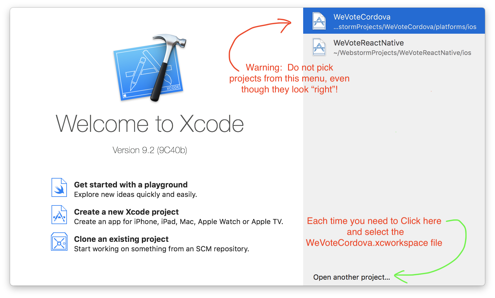
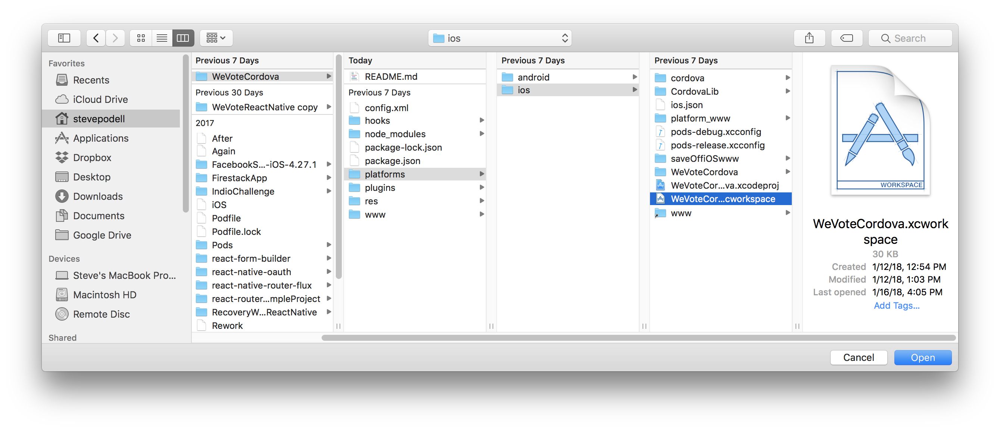
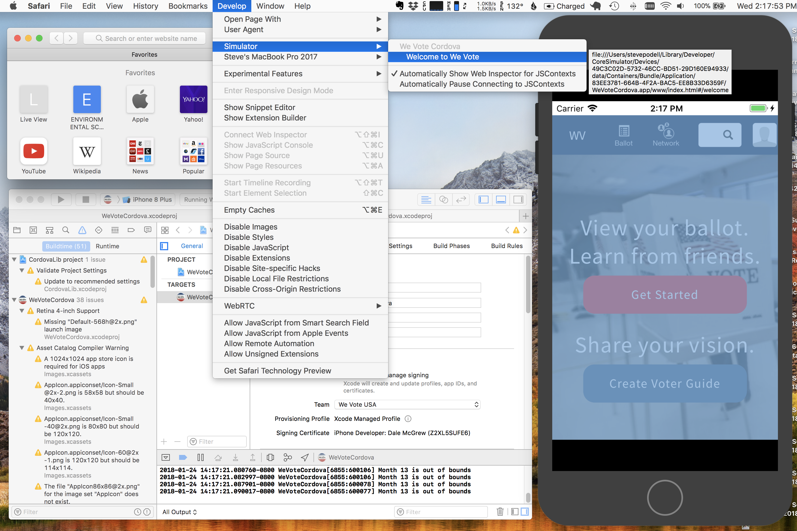
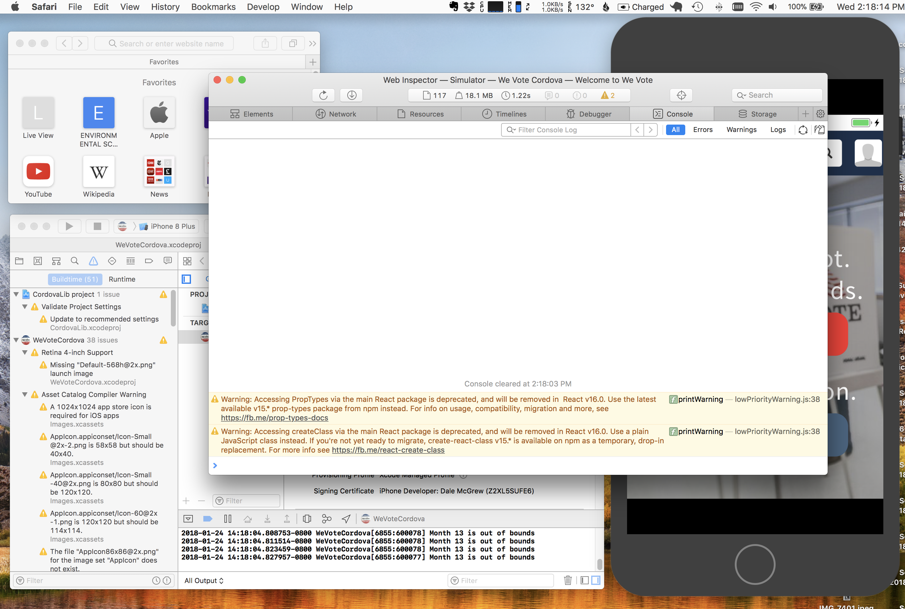
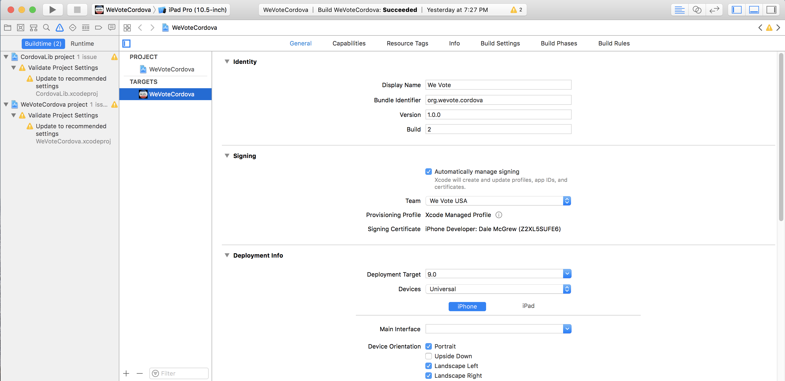

# The WeVoteCordova app for iOS and Android

Apache Cordova allows one to take their pre-existing JavaScript WebApp, bundle it with some additional Cordova JavaScript
and native code, and build an app for iOS or Android that can be released as an app in the App Store or Play Store.  Cordova
works perfectly well with React apps.

For a very simple app, you literally just drop it into Cordova and go, for more complex apps (like ours) there are some
changes to be made.  See [Cordova JavaScript Differences](docs/Cordova%20JavaScript%20Differences.md).

We use a very thin Apache Cordova wrapper to encapsulate the We Vote React WebApp.  The WeVoteCordova side is so thin, that
all it contains is Apache Cordova, some Documentation, and the iOS and Android config (and possibly a small amount of 
native code).  All of the JavaScript and React code, and the libraries that they rely on, remains in the WeVote WebApp.

Two target builds are planned for this Cordova app project, one each for iOS and Android.

## Installing the app:

https://cordova.apache.org/docs/en/latest/guide/platforms/ios/index.html#requirements-and-support

http://harrymoreno.com/2015/07/14/Deploying-a-React-App-to-Cordova.html

Download the WeVoteCordova app into a directory that parallels the We Vote WeApp directory on your computer.  Steve put his in
`/Users/stevepodell/WebstormProjects/WeVoteCordova` with his WebApp in `/Users/stevepodell/WebstormProjects/StevesForkOfWebApp`, but 
you can put them where you like.

Install Apple XCode from the MacOS App Store, you will need a Mac for the iOS part of this project, and a Mac will also be
fine for Android development.  Follow the instructions from WeVoteReactNative for XCode install.

You may need to install Gradle, a Java build tool for the Android side.  `npm install gradle`

There is a separate build procedure for WeVoteCordova and the We Vote WebApp, but you need to have the WebApp built first
to be successful with the WeVoteCordova build since WeVoteCordova relies on the `bundle.js` that is the 'compiled' result
of the React WebApp.

Cordova and our WeVoteCordova wants to load the `bundle.js` from a www directory, that ()on Steve's Mac) is at `/Users/stevepodell/WebstormProjects/WeVoteCordova/www`
and in order to make the setup easy to understand, there is now a www directory in the WebApp at `/Users/stevepodell/WebstormProjects/StevesForkOfWebApp/www`
These two www directories are joined together with [symlinks/Symbolic links](https://en.wikipedia.org/wiki/Symbolic_link)

## Creating all the Symlinks

These instructions are based on the following two home project directories...  

```
    /Users/stevepodell/WebstormProjects/WeVoteCordova
    /Users/stevepodell/WebstormProjects/StevesForkOfWebApp
```

Your directories will have different names, so you will have to adapt your symlink commands to your structure

1. Create a symbolic Link so that WeVoteCordova project sees the WebApp projects's www directory as its own www directory

    ```
    cd /Users/stevepodell/WebstormProjects/WeVoteCordova/platforms/ios
    ln -s ../StevesForkOfWebApp/www
    ```

1. Create a group of symlinks so that the WebApp project's www directory sees various subdirectories in the pre-existing WebApp project's directory 
structure, and certain subdirectories in WeVoteCordova as if they were in the WebApp project's www directory.
   ```
    cd /Users/stevepodell/WebstormProjects/WeVoteCordova/www
    ln -s ../../WeVoteCordova/platforms/ios/platform_www/cordova.js cordova.js
    ln -s /Users/stevepodell/WebstormProjects/StevesForkOfWebApp/www/bundle.js bundle.js
    ln -s /Users/stevepodell/WebstormProjects/StevesForkOfWebApp/build/css css
    ln -s /Users/stevepodell/WebstormProjects/StevesForkOfWebApp/build/javascript javascript
    ln -s /Users/stevepodell/WebstormProjects/StevesForkOfWebApp/build/img img
    ln -s ../../WeVoteCordova/platforms/ios/platform_www/cordova_plugins.js cordova_plugins.js
    ln -s /Users/stevepodell/WebstormProjects/StevesForkOfWebApp/build/fonts fonts
    ```
    
1. After creating all those links, the two www directories should look like this... first Cordova

    ```
    (WebAppEnv)Steves-MacBook-Pro-2017:ios stevepodell$ cd /Users/stevepodell/WebstormProjects/WeVoteCordova/platforms/ios
    (WebAppEnv)Steves-MacBook-Pro-2017:ios stevepodell$ ls -la
    total 48
    drwxr-xr-x  15 stevepodell  staff   480 Jan 12 15:46 .
    drwxr-xr-x   4 stevepodell  staff   128 Jan 12 12:55 ..
    -rw-r--r--@  1 stevepodell  staff  6148 Jan 18 19:12 .DS_Store
    -rw-r--r--   1 stevepodell  staff    53 Jan 12 12:54 .gitignore
    drwxr-xr-x   7 stevepodell  staff   224 Jan 12 12:54 CordovaLib
    drwxr-xr-x  14 stevepodell  staff   448 Jan 12 12:54 WeVoteCordova
    drwxr-xr-x@  3 stevepodell  staff    96 Jan 12 12:54 WeVoteCordova.xcodeproj
    drwxr-xr-x@  5 stevepodell  staff   160 Jan 12 13:03 WeVoteCordova.xcworkspace
    drwxr-xr-x  26 stevepodell  staff   832 Jan 12 12:54 cordova
    -rw-r--r--   1 stevepodell  staff   337 Jan 12 12:54 ios.json
    drwxr-xr-x   5 stevepodell  staff   160 Jan 12 12:54 platform_www
    -rw-r--r--   1 stevepodell  staff   860 Jan 12 12:54 pods-debug.xcconfig
    -rw-r--r--   1 stevepodell  staff   859 Jan 12 12:54 pods-release.xcconfig
    lrwxr-xr-x   1 stevepodell  staff    31 Jan 12 15:46 www -> ../../../StevesForkOfWebApp/www
    (WebAppEnv)Steves-MacBook-Pro-2017:ios stevepodell$
    ```

1. and for the WebApp...

    ```
    (WebAppEnv)Steves-MacBook-Pro-2017:www stevepodell$ cd /Users/stevepodell/WebstormProjects/StevesForkOfWebApp/www
    (WebAppEnv)Steves-MacBook-Pro-2017:www stevepodell$ ls -la
    total 16
    drwxr-xr-x  10 stevepodell  staff   320 Jan 19 17:05 .
    drwxr-xr-x  30 stevepodell  staff   960 Jan 19 09:02 ..
    lrwxr-xr-x   1 stevepodell  staff    73 Jan 16 17:02 bundle.js -> /Users/stevepodell/WebstormProjects/StevesForkOfWebApp/build/js/bundle.js
    lrwxr-xr-x   1 stevepodell  staff    57 Jan 12 14:57 cordova.js -> ../../WeVoteCordova/platforms/ios/platform_www/cordova.js
    lrwxr-xr-x   1 stevepodell  staff    65 Jan 18 20:20 cordova_plugins.js -> ../../WeVoteCordova/platforms/ios/platform_www/cordova_plugins.js
    lrwxr-xr-x   1 stevepodell  staff    64 Jan 17 13:50 css -> /Users/stevepodell/WebstormProjects/StevesForkOfWebApp/build/css
    lrwxr-xr-x   1 stevepodell  staff    66 Jan 19 17:05 fonts -> /Users/stevepodell/WebstormProjects/StevesForkOfWebApp/build/fonts
    lrwxr-xr-x   1 stevepodell  staff    64 Jan 18 16:57 img -> /Users/stevepodell/WebstormProjects/StevesForkOfWebApp/build/img
    -rw-r--r--   1 stevepodell  staff  6301 Jan 19 08:41 index.html
    lrwxr-xr-x   1 stevepodell  staff    71 Jan 17 14:04 javascript -> /Users/stevepodell/WebstormProjects/StevesForkOfWebApp/build/javascript
    (WebAppEnv)Steves-MacBook-Pro-2017:www stevepodell$ 
    ```

Once you have setup the symlinks, you can compile all the React in your WebApp setup as before, which creates a `bundle.js` 
file.  Then in the cordova project, you might not need to do anything.  Using the Xcode compiler will start up your Cordova 
project which contains the `bundle.js` and run it in a simulator, or on a phone attached with a USB cable.

## Opening the project in Xcode

This is very similar to the way we do it with the WeVoteReactNative iOS development.  
  
Download Xcode from the MacOS App Store, and launch it:

Don't use the last opened list, instead click on "Open another project..." (We use an Apple specific packager
called CocoaPods, which forces us to ignore that handy last opened menu.)



After clicking the "Open another project..." button, select the `WeVoteCordova.xcworkspace` file and press Open.




Select a simulator type from the menu on top (I use iPhone 8p in this example), then press the triangular green play button,
and the app starts in the simulator.

## Debugging Cordova Apps with the Safari debugger

 

You don't have to actually use Safari for Mac for anything, but launching its remote debugger.  You can see it opened on its
smallest default page in the picture above, it just has to be running so you can get to that "Develop" menu.  Once you
open the "We Vote Cordova" page that is currently being displayed, in the piture it is the "Welcome to We Vote" page. 



It is easy to get the Safari debugger working, but it is missing lots of features that we are used to from the
Chrome Devtools Debugger.


1. Enable debugging in Safari, [see this article](http://geeklearning.io/apache-cordova-and-remote-debugging-on-ios/)
1. Build your 'compiled' javascript app file `bundle.js`, on my Mac it is at `build/js/bundle.js`.  This file needs to be symlinked
into your www directory (see the section on symlinks above).
    1. On my Mac in WebStorm, I have a Gulp task that has a target "build", when I press the play button for that task, it builds the
bundle.js in 20 seconds (Two seconds to gather all the js scripts together, and 18 seconds to recompile sass).
1. Press the play button in Xcode, which should start the Simulator, load, and then start the WeVote WebApp.
1. In Safari open Develop/Simulator/WeVoteCordova/WeVote and the Safari Web Inspector appears.

## Debugging Cordova Apps with the Chrome dev tools

Chrome devtools is lightyears better than the Safari debugger, but is a bit challenging to get working. See ...

[medium.com article about the remotedebug-ios-webkit-adapter for debugging WebViews](https://medium.com/@auchenberg/hello-remotedebug-ios-webkit-adapter-debug-safari-and-ios-webviews-from-anywhere-2a8553df7465)

[github.com readme about remotedebug-ios-webkit-adapter#getting-started](https://github.com/RemoteDebug/remotedebug-ios-webkit-adapter#getting-started)

Install the remotedebug_ios_webkit_adapter (from a terminal window):

```
  brew update
  brew install --HEAD libimobiledevice
  brew install --HEAD ios-webkit-debug-proxy
  npm install remotedebug-ios-webkit-adapter -g
```

Run the remotedebug_ios_webkit_adapter:

```
    (WebAppEnv)Steves-MacBook-Pro-2017:WeVoteCordova stevepodell$ remotedebug_ios_webkit_adapter --port=9000
    remotedebug-ios-webkit-adapter is listening on port 9000
    iosAdapter.getTargets
    iosAdapter.getTargets
    iosAdapter.getTargets
    ...
```

You may have to restart the remotedebug_ios_webkit_adapter from time to time, to get the
`chrome://inspect/#devices` to see the simulator processes.

After starting the remotedebug_ios_webkit_adapter (hopefully on the first attempt) when you navigate in the Google Chrome
browser to `chrome://inspect` you will see the following screen, with the process to debug on the
list below:


  
Press that little blue 'inspect' to open the debugger, which should look like the following:


If `chrome://inspect` doesn't list your target, then try restarting remotedebug_ios_webkit_adapter and maybe restarting
your Cordova app via Xcode.  This is imperfect, but not too bad once you get the hang of it.

Unfortunately in both the Apple and Chrome debuggers, breakpoints are not maintained between restarts
of the app via Xcode, and also the files where you want to put the breakpoints have to be reopened each time.  (This deficiency
is not the case in React-Native, so hopefully a fix will arrive some day.)

In spite of the previous problem, it is possible to debug a startup behaviour, one that would fly past before you could set the first 
breakpoint -- on the upper left  corner of the chrome debugger, there is a "circular arrow, 
reload button" (see the following image) that will allow you to restart the app within the Chrome Inspector while maintaining
the current breakpoints.


## WebApp code changes needed to support Cordova

In Apache Cordova, all the real app code is in that `bundle.js` we make in the WebApp setup, but there are some code
changes in the WebApp that are necessary to support cordova.

[Cordova JavaScript Differences](docs/Cordova%20JavaScript%20Differences.md).

## Testing from a physical phone with the API server running on your Mac

If you are developing a Cordova specific feature, that requires access to the API server
running on your Mac, while not using the simulator, some extra setup is required to allow
access to your Mac's localhost.

[Testing with a Physical Phone and a localhost WeVote API Server](docs/TestingWithLocalHostFromPhone.md)


## Git

Unfortunately (2/15/18) the github repository we work against is not 'develop', so the pull request to
update your local 'develop' is different.
```
    git pull wevote-master master
    git push origin develop
```

otherwise all else in our github workflow is the same.

## Making an iOS release

1. After testing,and making your React changes in the WebApp, check in those changes and prepare (ideally) to build from a fully 
up-to-date WebApp develop.

1. Your WebApp config.js, should look like this:
    ```
    module.exports = {
      WE_VOTE_URL_PROTOCOL: "https://",  // "http://" for local dev or "https://" for live server
      WE_VOTE_HOSTNAME: ""WeVote.US",  // This should be without "http...". This is "WeVote.US" on live server.
    
      WE_VOTE_SERVER_ROOT_URL: "https://api.wevoteusa.org/",
      WE_VOTE_SERVER_ADMIN_ROOT_URL: "https://api.wevoteusa.org/admin/",
      WE_VOTE_SERVER_API_ROOT_URL: "https://api.wevoteusa.org/apis/v1/",
    
      DEBUG_MODE: false,
    
      // Use 1 or 0 as opposed to true or false
      test: {
        use_test_election: 0,
      },
    
      location: {
        text_for_map_search: "",
      },
    
      FACEBOOK_APP_ID: "<the actual number that you got from Dale>",
    
      STRIPE_API_KEY: "<the production 'pk_live_...' api key from Dale.  NOT the test 'pk_test_...'>",
    
      IS_CORDOVA: false,
    };
    ```

    That `IS_CORDOVA` value has been abandoned, and does not need to be changed.
    
    Be sure to double check that you are using these production config values, it
    would be difficult (but possible) to detect a misconfiguration while testing.

1. Run a gulp task, or otherwise build the WebApp `bundle.js`

2. On WeVoteCordova side,on the Target General Properties tab, increment the 
build number by one.  For example build 3, becomes Build 4.

    
    
    This may be the only change that gets made in the WeVoteCordova repository,
    but it is important to check it in so that we have a record of how each build was
    made.  When you do check it it, please include a reference to the WebApp
    Git commit that resulted in the `bundle.js`

3. Before checking in WeVoteCordova, test on a simulator for both an iPhone and iPad.

4. Build a release candidate in Xcode 

   * You will need a physical iPhone plugged into your computer via a USB cable (It is possible that an iPad or iPod touch would work for this purpose.)
   * The phone will have to be registered with Apple inorder for Xcode to sign the app.
   * Then build the release candidate in Xcode via Product/Archive
   * Then follow the options to upload the candidate to "the App Store" via [https://itunesconnect.apple.com/](https://itunesconnect.apple.com/)  Dale can make you
an account on itunesconnect

      * Allow "Upload your app's symbols...
      * Automatically manage signing
      * Upload

   * After upload, it could take a half hour for the build to appear on itunes connect, and then
the build could be "Processing" for another half hour.  (Due to an ancient tech WebObjects
page, refreshing the page could make the "processing" build disappear, but it
is still processing, and will reappear when done.  And sadly, the WebObjects page does not update itself when
done, so you will have to refresh to confirm that it is done processing, and probably shows "Missing Compliance"
as its status.)

    
    iTunes Connect Processing

5.  Wait for the build to appear
When processing is done, the build will be in the "Missing Compliance" state, clikc on the build number link, 
to "Provide Export Compliance Information"  Click on the "Provide Export Compliance Information" button

   * Have you added or made changes to encryption features since your last submission of this app? **NO**
   * Proceed to "Start Internal Testing"

6. Test in TestFlight
    After compliance is done, and you have proceeded to internal testing, it take can a minute to an hour for the app build
    to be available on the "iOS Builds" list in TestFlight.  Then a minute to an hour for the app to be available to test
    on your iPhone via the TestFlight app.

      

7. Finally submit for review in iTunesConnect
    Submit it for TestFlight
    
    Test it on TestFlight (the app might rejected if Apple does not see any
    evidence of testing, ideally by multiple users).

8.  Once testing is complete, submit it for "Review"
