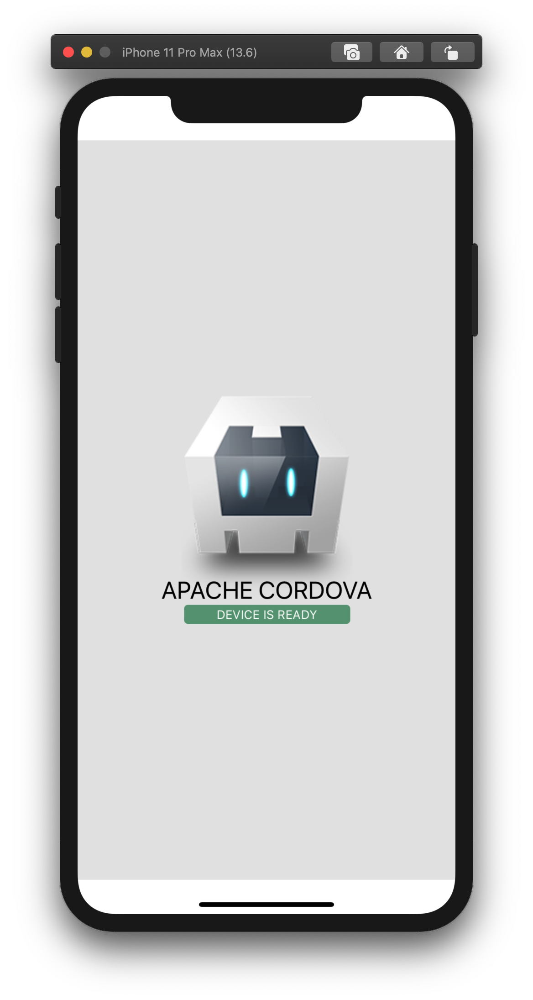
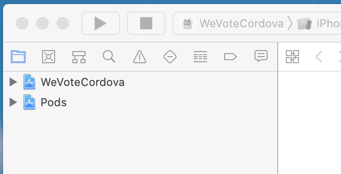
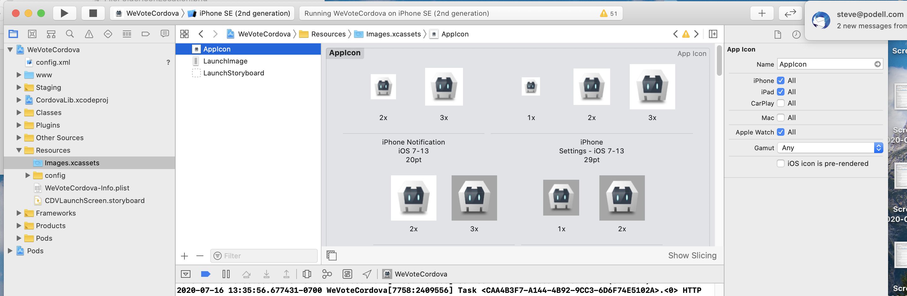
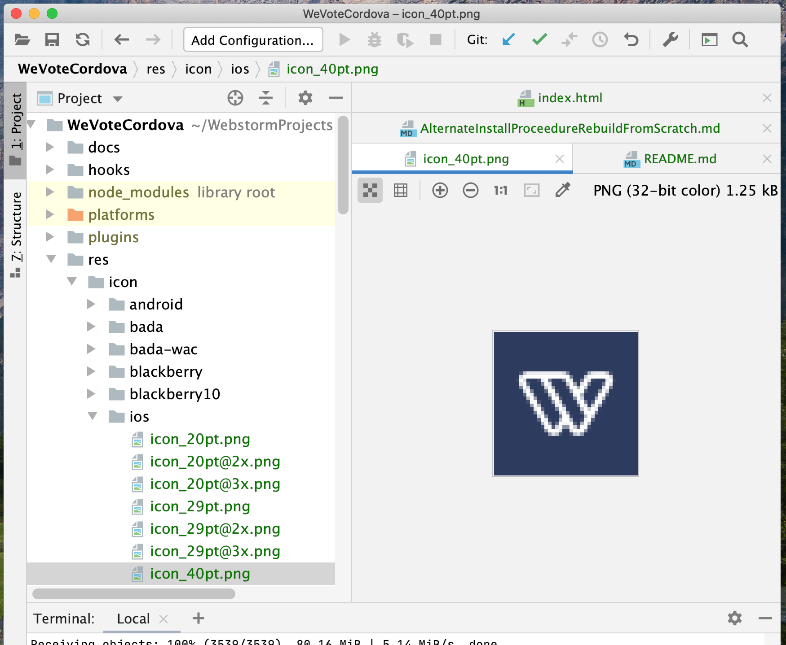
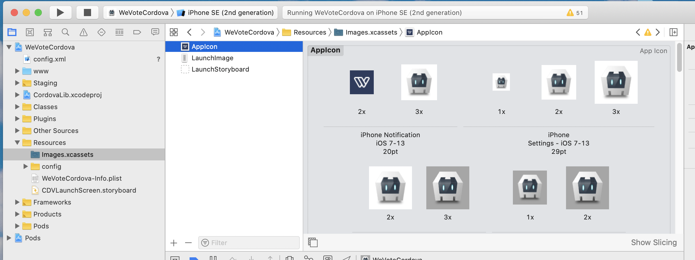
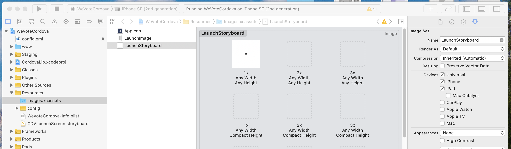

## Install from scratch (Kind of ugly but it works)

## You need to have the code for the WeVote WebApp setup on your machine

To build the bundle.js and associated files for Cordova, delete the WebApp/build directory, and execute the following
two commands:

    npm run prod-singleBundle
    npm run start-https-singleBundle

If you can't find a file called `WebApp/build/bundle.js` on your machine, don't proceed
until you can find it.

Note July 2020:  If you are using the latest node `v14.5.0` you will need later versions of
node-sass, 

    "node-sass": "^4.14.1",

but if you check in that version, you will break the production build.  So you will have to
manually change the package.json, and remember to not check in that change.

If `npm-install` fails with errors, or succeeds with come c++ errors...

You may need to `npm rebuild node-sass`

You may also need to `npm rebuild node-gyp`

I had two different versions of node-gyp installed (v3.x and v6.x), I uninstalled them both and allowed the `npm install`
script to add back in version I needed

    npm node-gyp -v
    node-gyp -v
    npm uninstall node-gyp
    sudo npm uninstall -g node-gyp
    npm install
    npm run prod-singleBundle
    npm run start-https-singleBundle


## Install our Code and the Cordova Libraries

1. Change to your base "MyProjects" equivalent directory
   ```
   cd  /Users/stevepodell/WebstormProjects
   ```

1.  Clone the WeVoteCordova code

    ```
    git clone https://github.com/wevote/WeVoteCordova.git
    ```
    
1. Rename the directory containing the WeVoteCordova software
    ```
    stevepodell@Steves-MacBook-Pro-32GB-Oct-2109 WebstormProjects % mv WeVoteCordova WeVoteCordovaSaveoff
    stevepodell@Steves-MacBook-Pro-32GB-Oct-2109 WebstormProjects %
    ```
1.  Install the Apache Cordova software, this is a command line interface (CLI) that is installed globally on your PC or Mac.

    First do an uninstall, since since any earlier install of the Cordova CLI prior to Version 9, will no longer work.  If you have never installed
    cordova, the uninstall will not do anything (and that is not a problem!).

    ```
    sudo npm uninstall -g cordova
    sudo npm install -g cordova
    ```
    Example: on the example machine that looks like...
    ```
    stevepodell@Steves-MacBook-Pro WeVoteCordova % sudo npm install -g cordova
    Password:
    npm WARN deprecated request@2.88.2: request has been deprecated, see https://github.com/request/request/issues/3142
    /usr/local/bin/cordova -> /usr/local/lib/node_modules/cordova/bin/cordova
    + cordova@9.0.0
    added 432 packages from 355 contributors in 14.165s
    
    
       ╭────────────────────────────────────────────────────────────────╮
       │                                                                │
       │      New patch version of npm available! 6.14.4 → 6.14.5       │
       │   Changelog: https://github.com/npm/cli/releases/tag/v6.14.5   │
       │               Run npm install -g npm to update!                │
       │                                                                │
       ╰────────────────────────────────────────────────────────────────╯
    
    stevepodell@Steves-MacBook-Pro WeVoteCordova % cordova -v
    9.0.0 (cordova-lib@9.0.1)
    stevepodell@Steves-MacBook-Pro WeVoteCordova % 
    ```    

    Do not proceed until you are at Cordova V9, or higher.  
    ```    
    Steves-MacBook-Pro-32GB-Oct-2018:WeVoteCordova stevepodell$ cordova -v
    9.0.0 (cordova-lib@9.0.1)
    Steves-MacBook-Pro-32GB-Oct-2018:WeVoteCordova stevepodell$ 
    ```
1. Create a new "empty" instance of the WeVoteCordova (with some minimal scaffolding)

    This will create a "Hello World" Cordova app, named WeVoteCordova -- the scaffolding, which we will throw away, is 
    is in two files `/www/index.html` and `/www/us/index.js`
    ```
    stevepodell@Steves-MacBook-Pro-32GB-Oct-2109 WebstormProjects % cordova create  WeVoteCordova us.wevote.wevotecordova WeVoteCordova
    Creating a new cordova project.
    stevepodell@Steves-MacBook-Pro-32GB-Oct-2109 WebstormProjects % cordova -v
    9.0.0 (cordova-lib@9.0.1)
   ```
   
1. cd to the WeVoteCordova directory
    ```
    stevepodell@Steves-MacBook-Pro-32GB-Oct-2109 WebstormProjects % cd WeVoteCordova
    stevepodell@Steves-MacBook-Pro-32GB-Oct-2109 WeVoteCordova %
    ```

77. 77 Copy ALL of WeVoteCordovaSaveoff/config.xml and WeVoteCordovaSaveoff/www/index.html overwriting the existing files in WeVoteCordova
<!--
1. Copy part of WeVoteCordovaSaveoff/config.xml to WeVoteCordova/config.xml, the plugins configuration

   And insert at the bottom of the file, after `</author` and before `</widget>`
   ```
    <plugin name="cordova-plugin-keyboard" spec="^1.2.0" />
    <plugin name="cordova-plugin-screensize" spec="~1.3.1" />
    <plugin name="cordova-plugin-device" spec="~2.0.3" />
    <plugin name="cordova-plugin-statusbar" spec="~2.4.3" />
    <plugin name="cordova-plugin-safariviewcontroller" spec="~1.6.0" />
    <plugin name="cordova-plugin-splashscreen" spec="~5.0.3" />
    <plugin name="cordova-plugin-whitelist" spec="~1.3.4" />
    <plugin name="cordova-plugin-facebook4" spec="^6.4.0">
        <variable name="APP_ID" value="1097389196952441" />
        <variable name="APP_NAME" value="WeVoteCordova" />
        <variable name="FACEBOOK_HYBRID_APP_EVENTS" value="false" />
        <variable name="FACEBOOK_ANDROID_SDK_VERSION" value="5.5.2" />
    </plugin>
   ```
   Afterwords it looks like this:
   ```
    <?xml version='1.0' encoding='utf-8'?>
    <widget id="us.wevote.wevotecordova" version="1.0.0" xmlns="http://www.w3.org/ns/widgets" xmlns:cdv="http://cordova.apache.org/ns/1.0">
        <name>WeVoteCordova</name>
        <description>
            A sample Apache Cordova application that responds to the deviceready event.
        </description>
        <author email="dev@cordova.apache.org" href="http://cordova.io">
            Apache Cordova Team
        </author>
        <content src="index.html" />
        <plugin name="cordova-plugin-whitelist" spec="1" />
        <access origin="*" />
        <allow-intent href="http://*/*" />
        <allow-intent href="https://*/*" />
        <allow-intent href="tel:*" />
        <allow-intent href="sms:*" />
        <allow-intent href="mailto:*" />
        <allow-intent href="geo:*" />
        <platform name="android">
            <allow-intent href="market:*" />
        </platform>
        <platform name="ios">
            <allow-intent href="itms:*" />
            <allow-intent href="itms-apps:*" />
        </platform>
        <plugin name="cordova-plugin-keyboard" spec="^1.2.0" />
        <plugin name="cordova-plugin-screensize" spec="~1.3.1" />
        <plugin name="cordova-plugin-device" spec="~2.0.3" />
        <plugin name="cordova-plugin-statusbar" spec="~2.4.3" />
        <plugin name="cordova-plugin-safariviewcontroller" spec="~1.6.0" />
        <plugin name="cordova-plugin-splashscreen" spec="~5.0.3" />
        <plugin name="cordova-plugin-whitelist" spec="~1.3.4" />
        <plugin name="cordova-plugin-facebook4" spec="^6.4.0">
            <variable name="APP_ID" value="1097389196952441" />
            <variable name="APP_NAME" value="WeVoteCordova" />
            <variable name="FACEBOOK_HYBRID_APP_EVENTS" value="false" />
            <variable name="FACEBOOK_ANDROID_SDK_VERSION" value="5.5.2" />
        </plugin>
    
</widget>
   ```
-->

1. Add the Cordova iOS and Android platforms
   ```
    stevepodell@Steves-MacBook-Pro-32GB-Oct-2109 WeVoteCordova % cordova platform add ios android                                   
    Using cordova-fetch for cordova-ios@^5.0.0
    (node:89816) Warning: Accessing non-existent property 'ios' of module exports inside circular dependency
    (Use `node --trace-warnings ...` to show where the warning was created)
    (node:89816) Warning: Accessing non-existent property 'android' of module exports inside circular dependency
    Adding ios project...
    Creating Cordova project for the iOS platform:
            Path: platforms/ios
            Package: org.wevote.cordova
            Name: WeVoteCordova
    iOS project created with cordova-ios@5.1.1
    Plugin 'cordova-plugin-keyboard' found in config.xml... Migrating it to package.json
    Plugin 'cordova-plugin-screensize' found in config.xml... Migrating it to package.json
    Plugin 'cordova-plugin-device' found in config.xml... Migrating it to package.json
    Plugin 'cordova-plugin-statusbar' found in config.xml... Migrating it to package.json
    Plugin 'cordova-plugin-safariviewcontroller' found in config.xml... Migrating it to package.json
    Plugin 'cordova-plugin-splashscreen' found in config.xml... Migrating it to package.json
    Plugin 'cordova-plugin-whitelist' found in config.xml... Migrating it to package.json
    Plugin 'cordova-plugin-facebook4' found in config.xml... Migrating it to package.json
    Discovered saved plugin "cordova-plugin-keyboard". Adding it to the project
    Installing "cordova-plugin-keyboard" for ios
    Adding cordova-plugin-keyboard to package.json
    Discovered saved plugin "cordova-plugin-screensize". Adding it to the project
    Installing "cordova-plugin-screensize" for ios
    Adding cordova-plugin-screensize to package.json
    Discovered saved plugin "cordova-plugin-device". Adding it to the project
    Installing "cordova-plugin-device" for ios
    Adding cordova-plugin-device to package.json
    Discovered saved plugin "cordova-plugin-statusbar". Adding it to the project
    Installing "cordova-plugin-statusbar" for ios
    Adding cordova-plugin-statusbar to package.json
    Discovered saved plugin "cordova-plugin-safariviewcontroller". Adding it to the project
    Installing "cordova-plugin-safariviewcontroller" for ios
    Adding cordova-plugin-safariviewcontroller to package.json
    Discovered saved plugin "cordova-plugin-splashscreen". Adding it to the project
    Installing "cordova-plugin-splashscreen" for ios
    Adding cordova-plugin-splashscreen to package.json
    Discovered saved plugin "cordova-plugin-whitelist". Adding it to the project
    Installing "cordova-plugin-whitelist" for ios
    Adding cordova-plugin-whitelist to package.json
    Discovered saved plugin "cordova-plugin-facebook4". Adding it to the project
    Installing "cordova-plugin-facebook4" for ios
    Running command: pod install --verbose
    /usr/local/lib/ruby/gems/2.7.0/gems/cocoapods-core-1.8.4/lib/cocoapods-core/cdn_source.rb:326: warning: URI.escape is obsolete
    
    /usr/local/lib/ruby/gems/2.7.0/gems/cocoapods-core-1.8.4/lib/cocoapods-core/cdn_source.rb:326: warning: URI.escape is obsolete
    
    /usr/local/lib/ruby/gems/2.7.0/gems/cocoapods-core-1.8.4/lib/cocoapods-core/cdn_source.rb:326: warning: URI.escape is obsolete
    
    /usr/local/lib/ruby/gems/2.7.0/gems/cocoapods-core-1.8.4/lib/cocoapods-core/cdn_source.rb:326: warning: URI.escape is obsolete
    
    /usr/local/lib/ruby/gems/2.7.0/gems/cocoapods-core-1.8.4/lib/cocoapods-core/cdn_source.rb:326: warning: URI.escape is obsolete
    
    /usr/local/lib/ruby/gems/2.7.0/gems/cocoapods-core-1.8.4/lib/cocoapods-core/cdn_source.rb:326: warning: URI.escape is obsolete
    
    /usr/local/lib/ruby/gems/2.7.0/gems/cocoapods-core-1.8.4/lib/cocoapods-core/cdn_source.rb:326: warning: URI.escape is obsolete
    
    /usr/local/lib/ruby/gems/2.7.0/gems/cocoapods-core-1.8.4/lib/cocoapods-core/cdn_source.rb:326: warning: URI.escape is obsolete
    
    /usr/local/lib/ruby/gems/2.7.0/gems/cocoapods-core-1.8.4/lib/cocoapods-core/cdn_source.rb:326: warning: URI.escape is obsolete
    
    /usr/local/lib/ruby/gems/2.7.0/gems/cocoapods-core-1.8.4/lib/cocoapods-core/cdn_source.rb:326: warning: URI.escape is obsolete
    
    /usr/local/lib/ruby/gems/2.7.0/gems/cocoapods-core-1.8.4/lib/cocoapods-core/cdn_source.rb:326: warning: URI.escape is obsolete
    
    /usr/local/lib/ruby/gems/2.7.0/gems/cocoapods-core-1.8.4/lib/cocoapods-core/cdn_source.rb:326: warning: URI.escape is obsolete
    
    /usr/local/lib/ruby/gems/2.7.0/gems/cocoapods-core-1.8.4/lib/cocoapods-core/cdn_source.rb:326: warning: URI.escape is obsolete
    
    /usr/local/lib/ruby/gems/2.7.0/gems/cocoapods-core-1.8.4/lib/cocoapods-core/cdn_source.rb:326: warning: URI.escape is obsolete
    
    /usr/local/lib/ruby/gems/2.7.0/gems/cocoapods-core-1.8.4/lib/cocoapods-core/cdn_source.rb:326: warning: URI.escape is obsolete
    
    /usr/local/lib/ruby/gems/2.7.0/gems/cocoapods-1.8.4/lib/cocoapods/downloader/cache.rb:114: warning: Using the last argument as keyword parameters is deprecated; maybe ** should be added to the call
    /usr/local/lib/ruby/gems/2.7.0/gems/cocoapods-1.8.4/lib/cocoapods/downloader/request.rb:61: warning: The called method `slug' is defined here
    
    /usr/local/lib/ruby/gems/2.7.0/gems/cocoapods-1.8.4/lib/cocoapods/downloader/cache.rb:100: warning: Using the last argument as keyword parameters is deprecated; maybe ** should be added to the call
    /usr/local/lib/ruby/gems/2.7.0/gems/cocoapods-1.8.4/lib/cocoapods/downloader/request.rb:61: warning: The called method `slug' is defined here
    
    /usr/local/lib/ruby/gems/2.7.0/gems/nanaimo-0.2.6/lib/nanaimo/writer/pbxproj.rb:13: warning: Using the last argument as keyword parameters is deprecated; maybe ** should be added to the call
    /usr/local/lib/ruby/gems/2.7.0/gems/nanaimo-0.2.6/lib/nanaimo/writer.rb:35: warning: The called method `initialize' is defined here
    
    /usr/local/lib/ruby/gems/2.7.0/gems/cocoapods-core-1.8.4/lib/cocoapods-core/cdn_source.rb:326: warning: URI.escape is obsolete
    
    
    [!] The `WeVoteCordova [Debug]` target overrides the `LD_RUNPATH_SEARCH_PATHS` build setting defined in `Pods/Target Support Files/Pods-WeVoteCordova/Pods-WeVoteCordova.debug.xcconfig'. This can lead to problems with the CocoaPods installation
    
    [!] The `WeVoteCordova [Release]` target overrides the `LD_RUNPATH_SEARCH_PATHS` build setting defined in `Pods/Target Support Files/Pods-WeVoteCordova/Pods-WeVoteCordova.release.xcconfig'. This can lead to problems with the CocoaPods installation
    
    Adding cordova-plugin-facebook4 to package.json
    Using cordova-fetch for cordova-android@^8.0.0
    Adding android project...
    Creating Cordova project for the Android platform:
            Path: platforms/android
            Package: org.wevote.cordova
            Name: WeVoteCordova
            Activity: MainActivity
            Android target: android-28
    Subproject Path: CordovaLib
    Subproject Path: app
    Android project created with cordova-android@8.1.0
    Source path does not exist: res/screen/android/screen-hdpi-landscape.png
    stevepodell@Steves-MacBook-Pro-32GB-Oct-2109 WeVoteCordova % 

   ```
<!--
1. Manually install the plugins
    ```
    cordova plugin add cordova-plugin-facebook4 --save --variable APP_ID="1097389196952441" --variable APP_NAME="WeVoteWebApp"
    cordova plugin add cordova-plugin-safariviewcontroller
    cordova plugin add cordova-plugin-inappbrowser
    cordova plugin add cordova-plugin-taptic-engine
    cordova plugin add cordova-plugin-keyboard
    cordova plugin add cordova-plugin-device
    cordova plugin add cordova-plugin-statusbar
    cordova plugin add cordova-plugin-splashscreen
    cordova plugin add cordova-plugin-inappbrowser
    ```
    Then confirm the install
    ```
    stevepodell@Steves-MacBook-Pro-32GB-Oct-2109 WeVoteCordova % cordova plugin ls                             
    cordova-plugin-device 2.0.3 "Device"
    cordova-plugin-facebook4 6.4.0 "Facebook Connect"
    cordova-plugin-inappbrowser 4.0.0 "InAppBrowser"
    cordova-plugin-keyboard 1.2.0 "Keyboard"
    cordova-plugin-safariviewcontroller 1.6.0 "SafariViewController"
    cordova-plugin-screensize 1.3.1 "screensize"
    cordova-plugin-splashscreen 5.0.4 "Splashscreen"
    cordova-plugin-statusbar 2.4.3 "StatusBar"
    cordova-plugin-taptic-engine 2.1.0 "Taptic Engine"
    cordova-plugin-whitelist 1.3.4 "Whitelist"
    stevepodell@Steves-MacBook-Pro-32GB-Oct-2109 WeVoteCordova % 
    ```

1. Rebuild the platforms dir with the new plugins, by removing the platforms and adding them back in
    ```
   stevepodell@Steves-MacBook-Pro-32GB-Oct-2109 WeVoteCordova % cordova platforms rm ios android
   Removing ios from cordova.platforms array in package.json
   Removing android from cordova.platforms array in package.json
   stevepodell@Steves-MacBook-Pro-32GB-Oct-2109 WeVoteCordova % cordova platforms add ios android
   Using cordova-fetch for cordova-ios@^5.0.0
   (node:65490) Warning: Accessing non-existent property 'ios' of module exports inside circular dependency
   (Use `node --trace-warnings ...` to show where the warning was created)
   (node:65490) Warning: Accessing non-existent property 'android' of module exports inside circular dependency
   Adding ios project...
   Creating Cordova project for the iOS platform:
           Path: platforms/ios
           Package: us.wevote.wevotecordova
           Name: WeVoteCordova
   iOS project created with cordova-ios@5.1.1
   Installing "cordova-plugin-whitelist" for ios
   Plugin 'cordova-plugin-keyboard' found in config.xml... Migrating it to package.json
   Plugin 'cordova-plugin-screensize' found in config.xml... Migrating it to package.json
   Plugin 'cordova-plugin-device' found in config.xml... Migrating it to package.json
   Plugin 'cordova-plugin-statusbar' found in config.xml... Migrating it to package.json
   Plugin 'cordova-plugin-safariviewcontroller' found in config.xml... Migrating it to package.json
   Plugin 'cordova-plugin-splashscreen' found in config.xml... Migrating it to package.json
   Plugin 'cordova-plugin-facebook4' found in config.xml... Migrating it to package.json
   Discovered saved plugin "cordova-plugin-keyboard". Adding it to the project
   Installing "cordova-plugin-keyboard" for ios
   Adding cordova-plugin-keyboard to package.json
   Discovered saved plugin "cordova-plugin-screensize". Adding it to the project
   Installing "cordova-plugin-screensize" for ios
   Adding cordova-plugin-screensize to package.json
   Discovered saved plugin "cordova-plugin-device". Adding it to the project
   Installing "cordova-plugin-device" for ios
   Adding cordova-plugin-device to package.json
   Discovered saved plugin "cordova-plugin-statusbar". Adding it to the project
   Installing "cordova-plugin-statusbar" for ios
   Adding cordova-plugin-statusbar to package.json
   Discovered saved plugin "cordova-plugin-safariviewcontroller". Adding it to the project
   Installing "cordova-plugin-safariviewcontroller" for ios
   Adding cordova-plugin-safariviewcontroller to package.json
   Discovered saved plugin "cordova-plugin-splashscreen". Adding it to the project
   Installing "cordova-plugin-splashscreen" for ios
   Adding cordova-plugin-splashscreen to package.json
   Discovered saved plugin "cordova-plugin-facebook4". Adding it to the project
   Installing "cordova-plugin-facebook4" for ios
   Running command: pod install --verbose
   /usr/local/lib/ruby/gems/2.7.0/gems/cocoapods-core-1.8.4/lib/cocoapods-core/cdn_source.rb:326: warning: URI.escape is obsolete
   
   /usr/local/lib/ruby/gems/2.7.0/gems/cocoapods-core-1.8.4/lib/cocoapods-core/cdn_source.rb:326: warning: URI.escape is obsolete
   
   /usr/local/lib/ruby/gems/2.7.0/gems/cocoapods-core-1.8.4/lib/cocoapods-core/cdn_source.rb:326: warning: URI.escape is obsolete
   
   /usr/local/lib/ruby/gems/2.7.0/gems/cocoapods-core-1.8.4/lib/cocoapods-core/cdn_source.rb:326: warning: URI.escape is obsolete
   
   /usr/local/lib/ruby/gems/2.7.0/gems/cocoapods-core-1.8.4/lib/cocoapods-core/cdn_source.rb:326: warning: URI.escape is obsolete
   
   /usr/local/lib/ruby/gems/2.7.0/gems/cocoapods-core-1.8.4/lib/cocoapods-core/cdn_source.rb:326: warning: URI.escape is obsolete
   
   /usr/local/lib/ruby/gems/2.7.0/gems/cocoapods-core-1.8.4/lib/cocoapods-core/cdn_source.rb:326: warning: URI.escape is obsolete
   
   /usr/local/lib/ruby/gems/2.7.0/gems/cocoapods-core-1.8.4/lib/cocoapods-core/cdn_source.rb:326: warning: URI.escape is obsolete
   
   /usr/local/lib/ruby/gems/2.7.0/gems/cocoapods-core-1.8.4/lib/cocoapods-core/cdn_source.rb:326: warning: URI.escape is obsolete
   
   /usr/local/lib/ruby/gems/2.7.0/gems/cocoapods-core-1.8.4/lib/cocoapods-core/cdn_source.rb:326: warning: URI.escape is obsolete
   
   /usr/local/lib/ruby/gems/2.7.0/gems/cocoapods-core-1.8.4/lib/cocoapods-core/cdn_source.rb:326: warning: URI.escape is obsolete
   
   /usr/local/lib/ruby/gems/2.7.0/gems/cocoapods-core-1.8.4/lib/cocoapods-core/cdn_source.rb:326: warning: URI.escape is obsolete
   
   /usr/local/lib/ruby/gems/2.7.0/gems/cocoapods-core-1.8.4/lib/cocoapods-core/cdn_source.rb:326: warning: URI.escape is obsolete
   
   /usr/local/lib/ruby/gems/2.7.0/gems/cocoapods-core-1.8.4/lib/cocoapods-core/cdn_source.rb:326: warning: URI.escape is obsolete
   
   /usr/local/lib/ruby/gems/2.7.0/gems/cocoapods-core-1.8.4/lib/cocoapods-core/cdn_source.rb:326: warning: URI.escape is obsolete
   
   /usr/local/lib/ruby/gems/2.7.0/gems/cocoapods-1.8.4/lib/cocoapods/downloader/cache.rb:114: warning: Using the last argument as keyword parameters is deprecated; maybe ** should be added to the call
   /usr/local/lib/ruby/gems/2.7.0/gems/cocoapods-1.8.4/lib/cocoapods/downloader/request.rb:61: warning: The called method `slug' is defined here
   
   /usr/local/lib/ruby/gems/2.7.0/gems/cocoapods-1.8.4/lib/cocoapods/downloader/cache.rb:100: warning: Using the last argument as keyword parameters is deprecated; maybe ** should be added to the call
   /usr/local/lib/ruby/gems/2.7.0/gems/cocoapods-1.8.4/lib/cocoapods/downloader/request.rb:61: warning: The called method `slug' is defined here
   
   /usr/local/lib/ruby/gems/2.7.0/gems/nanaimo-0.2.6/lib/nanaimo/writer/pbxproj.rb:13: warning: Using the last argument as keyword parameters is deprecated; maybe ** should be added to the call
   /usr/local/lib/ruby/gems/2.7.0/gems/nanaimo-0.2.6/lib/nanaimo/writer.rb:35: warning: The called method `initialize' is defined here
   
   /usr/local/lib/ruby/gems/2.7.0/gems/cocoapods-core-1.8.4/lib/cocoapods-core/cdn_source.rb:326: warning: URI.escape is obsolete
   
   
   [!] The `WeVoteCordova [Debug]` target overrides the `LD_RUNPATH_SEARCH_PATHS` build setting defined in `Pods/Target Support Files/Pods-WeVoteCordova/Pods-WeVoteCordova.debug.xcconfig'. This can lead to problems with the CocoaPods installation
   
   [!] The `WeVoteCordova [Release]` target overrides the `LD_RUNPATH_SEARCH_PATHS` build setting defined in `Pods/Target Support Files/Pods-WeVoteCordova/Pods-WeVoteCordova.release.xcconfig'. This can lead to problems with the CocoaPods installation
   
   Adding cordova-plugin-facebook4 to package.json
   Using cordova-fetch for cordova-android@^8.0.0
   Adding android project...
   Creating Cordova project for the Android platform:
           Path: platforms/android
           Package: us.wevote.wevotecordova
           Name: WeVoteCordova
           Activity: MainActivity
           Android target: android-28
   Subproject Path: CordovaLib
   Subproject Path: app
   Android project created with cordova-android@8.1.0
   Installing "cordova-plugin-device" for android
   Installing "cordova-plugin-facebook4" for android
   Subproject Path: CordovaLib
   Subproject Path: app
   Installing "cordova-plugin-keyboard" for android
   Installing "cordova-plugin-safariviewcontroller" for android
   Subproject Path: CordovaLib
   Subproject Path: app
   Installing "cordova-plugin-screensize" for android
   Installing "cordova-plugin-splashscreen" for android
   Installing "cordova-plugin-statusbar" for android
   Installing "cordova-plugin-whitelist" for android
   stevepodell@Steves-MacBook-Pro-32GB-Oct-2109 WeVoteCordova % 
    ```   
  
--> 
1. Copy source controlled files from the `WeVoteCordovaSaveoff` dir you made earlier to the `WeVoteCordova` dir
    
    You can do this with your IDE, or in Finder
    ```
    /docs
    /res
    .gitignore
    .npmignore
    buildSymLinks.js
    README.MD
    ```
   **WHAT ABOUT CONFIG.XML?**
   TESTED AND WORKS W/SCAFFOLDING

    
1. Open the `WeVoteCordova.xcworkspace` file with XCode 

    Open `/Users/stevepodell/WebstormProjects/WeVoteCordova/platforms/ios/WeVoteCordova.xcworkspace` with XCode,
and then press the Run (triangle) button, and the default helloworld app will start in a simulator

    
    That "Device is Ready" indicates the scaffolding supplied index.html loaded, the `deviceready` event has fired and was 
    interpreted by the scaffolding index.js

1. Delete the scaffolding index.html and index.js used for HelloWorld
    
    ```
    stevepodell@Steves-MacBook-Pro-32GB-Oct-2109 WeVoteCordova % pwd
    /Users/stevepodell/WebstormProjects/WeVoteCordova
    stevepodell@Steves-MacBook-Pro-32GB-Oct-2109 WeVoteCordova % cd www
    stevepodell@Steves-MacBook-Pro-32GB-Oct-2109 www % rm index.html
    stevepodell@Steves-MacBook-Pro-32GB-Oct-2109 www % rm -fr js
    stevepodell@Steves-MacBook-Pro-32GB-Oct-2109 www % 
    ```

1. Copy over the source controlled index.html for WeVoteCordova
    ```
    stevepodell@Steves-MacBook-Pro-32GB-Oct-2109 www % cp /Users/stevepodell/WebstormProjects/WeVoteCordovaSaveOff/www/index.html .
    stevepodell@Steves-MacBook-Pro-32GB-Oct-2109 www %
    ```
1. Set up the sym links for iOS and Android
    ```
    node buildSymLinks /Users/stevepodell/WebstormProjects/WebApp/build
    ```
    These symlinks allow us to compile the WebApp and have all the necessary components available for the Cordova builds
    ```
    stevepodell@Steves-MacBook-Pro-32GB-Oct-2109 WeVoteCordova % node buildSymLinks /Users/stevepodell/WebstormProjects/WebApp/build
    __dirname /Users/stevepodell/WebstormProjects/WeVoteCordova
    unlink: android index.html
    unlink: ios index.html
    rmdir: /Users/stevepodell/WebstormProjects/WeVoteCordova/platforms/android/app/src/main/assets/www/css
    rmdir: /Users/stevepodell/WebstormProjects/WeVoteCordova/platforms/android/app/src/main/assets/www/img
    rmdir: /Users/stevepodell/WebstormProjects/WeVoteCordova/platforms/ios/www/img
    rmdir: /Users/stevepodell/WebstormProjects/WeVoteCordova/platforms/ios/www/css
    ln android css successful
    ln ios bundle.js successful
    ln android bundle.js successful
    ln ios css successful
    ln ios img successful
    ln android img successful
    ln ios index.html successful
    ln android index.html successful
    stevepodell@Steves-MacBook-Pro-32GB-Oct-2109 WeVoteCordova % 
    ```
1. Install the node packages (this really just confirms that they are installed)
    ```
    stevepodell@Steves-MacBook-Pro-32GB-Oct-2109 WeVoteCordova % npm install
    npm WARN us.wevote.wevotecordova@1.0.2 No repository field.
    
    audited 82 packages in 0.51s
    
    1 package is looking for funding
      run `npm fund` for details
    
    found 0 vulnerabilities
    
    stevepodell@Steves-MacBook-Pro-32GB-Oct-2109 WeVoteCordova % 
    ```
1. Check that cordova requirements have been met
    ```
    stevepodell@Steves-MacBook-Pro-32GB-Oct-2109 www % cordova requirements

    Requirements check results for android:
    Java JDK: installed 1.8.0
    Android SDK: installed true
    Android target: installed android-Q,android-28,android-27,android-26,android-25,android-24,android-23
    Gradle: installed /usr/local/Cellar/gradle/6.3/bin/gradle
    
    Requirements check results for ios:
    Apple macOS: installed darwin
    Xcode: installed 11.5
    ios-deploy: installed 1.10.0
    CocoaPods: installed 1.8.4
    stevepodell@Steves-MacBook-Pro-32GB-Oct-2109 www %
    ```

1.  Run the WeVoteCordova app from XCode, and you should get a rough version of the Cordova app running.  The startup 
screens and icons will not be correct, but the WebApp running within Cordova should look good.

1. Optional:  If the Cordova iOS app loads the html page (White "Loading We Vote" on blue, but crashes in JQuery regex), logs `SyntaxError: Invalid regular expression: range out of order in character class`
 and never advances to the first js page in the WebApp:

    In the WebApp, delete
    ```
    /build
    /node_modules
    /package-lock.json
    ```
   Then (Still in the WebApp!)
   
    ```
    npm install
    npm rebuild node-gyp
    npm rebuild node-sass
    npm install
    npm run prod-singleBundle
    npm run start-https-singleBundle
   
   stevepodell@Steves-MacBook-Pro-32GB-Oct-2109 WebApp % npm install
   npm WARN deprecated request@2.88.2: request has been deprecated, see https://github.com/request/request/issues/3142
   npm WARN deprecated mkdirp@0.5.4: Legacy versions of mkdirp are no longer supported. Please update to mkdirp 1.x. (Note that the API surface has changed to use Promises in 1.x.)
   npm WARN deprecated chokidar@2.1.8: Chokidar 2 will break on node v14+. Upgrade to chokidar 3 with 15x less dependencies.
   npm WARN deprecated urix@0.1.0: Please see https://github.com/lydell/urix#deprecated
   npm WARN deprecated fsevents@1.2.13: fsevents 1 will break on node v14+ and could be using insecure binaries. Upgrade to fsevents 2.
   npm WARN deprecated @hapi/joi@15.1.1: joi is leaving the @hapi organization and moving back to 'joi' (https://github.com/sideway/joi/issues/2411)
   npm WARN deprecated core-js@1.2.7: core-js@<3 is no longer maintained and not recommended for usage due to the number of issues. Please, upgrade your dependencies to the actual version of core-js@3.
   npm WARN deprecated core-js@2.6.11: core-js@<3 is no longer maintained and not recommended for usage due to the number of issues. Please, upgrade your dependencies to the actual version of core-js@3.
   npm WARN deprecated natives@1.1.6: This module relies on Node.js's internals and will break at some point. Do not use it, and update to graceful-fs@4.x.
   npm WARN deprecated resolve-url@0.2.1: https://github.com/lydell/resolve-url#deprecated
   npm WARN deprecated @hapi/address@2.1.4: This version has been deprecated and is no longer supported or maintained
   npm WARN deprecated @hapi/bourne@1.3.2: This version has been deprecated and is no longer supported or maintained
   npm WARN deprecated @hapi/hoek@8.5.1: This version has been deprecated and is no longer supported or maintained
   npm WARN deprecated @hapi/topo@3.1.6: This version has been deprecated and is no longer supported or maintained
   npm WARN deprecated lodash.isarray@4.0.0: This package is deprecated. Use Array.isArray.
   npm WARN deprecated @types/vfile-message@2.0.0: This is a stub types definition. vfile-message provides its own type definitions, so you do not need this installed.
   ```
1. Copy the icons from `res/` to the `LaunchStoryboard` `Images.xcassets` in Xcode

    If you have two monitors, they will be very handy for this step.  Open Xcode in one monitor, and your IDE in
    the other.  If you use PyCharm or WebStorm these pictures will show you exactly what to do.
    
    In Xcode, click on the file folder icon in the upper right corner
    
    Then navigate to WeVoteCordova/Resources/images.xcassets and within the edit window select AppIcon.  All of the application icons
    that are displayed are the default cordova icons from the scaffolding.  Replace then all from WeVoteCordova/res/icon/ios
    
    Replace then all from WeVoteCordova/res/icon/ios in your IDE (or finder!)
    
    The very first icon in XCode is the '2x' 'iPhone Notification for iOS 7-13' '20pt', so drag
    `icon_20pt@2x.png` from your IDE and drop it on the image in Xcode.
    
    Repeat this for all of the icons on the AppIcon editor page up to 'App Store IOS 1024pt'.  There is no need to
    do anything for the 'Apple Watch' icons.  If you drop the wrong size in a configuration, the XCode IDE will tell
    you and you can try again.
    
1. Setup the LaunchStoryboard
    As of iOS 13, we can no longer have the hand crafted launch images "View your ballot for the next election..." Apple now 
    recommends simply a icon, or a mockup of the first screen (which would not work well for our app).
    Change your IDE to show the pngs in `WeVoteCordova/res/screen/ios` and in XCode selecct LaunchStoryBoard in the edit 
    window.  For each LaunchStoryBoard image configuration, drop the `WeVoteCordova/res/screen/ios/June2020LaunchScreen.png` onto each.
    Yes, drop the same image 40 times into the different configurations.  We can do something
    fancier later, but this works well enough for now. 
    
    
1. Configure the Cordova CDVLauntScreen to use the LaunchStoryboard

    In Xcode, click on the WeVoteCordova path in the left pane, which displays the 'General' editor,
    under 'App Icons and LaunchImages' click on the pulldown for 'Launch File Screen' and select the only optionm
    'CDVLaunchScreen'.
    
    No need to save in the Xcode IDE.  Next time the app starts, all these images should be in place.
    
## Git setup
1. Execute the following commands from your WeVoteCordova directory
    ```
    git init
    git checkout -b develop
    git commit --allow-empty -m "initial commit"
    git remote add upstream https://github.com/wevote/WeVoteCordova.git
    git remote add origin https://github.com/SailingSteve/WeVoteCordova.git
    git remote -v
    git fetch
    ```
    What it looks like in the terminal:    
    
    ```
    stevepodell@Steves-MacBook-Pro-32GB-Oct-2109 WeVoteCordova % git init                                            
    Initialized empty Git repository in /Users/stevepodell/WebstormProjects/WeVoteCordova/.git/
    stevepodell@Steves-MacBook-Pro-32GB-Oct-2109 WeVoteCordova % git checkout -b develop
    Switched to a new branch 'develop'
    stevepodell@Steves-MacBook-Pro-32GB-Oct-2109 WeVoteCordova % git commit --allow-empty -m "initial commit"
    [develop (root-commit) 2b7aa39] initial commit
    stevepodell@Steves-MacBook-Pro-32GB-Oct-2109 WeVoteCordova % 
    stevepodell@Steves-MacBook-Pro-32GB-Oct-2109 WeVoteCordova % git remote add upstream https://github.com/wevote/WeVoteCordova.git
    stevepodell@Steves-MacBook-Pro-32GB-Oct-2109 WeVoteCordova % git remote add origin https://github.com/SailingSteve/WeVoteCordova.git
    stevepodell@Steves-MacBook-Pro-32GB-Oct-2109 WeVoteCordova % git remote -v
    origin  https://github.com/SailingSteve/WeVoteCordova.git (fetch)
    origin  https://github.com/SailingSteve/WeVoteCordova.git (push)
    upstream        https://github.com/wevote/WeVoteCordova.git (fetch)
    upstream        https://github.com/wevote/WeVoteCordova.git (push)
    stevepodell@Steves-MacBook-Pro-32GB-Oct-2109 WeVoteCordova % git fetch
    remote: Enumerating objects: 13, done.
    remote: Counting objects: 100% (13/13), done.
    remote: Compressing objects: 100% (13/13), done.
    remote: Total 3539 (delta 4), reused 2 (delta 0), pack-reused 3526
    Receiving objects: 100% (3539/3539), 80.16 MiB | 5.14 MiB/s, done.
    Resolving deltas: 100% (1557/1557), done.
    From https://github.com/SailingSteve/WeVoteCordova
     * [new branch]      develop                                  -> origin/develop
     * [new branch]      master                                   -> origin/master
     * [new branch]      steveCordovaJuly15-10am                  -> origin/steveCordovaJuly15-10am
     * [new branch]      steveCordovaJune28                       -> origin/steveCordovaJune28
     * [new branch]      steveCordovaJune28-3                     -> origin/steveCordovaJune28-3
     * [new branch]      steveCordovaRemovePlatformsPluginsJuly14 -> origin/steveCordovaRemovePlatformsPluginsJuly14
     * [new branch]      steveCordovaUpdateFromScratchJune23      -> origin/steveCordovaUpdateFromScratchJune23
     * [new branch]      steveCorovaJune29-10                     -> origin/steveCorovaJune29-10
    stevepodell@Steves-MacBook-Pro-32GB-Oct-2109 WeVoteCordova % 
    ```
    You will a have different branch list than in this example.

1. Add the bits you manually copied in to git, so that they will match develop (plus any changes you might have made)

    ```
    /docs
    /res
    /www/index.html
    .gitignore
    .npmignore
    buildSymLinks.js
    README.MD
    ```


1. Now make a new branch (I used my IDE to do this), and called it steveCordovaJuly16-2pm 
Your develop branch might not be exactly matching upstream/develop but it should be very close -- close
enougth not to worry about any differences.  Once you stash your changes, change branch to develop, `pull upstream develop`
you should be working with the correct base, and you can go back to your working branch ... `steveCordovaJuly16-2pm` in
my case, and make your pull request.

That's it!  Installed from scratch in about an hour.  


## Android

Dale was working on React.lazy, so no thee are lots of bundles, hopefully the names are stable

    stevepodell@Steves-MacBook-Pro-32GB-Oct-2109 www % ls -la /Users/stevepodell/WebstormProjects/WebApp/build
    total 12600
    drwxr-xr-x  18 stevepodell  staff      576 Jun 24 20:43 .
    drwxr-xr-x  32 stevepodell  staff     1024 Jun 24 20:30 ..
    -rw-r--r--   1 stevepodell  staff  1050239 Jun 24 20:43 bundle.bundle.6cfd1892.js
    -rw-r--r--   1 stevepodell  staff  2629547 Jun 24 20:43 components.bundle.6045a1fb.js
    drwxr-xr-x   4 stevepodell  staff      128 Jun 24 20:43 css
    -rw-r--r--   1 stevepodell  staff  1432817 Jun 24 20:43 defaultVendors.bundle.4fc79d6e.js
    -rw-r--r--   1 stevepodell  staff     8150 Jun 24 20:43 extension.html
    drwxr-xr-x  45 stevepodell  staff     1440 Jun 24 20:43 img
    -rw-r--r--   1 stevepodell  staff    10614 Jun 24 20:43 index.html
    drwxr-xr-x   4 stevepodell  staff      128 Jun 24 20:43 javascript
    -rw-r--r--   1 stevepodell  staff   484092 Jun 24 20:43 materialStyle.bundle.cadaeb81.js
    -rw-r--r--   1 stevepodell  staff    30912 Jun 24 20:43 precache-manifest.baebc9a3b2957e0421d382cd732a3c1f.js
    -rw-r--r--   1 stevepodell  staff   236199 Jun 24 20:43 reactCore.bundle.55ad9585.js
    -rw-r--r--   1 stevepodell  staff   234412 Jun 24 20:43 ready.bundle.69e300fa.js
    -rw-r--r--   1 stevepodell  staff       24 Jun 24 20:43 robots.txt
    -rw-r--r--   1 stevepodell  staff     3182 Jun 24 20:43 runtime.bundle.c2a15a59.js
    -rw-r--r--   1 stevepodell  staff   303812 Jun 24 20:43 stores.bundle.75187ce3.js
    -rw-r--r--   1 stevepodell  staff     3652 Jun 24 20:43 sw.js
    stevepodell@Steves-MacBook-Pro-32GB-Oct-2109 www % ls -la /Users/stevepodell/WebstormProjects/WebApp/build/*bundle*          
    -rw-r--r--  1 stevepodell  staff  2886889 Jun 24 20:46 /Users/stevepodell/WebstormProjects/WebApp/build/bundle.bundle.5b1e6b10.js
    -rw-r--r--  1 stevepodell  staff  8082168 Jun 24 20:46 /Users/stevepodell/WebstormProjects/WebApp/build/components.bundle.bc1fa8c8.js
    -rw-r--r--  1 stevepodell  staff  8742090 Jun 24 20:46 /Users/stevepodell/WebstormProjects/WebApp/build/defaultVendors.bundle.22af60ea.js
    -rw-r--r--  1 stevepodell  staff  3875672 Jun 24 20:46 /Users/stevepodell/WebstormProjects/WebApp/build/materialStyle.bundle.469b4bf1.js
    -rw-r--r--  1 stevepodell  staff  3653909 Jun 24 20:46 /Users/stevepodell/WebstormProjects/WebApp/build/reactCore.bundle.74b0f2f1.js
    -rw-r--r--  1 stevepodell  staff   724137 Jun 24 20:46 /Users/stevepodell/WebstormProjects/WebApp/build/ready.bundle.4db4bbed.js
    -rw-r--r--  1 stevepodell  staff    14604 Jun 24 20:46 /Users/stevepodell/WebstormProjects/WebApp/build/runtime.bundle.acfdeda3.js
    -rw-r--r--  1 stevepodell  staff  1062086 Jun 24 20:46 /Users/stevepodell/WebstormProjects/WebApp/build/stores.bundle.79dd0d53.js
    stevepodell@Steves-MacBook-Pro-32GB-Oct-2109 www % 


stevepodell@Steves-MacBook-Pro-32GB-Oct-2109 www % rm bundle.js
stevepodell@Steves-MacBook-Pro-32GB-Oct-2109 www % ln -s /Users/stevepodell/WebstormProjects/WebApp/build/bundle.bundle.5b1e6b10.js bundle.js
stevepodell@Steves-MacBook-Pro-32GB-Oct-2109 www % ln -s /Users/stevepodell/WebstormProjects/WebApp/build/components.bundle.bc1fa8c8.js components.bundle.bc1fa8c8.js
stevepodell@Steves-MacBook-Pro-32GB-Oct-2109 www % ln -s /Users/stevepodell/WebstormProjects/WebApp/build/defaultVendors.bundle.22af60ea.js defaultVendors.bundle.22af60ea.js
stevepodell@Steves-MacBook-Pro-32GB-Oct-2109 www % ln -s  /Users/stevepodell/WebstormProjects/WebApp/build/materialStyle.bundle.469b4bf1.js materialStyle.bundle.469b4bf1.js
stevepodell@Steves-MacBook-Pro-32GB-Oct-2109 www % ln -s /Users/stevepodell/WebstormProjects/WebApp/build/reactCore.bundle.74b0f2f1.js reactCore.bundle.74b0f2f1.js
stevepodell@Steves-MacBook-Pro-32GB-Oct-2109 www % ln -s /Users/stevepodell/WebstormProjects/WebApp/build/ready.bundle.4db4bbed.js ready.bundle.4db4bbed.js
stevepodell@Steves-MacBook-Pro-32GB-Oct-2109 www % ln -s /Users/stevepodell/WebstormProjects/WebApp/build/runtime.bundle.acfdeda3.js runtime.bundle.acfdeda3.js
stevepodell@Steves-MacBook-Pro-32GB-Oct-2109 www % ln -s /Users/stevepodell/WebstormProjects/WebApp/build/stores.bundle.79dd0d53.js stores.bundle.79dd0d53.js
stevepodell@Steves-MacBook-Pro-32GB-Oct-2109 www % 

    `icon_20pt@2x.png` from your IDE and drop it on the image in Xcode.
    
    Repeat this for all of the icons on the AppIcon editor page up to 'App Store IOS 1024pt'.  There is no need to
    do anything for the 'Apple Watch' icons.  If you drop the wrong size in a configuration, the XCode IDE will tell
    you and you can try again.
    
1. Setup the LaunchStoryboard
    As of iOS 13, we can no longer have the hand crafted launch images "View your ballot for the next election..." Apple now 
    recommends simply a icon, or a mockup of the first screen (which would not work well for our app).
    Change your IDE to show the pngs in `WeVoteCordova/res/screen/ios` and in XCode selecct LaunchStoryBoard in the edit 
    window.  For each LaunchStoryBoard image configuration, drop the `WeVoteCordova/res/screen/ios/June2020LaunchScreen.png` onto each.
    Yes, drop the same image 40 times into the different configurations.  We can do something
    fancier later, but this works well enough for now. 
    
    
1. Configure the Cordova CDVLauntScreen to use the LaunchStoryboard

    In Xcode, click on the WeVoteCordova path in the left pane, which displays the 'General' editor,
    under 'App Icons and LaunchImages' click on the pulldown for 'Launch File Screen' and select the only optionm
    'CDVLaunchScreen'.
    
    No need to save in the Xcode IDE.  Next time the app starts, all these images should be in place.
    
## Git setup
1. Execute the following commands from your WeVoteCordova directory
    ```
    git init
    git checkout -b develop
    git commit --allow-empty -m "initial commit"
    git remote add upstream https://github.com/wevote/WeVoteCordova.git
    git remote add origin https://github.com/SailingSteve/WeVoteCordova.git
    git remote -v
    git fetch
    ```
    What it looks like in the terminal:    
    
    ```
    stevepodell@Steves-MacBook-Pro-32GB-Oct-2109 WeVoteCordova % git init                                            
    Initialized empty Git repository in /Users/stevepodell/WebstormProjects/WeVoteCordova/.git/
    stevepodell@Steves-MacBook-Pro-32GB-Oct-2109 WeVoteCordova % git checkout -b develop
    Switched to a new branch 'develop'
    stevepodell@Steves-MacBook-Pro-32GB-Oct-2109 WeVoteCordova % git commit --allow-empty -m "initial commit"
    [develop (root-commit) 2b7aa39] initial commit
    stevepodell@Steves-MacBook-Pro-32GB-Oct-2109 WeVoteCordova % 
    stevepodell@Steves-MacBook-Pro-32GB-Oct-2109 WeVoteCordova % git remote add upstream https://github.com/wevote/WeVoteCordova.git
    stevepodell@Steves-MacBook-Pro-32GB-Oct-2109 WeVoteCordova % git remote add origin https://github.com/SailingSteve/WeVoteCordova.git
    stevepodell@Steves-MacBook-Pro-32GB-Oct-2109 WeVoteCordova % git remote -v
    origin  https://github.com/SailingSteve/WeVoteCordova.git (fetch)
    origin  https://github.com/SailingSteve/WeVoteCordova.git (push)
    upstream        https://github.com/wevote/WeVoteCordova.git (fetch)
    upstream        https://github.com/wevote/WeVoteCordova.git (push)
    stevepodell@Steves-MacBook-Pro-32GB-Oct-2109 WeVoteCordova % git fetch
    remote: Enumerating objects: 13, done.
    remote: Counting objects: 100% (13/13), done.
    remote: Compressing objects: 100% (13/13), done.
    remote: Total 3539 (delta 4), reused 2 (delta 0), pack-reused 3526
    Receiving objects: 100% (3539/3539), 80.16 MiB | 5.14 MiB/s, done.
    Resolving deltas: 100% (1557/1557), done.
    From https://github.com/SailingSteve/WeVoteCordova
     * [new branch]      develop                                  -> origin/develop
     * [new branch]      master                                   -> origin/master
     * [new branch]      steveCordovaJuly15-10am                  -> origin/steveCordovaJuly15-10am
     * [new branch]      steveCordovaJune28                       -> origin/steveCordovaJune28
     * [new branch]      steveCordovaJune28-3                     -> origin/steveCordovaJune28-3
     * [new branch]      steveCordovaRemovePlatformsPluginsJuly14 -> origin/steveCordovaRemovePlatformsPluginsJuly14
     * [new branch]      steveCordovaUpdateFromScratchJune23      -> origin/steveCordovaUpdateFromScratchJune23
     * [new branch]      steveCorovaJune29-10                     -> origin/steveCorovaJune29-10
    stevepodell@Steves-MacBook-Pro-32GB-Oct-2109 WeVoteCordova % 
    ```
    You will a have different branch list than in this example.

1. Add the bits you manually copied in to git, so that they will match develop (plus any changes you might have made)

    ```
    /docs
    /res
    /www/index.html
    .gitignore
    .npmignore
    buildSymLinks.js
    README.MD
    ```


1. Now make a new branch (I used my IDE to do this), and called it steveCordovaJuly16-2pm 
Your develop branch might not be exactly matching upstream/develop but it should be very close -- close
enougth not to worry about any differences.  Once you stash your changes, change branch to develop, `pull upstream develop`
you should be working with the correct base, and you can go back to your working branch ... `steveCordovaJuly16-2pm` in
my case, and make your pull request.

That's it!  Installed from scratch in about an hour.  


## Android

Dale was working on React.lazy, so no thee are lots of bundles, hopefully the names are stable

    stevepodell@Steves-MacBook-Pro-32GB-Oct-2109 www % ls -la /Users/stevepodell/WebstormProjects/WebApp/build
    total 12600
    drwxr-xr-x  18 stevepodell  staff      576 Jun 24 20:43 .
    drwxr-xr-x  32 stevepodell  staff     1024 Jun 24 20:30 ..
    -rw-r--r--   1 stevepodell  staff  1050239 Jun 24 20:43 bundle.bundle.6cfd1892.js
    -rw-r--r--   1 stevepodell  staff  2629547 Jun 24 20:43 components.bundle.6045a1fb.js
    drwxr-xr-x   4 stevepodell  staff      128 Jun 24 20:43 css
    -rw-r--r--   1 stevepodell  staff  1432817 Jun 24 20:43 defaultVendors.bundle.4fc79d6e.js
    -rw-r--r--   1 stevepodell  staff     8150 Jun 24 20:43 extension.html
    drwxr-xr-x  45 stevepodell  staff     1440 Jun 24 20:43 img
    -rw-r--r--   1 stevepodell  staff    10614 Jun 24 20:43 index.html
    drwxr-xr-x   4 stevepodell  staff      128 Jun 24 20:43 javascript
    -rw-r--r--   1 stevepodell  staff   484092 Jun 24 20:43 materialStyle.bundle.cadaeb81.js
    -rw-r--r--   1 stevepodell  staff    30912 Jun 24 20:43 precache-manifest.baebc9a3b2957e0421d382cd732a3c1f.js
    -rw-r--r--   1 stevepodell  staff   236199 Jun 24 20:43 reactCore.bundle.55ad9585.js
    -rw-r--r--   1 stevepodell  staff   234412 Jun 24 20:43 ready.bundle.69e300fa.js
    -rw-r--r--   1 stevepodell  staff       24 Jun 24 20:43 robots.txt
    -rw-r--r--   1 stevepodell  staff     3182 Jun 24 20:43 runtime.bundle.c2a15a59.js
    -rw-r--r--   1 stevepodell  staff   303812 Jun 24 20:43 stores.bundle.75187ce3.js
    -rw-r--r--   1 stevepodell  staff     3652 Jun 24 20:43 sw.js
    stevepodell@Steves-MacBook-Pro-32GB-Oct-2109 www % ls -la /Users/stevepodell/WebstormProjects/WebApp/build/*bundle*          
    -rw-r--r--  1 stevepodell  staff  2886889 Jun 24 20:46 /Users/stevepodell/WebstormProjects/WebApp/build/bundle.bundle.5b1e6b10.js
    -rw-r--r--  1 stevepodell  staff  8082168 Jun 24 20:46 /Users/stevepodell/WebstormProjects/WebApp/build/components.bundle.bc1fa8c8.js
    -rw-r--r--  1 stevepodell  staff  8742090 Jun 24 20:46 /Users/stevepodell/WebstormProjects/WebApp/build/defaultVendors.bundle.22af60ea.js
    -rw-r--r--  1 stevepodell  staff  3875672 Jun 24 20:46 /Users/stevepodell/WebstormProjects/WebApp/build/materialStyle.bundle.469b4bf1.js
    -rw-r--r--  1 stevepodell  staff  3653909 Jun 24 20:46 /Users/stevepodell/WebstormProjects/WebApp/build/reactCore.bundle.74b0f2f1.js
    -rw-r--r--  1 stevepodell  staff   724137 Jun 24 20:46 /Users/stevepodell/WebstormProjects/WebApp/build/ready.bundle.4db4bbed.js
    -rw-r--r--  1 stevepodell  staff    14604 Jun 24 20:46 /Users/stevepodell/WebstormProjects/WebApp/build/runtime.bundle.acfdeda3.js
    -rw-r--r--  1 stevepodell  staff  1062086 Jun 24 20:46 /Users/stevepodell/WebstormProjects/WebApp/build/stores.bundle.79dd0d53.js
    stevepodell@Steves-MacBook-Pro-32GB-Oct-2109 www % 


stevepodell@Steves-MacBook-Pro-32GB-Oct-2109 www % rm bundle.js
stevepodell@Steves-MacBook-Pro-32GB-Oct-2109 www % ln -s /Users/stevepodell/WebstormProjects/WebApp/build/bundle.bundle.5b1e6b10.js bundle.js
stevepodell@Steves-MacBook-Pro-32GB-Oct-2109 www % ln -s /Users/stevepodell/WebstormProjects/WebApp/build/components.bundle.bc1fa8c8.js components.bundle.bc1fa8c8.js
stevepodell@Steves-MacBook-Pro-32GB-Oct-2109 www % ln -s /Users/stevepodell/WebstormProjects/WebApp/build/defaultVendors.bundle.22af60ea.js defaultVendors.bundle.22af60ea.js
stevepodell@Steves-MacBook-Pro-32GB-Oct-2109 www % ln -s  /Users/stevepodell/WebstormProjects/WebApp/build/materialStyle.bundle.469b4bf1.js materialStyle.bundle.469b4bf1.js
stevepodell@Steves-MacBook-Pro-32GB-Oct-2109 www % ln -s /Users/stevepodell/WebstormProjects/WebApp/build/reactCore.bundle.74b0f2f1.js reactCore.bundle.74b0f2f1.js
stevepodell@Steves-MacBook-Pro-32GB-Oct-2109 www % ln -s /Users/stevepodell/WebstormProjects/WebApp/build/ready.bundle.4db4bbed.js ready.bundle.4db4bbed.js
stevepodell@Steves-MacBook-Pro-32GB-Oct-2109 www % ln -s /Users/stevepodell/WebstormProjects/WebApp/build/runtime.bundle.acfdeda3.js runtime.bundle.acfdeda3.js
stevepodell@Steves-MacBook-Pro-32GB-Oct-2109 www % ln -s /Users/stevepodell/WebstormProjects/WebApp/build/stores.bundle.79dd0d53.js stores.bundle.79dd0d53.js
stevepodell@Steves-MacBook-Pro-32GB-Oct-2109 www % 

