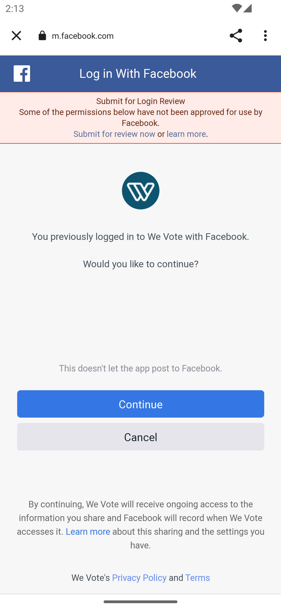

# In Oct 2, 2023 completely rebuilt from scratch

## Pre pod messing around:
```
stevepodell@Steves-MBP-M1-Dec2021 Pods % pwd  
/Users/stevepodell/WebstormProjects/WeVoteCordova copy 2/platforms/ios/Pods
stevepodell@Steves-MBP-M1-Dec2021 Pods % ls -la
total 32
drwxr-xr-x  25 stevepodell  staff   800 Oct  2 11:05 .
drwxr-xr-x  19 stevepodell  staff   608 Oct  2 11:04 ..
-rw-r--r--@  1 stevepodell  staff  6148 Oct  2 11:05 .DS_Store
drwxr-xr-x   5 stevepodell  staff   160 Oct  2 11:05 .idea
drwxr-xr-x   5 stevepodell  staff   160 Aug 13  2022 FBAEMKit
drwxr-xr-x   7 stevepodell  staff   224 Aug 13  2022 FBSDKCoreKit
drwxr-xr-x   5 stevepodell  staff   160 Aug 13  2022 FBSDKCoreKit_Basics
drwxr-xr-x   5 stevepodell  staff   160 Aug 13  2022 FBSDKLoginKit
drwxr-xr-x   5 stevepodell  staff   160 Aug 13  2022 FBSDKShareKit
drwxr-xr-x   5 stevepodell  staff   160 Aug 13  2022 Firebase
drwxr-xr-x   3 stevepodell  staff    96 Aug 13  2022 FirebaseAnalytics
drwxr-xr-x   7 stevepodell  staff   224 Aug 13  2022 FirebaseCore
drwxr-xr-x   6 stevepodell  staff   192 Aug 13  2022 FirebaseCoreDiagnostics
drwxr-xr-x   7 stevepodell  staff   224 Aug 13  2022 FirebaseInstallations
drwxr-xr-x   9 stevepodell  staff   288 Aug 13  2022 FirebaseMessaging
drwxr-xr-x   3 stevepodell  staff    96 Aug 13  2022 GoogleAppMeasurement
drwxr-xr-x   5 stevepodell  staff   160 Aug 13  2022 GoogleDataTransport
drwxr-xr-x   5 stevepodell  staff   160 Aug 13  2022 GoogleUtilities
drwxr-xr-x   4 stevepodell  staff   128 Aug 13  2022 Headers
drwxr-xr-x   2 stevepodell  staff    64 Aug 13  2022 Local Podspecs
-rw-r--r--   1 stevepodell  staff  6038 Aug 13  2022 Manifest.lock
drwxr-xr-x@  4 stevepodell  staff   128 Aug 13  2022 Pods.xcodeproj
drwxr-xr-x   5 stevepodell  staff   160 Aug 13  2022 PromisesObjC
drwxr-xr-x  19 stevepodell  staff   608 Aug 13  2022 Target Support Files
drwxr-xr-x  11 stevepodell  staff   352 Aug 13  2022 nanopb
stevepodell@Steves-MBP-M1-Dec2021 Pods % 
```
## Commands

1652  cordova plugin remove cordova-plugin-firebase-messaging
1653  cordova plugin remove cordova-plugin-firebase-analytics

pod repo update
Edit via buildSymLinks /Users/stevepodell/WebstormProjects/WeVoteCordova/platforms/ios/Podfile to
   platform :ios, '12.0'
stevepodell@Steves-MBP-M1-Dec2021 ios % arch -arm64 pod install --verbose

## For this release

```
   stevepodell@Steves-MBP-M1-Dec2021 Pods % ls -la
   total 8
   drwxr-xr-x  13 stevepodell  staff   416 Oct  3 16:04 .
   drwxr-xr-x  19 stevepodell  staff   608 Oct  3 16:04 ..
   drwxr-xr-x   3 stevepodell  staff    96 Oct  3 16:04 FBAEMKit
   drwxr-xr-x   3 stevepodell  staff    96 Oct  3 16:04 FBSDKCoreKit
   drwxr-xr-x   3 stevepodell  staff    96 Oct  3 16:04 FBSDKCoreKit_Basics
   drwxr-xr-x   3 stevepodell  staff    96 Oct  3 16:04 FBSDKGamingServicesKit
   drwxr-xr-x   3 stevepodell  staff    96 Oct  3 16:04 FBSDKLoginKit
   drwxr-xr-x   3 stevepodell  staff    96 Oct  3 16:04 FBSDKShareKit
   drwxr-xr-x   2 stevepodell  staff    64 Oct  3 16:02 Headers
   drwxr-xr-x   2 stevepodell  staff    64 Oct  3 16:02 Local Podspecs
   -rw-r--r--   1 stevepodell  staff  1183 Oct  3 16:28 Manifest.lock
   drwxr-xr-x@  4 stevepodell  staff   128 Oct  3 16:28 Pods.xcodeproj
   drwxr-xr-x   9 stevepodell  staff   288 Oct  3 16:04 Target Support Files
   stevepodell@Steves-MBP-M1-Dec2021 Pods % 
```


## Oct 3, 2023

1656  cordova platform remove ios android
1657  cordova platform add ios@6.3
1661  cordova platform add android
1662  node buildSymLinks /Users/stevepodell/WebstormProjects/WebApp/build
1663  cd platforms/ios

stevepodell@Steves-MBP-M1-Dec2021 ios % arch -arm64 pod install
Analyzing dependencies
Downloading dependencies
Installing FBAEMKit (16.0.1)
Installing FBSDKCoreKit (16.0.1)
Installing FBSDKCoreKit_Basics (16.0.1)
Installing FBSDKGamingServicesKit (16.0.1)
Installing FBSDKLoginKit (16.0.1)
Installing FBSDKShareKit (16.0.1)
Generating Pods project
Integrating client project
Pod installation complete! There are 4 dependencies from the Podfile and 6 total pods installed.

[!] The `We Vote [Debug]` target overrides the `LD_RUNPATH_SEARCH_PATHS` build setting defined in `Pods/Target Support Files/Pods-We Vote/Pods-We Vote.debug.xcconfig'. This can lead to problems with the CocoaPods installation
- Use the `$(inherited)` flag, or
- Remove the build settings from the target.

[!] The `We Vote [Release]` target overrides the `LD_RUNPATH_SEARCH_PATHS` build setting defined in `Pods/Target Support Files/Pods-We Vote/Pods-We Vote.release.xcconfig'. This can lead to problems with the CocoaPods installation
- Use the `$(inherited)` flag, or
- Remove the build settings from the target.
stevepodell@Steves-MBP-M1-Dec2021 ios % 

1664  cd ../..
1665  node buildSymLinks /Users/stevepodell/WebstormProjects/WebApp/build
"Signing & Capabilities"/Team: "We Vote USA"7

## October 16: Back to Android
All the libs and gradle links were messed up
Converted project to gradle wrappers (which seems temporary, and is not saved in config)

## Oct 23, 2023 Android
1) Minimum supported Gradle version is 8.0. Current version is 7.5.1.
Settings/Build, Execution, Deployment/Use Gradle from 
   Specified location
      /opt/homebrew/Cellar/gradle/8.4/libexec
Sync Project with Gradle Files

## Oct 24, 2023 iOS
Minimum supported version problem so
1404  cordova platforms remove  ios
1405  cordova platforms add ios@7.0.1 
run build symlinks to update version
cd platforms/ios
arch -arm64 pod install
Added preference name="deployment-target" value="15.0" />
Compiles and buildSymLinks fine
but still give missing symlink to index.html

## Oct 24, 2023 Android
Updated
   1477  cordova plugin rm cordova-plugin-screen-orientation
   1478  cordova plugin add cordova-plugin-screen-orientation
   1489  cordova plugin rm cordova-plugin-device
   1490  cordova plugin add cordova-plugin-device

Needed to manually copy in an old version of google-services.json
window.cordova.getappversion is not working

Removed 3 obsolete or broken plugins:
Plugin doesn't support this project's cordova-android version. cordova-android: 12.0.1, failed version requirement: >=4.0.0 <10.0.0
Skipping 'cordova-plugin-whitelist' for android

Plugin doesn't support this project's cordova-android version. cordova-android: 12.0.1, failed version requirement: <9.0.0
Skipping 'cordova-support-google-services' for android
   DEPRECATION NOTICE: no longer needed. Use preference GradlePluginGoogleServicesEnabled for cordova-android version 9 or higher.

Plugin stopped working and was deprecated cordova-plugin-app-version
Replaced with some scripting in bldSrcCordova

## Nov 1, 2023
No longer works for iOS and Android
stevepodell@Steves-MBP-M1-Dec2021 WeVoteCordova % cordova plugin rm cordova-plugin-splashscreen


## Nov 8, 2023
Needed for Android  https://developers.facebook.com/docs/android/troubleshooting/#faq_267321845055988
    <queries>
        <provider android:authorities="com.facebook.katana.provider.PlatformProvider" /> <!-- allows app to access Facebook app features -->
        <provider android:authorities="com.facebook.orca.provider.PlatformProvider" /> <!-- allows sharing to Messenger app -->
        <package android:name="com.facebook.katana" />
    </queries>
Needs Dale to do a Business Verification to get rid of 




## Nov 13, 2023
/Users/stevepodell/Library/Android/sdk/platform-tools/adb shell dumpsys package queries | grep facebook

### Update to the latest FB SDK
cordova plugin add cordova-plugin-facebook-connect --save --variable APP_ID="1097389196952441" --variable APP_NAME="WeVoteCordova" --variable FACEBOOK_ANDROID_SDK_VERSION="16.0.0"

Still no resolution to the "Apps that target Android API 30+ (Android 11+) cannot call Facebook native apps unless the package visibility needs are declared." problem

Opened an issue for the plugin, which is getting 3800 weekly downloads, but no maintenance since Sept 17, 2021 
https://github.com/cordova-plugin-facebook-connect/cordova-plugin-facebook-connect/issues/139

