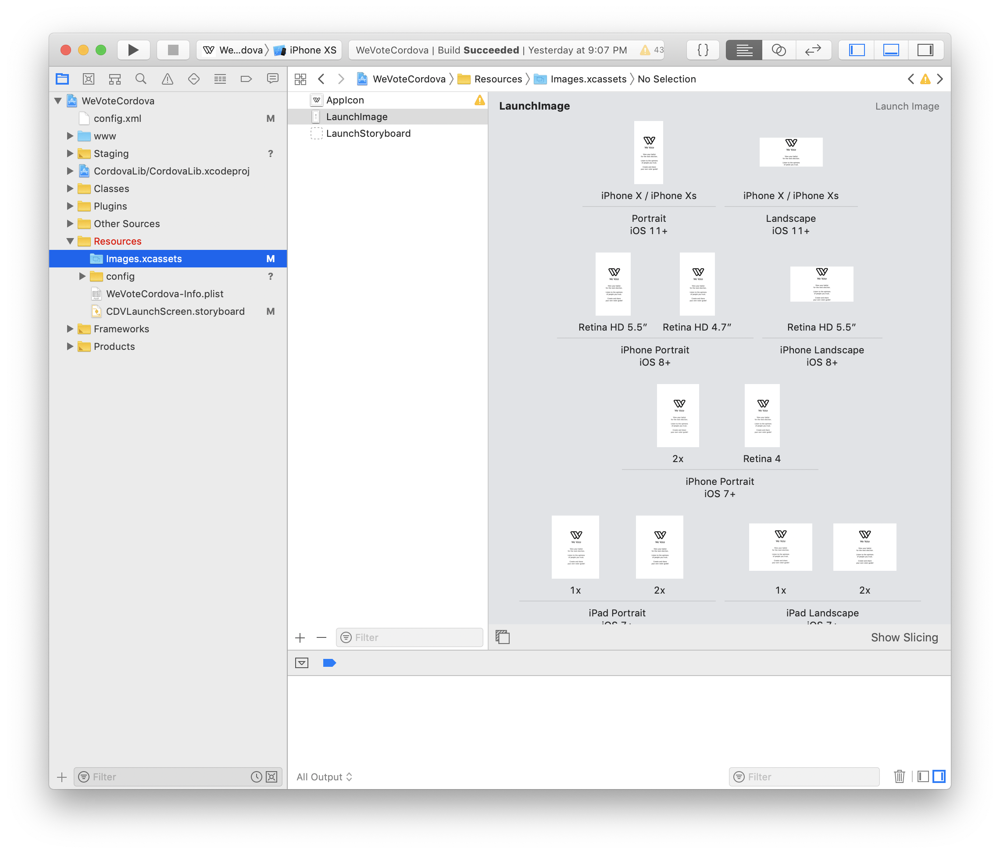

# Updating Splash Screens and We Vote Icons to new artwork

With new artwork in hand, you need to update the icons and splash screens...

iOS and Android deal with these differently.  In Xcode for iOS, once you have been given the new artwork, and have duplicated, sized
and cropped them correctly to match the old sizes, just drag them from your IDE or from Finder to the correct frames in Xcode.  



Xcode doesn't tell you on that screen what size image goes in each frame, so I often just drag any image into the frame and
look at the yellow warning sign to see what image size it expected.

Getting to the same result for Android requires a bunch of manual operations -- when you are done the new images will display correctly in
the simulators and in the production apps on phones and tablets....

[Android Screen sizes](https://github.com/phonegap/phonegap/wiki/App-Splash-Screen-Sizes)

## Resizing and duplicating

There are websites that do some of this for you: you pass in the high res image, and they give you a zip file with all the 
different sized icons, but I don't use them anymore, they never seem to have the sizes for the latest Apple devices, and you end up doing
almost as much manual work.

The Photoshop file for the splash screen is at res/screen/ios/LoadingScreen-Mobile-2400x2400.  The file res/screen/ios/LoadingScreen-Mobile-2400x2400.png
was exported from Photoshop as a super high resolution png for resizing -- next time we should output it at 2500x2500 so we never have
to upsize an image (upsized images always look a little fuzzy).  I did all the cropping and downsizing with Apple's Preview app, 
it is easy to use, and does a great job, although I wish it had on-screen guides to indicate the center.

For Icons, I find the latest SVG for the icon, somewhere in the webapp (WebApp/src/img/global/svg-icons/we-vote-icon-square-2k-black.png), 
load it into Photoshop, and output it as a PNG at the highest resolution that I will need.  For this last run it was 1024 x 1024 
as required for the Apple App Store submission, all the other icons were made by downscaling them in the built-in MacOS Preview app 
(which provides image viewing, scaling, and cropping).

All the icons for iOS and Android start off in res/icon/ios (yes even the ones for Android!  It is just easier to have them
in one place, and you end up making fewer unneeded duplicates.)

Get all the files duplicated, sized, and cropped as you will need them.  Replace all the existing files in the `res/icon/ios`, 
the `res/screen/android` and the `res/screen/ios` directories with your work derived from the latest artwork.  Then copy 
the Android files to the locations that a `cordova add android` would place them for a new install.  To copy them, open a
terminal window to the `WeVoteCordova` directory and execute the following commands:

```
  cp res/screen/android/screen-hdpi-landscape.png latforms/android/app/src/main/res/drawable-land-hdpi/screen.png
  cp res/screen/android/screen-ldpi-landscape.png platforms/android/app/src/main/res/drawable-land-ldpi/screen.png
  cp res/screen/android/screen-mdpi-landscape.png  platforms/android/app/src/main/res/drawable-land-mdpi/screen.png
  cp res/screen/android/screen-xdpi-landscape.png platforms/android/app/src/main/res/drawable-land-xhdpi/screen.png
  cp res/screen/android/screen-xxhdpi-landscape.png platforms/android/app/src/main/res/drawable-land-xxhdpi/screen.png
  cp res/screen/android/screen-xxxhdpi-landscape.png platforms/android/app/src/main/res/drawable-land-xxxhdpi/screen.png
  cp res/screen/android/screen-hdpi-portrait.png platforms/android/app/src/main/res/drawable-port-hdpi/screen.png
  cp res/screen/android/screen-ldpi-portrait.png platforms/android/app/src/main/res/drawable-port-ldpi/screen.png
  cp res/screen/android/screen-mdpi-portrait.png platforms/android/app/src/main/res/drawable-port-mdpi/screen.png
  cp res/screen/android/screen-xdpi-portrait.png platforms/android/app/src/main/res/drawable-port-xhdpi/screen.png
  cp res/screen/android/screen-xxhdpi-portrait.png platforms/android/app/src/main/res/drawable-port-xxhdpi/screen.png
  cp res/screen/android/screen-xxxhdpi-portrait.png platforms/android/app/src/main/res/drawable-port-xxxhdpi/screen.png
  cp res/icon/ios/WeVoteAppIcon-72.png platforms/android/app/src/main/res/mipmap-hdpi/icon.png
  cp res/icon/ios/WeVoteAppIcon-36.png platforms/android/app/src/main/res/mipmap-ldpi/icon.png
  cp res/icon/ios/WeVoteAppIcon-48.png platforms/android/app/src/main/res/mipmap-mdpi/icon.png
  cp res/icon/ios/WeVoteAppIcon-96.png platforms/android/app/src/main/res/mipmap-xhdpi/icon.png
  cp res/icon/ios/WeVoteAppIcon-144.png platforms/android/app/src/main/res/mipmap-xxhdpi/icon.png
  cp res/icon/ios/WeVoteAppIcon-192.png platforms/android/app/src/main/res/mipmap-xxxhdpi/icon.png
```

That completes the updating of the icons and splash screens for WeVoteCordova.

-------

**[Return to the WeVote Cordova home documentation page ](/README.md)**
