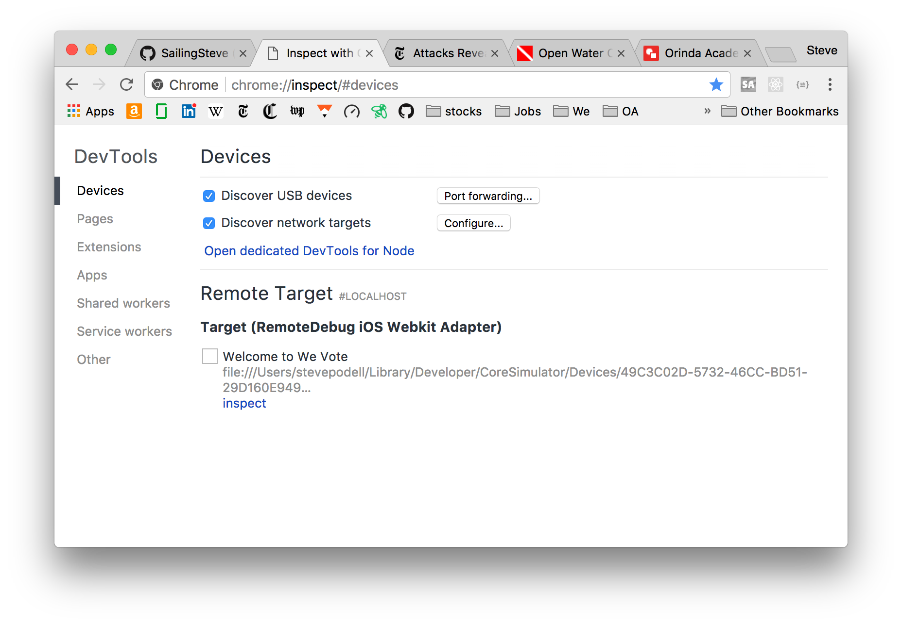
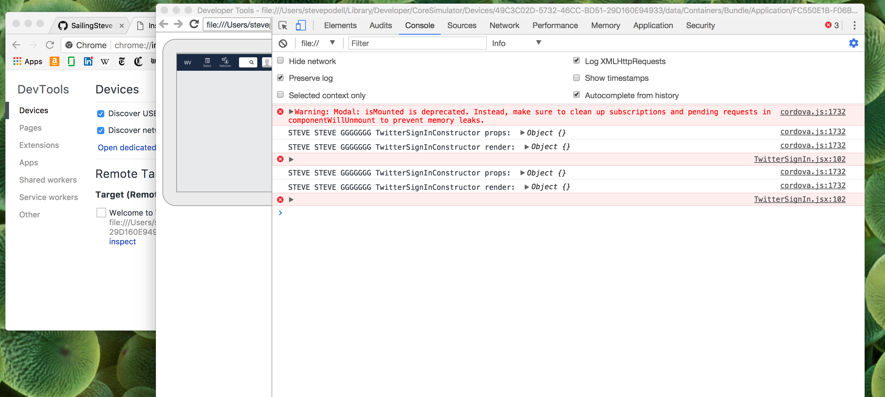
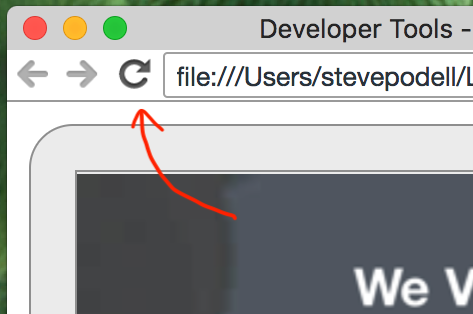

## Debugging Cordova Apps with the Chrome dev tools

The Safari debugger has improved tremendously over the last two years, and is now comparable to the Chrome 
dev tools. I don't think there's any reason anymore to go through all this set up to use the chrome tools, 
but if you really want to use Chrome, these are the instructions.

Chrome devtools is a bit challenging to get working. See ...

[medium.com article about the remotedebug-ios-webkit-adapter for debugging WebViews](https://medium.com/@auchenberg/hello-remotedebug-ios-webkit-adapter-debug-safari-and-ios-webviews-from-anywhere-2a8553df7465)

[github.com readme about remotedebug-ios-webkit-adapter#getting-started](https://github.com/RemoteDebug/remotedebug-ios-webkit-adapter#getting-started)

Install the remotedebug_ios_webkit_adapter (from a terminal window):

    brew update
    brew install --HEAD libimobiledevice
    brew install --HEAD ios-webkit-debug-proxy
    npm install remotedebug-ios-webkit-adapter -g

Run the remotedebug_ios_webkit_adapter:

    (WebAppEnv)Steves-iMac:WeVoteCordova your-username$ remotedebug_ios_webkit_adapter --port=9000
    remotedebug-ios-webkit-adapter is listening on port 9000
    iosAdapter.getTargets
    iosAdapter.getTargets
    iosAdapter.getTargets
    ...

You may have to restart the remotedebug_ios_webkit_adapter from time to time, to get the
`chrome://inspect/#devices` to see the simulator processes.

After starting the remotedebug_ios_webkit_adapter (hopefully on the first attempt) when you navigate in the Google Chrome
browser to `chrome://inspect` you will see the following screen, with the process to debug on the
list below:

  
Press that little blue 'inspect' to open the debugger, which should look like the following:

If `chrome://inspect` doesn't list your target, then try restarting remotedebug_ios_webkit_adapter and maybe restarting
your Cordova app via Xcode.  This is imperfect, but not too bad once you get the hang of it.

Unfortunately in both the Apple and Chrome debuggers, breakpoints are not maintained between restarts
of the app via Xcode, and also the files where you want to put the breakpoints have to be reopened each time.  (This deficiency
is not the case in React-Native, so hopefully a fix will arrive some day.)

Press ⌘+P to bring up the list of recently opened files -- this can save you a bunch of clicks.

In spite of the previous problem, it is possible to debug a startup behaviour, one that would fly past before you could set the first 
breakpoint -- on the upper left  corner of the chrome debugger, there is a "circular arrow, 
reload button" (see the following image) that will allow you to restart the app within the Chrome Inspector while maintaining
the current breakpoints.

