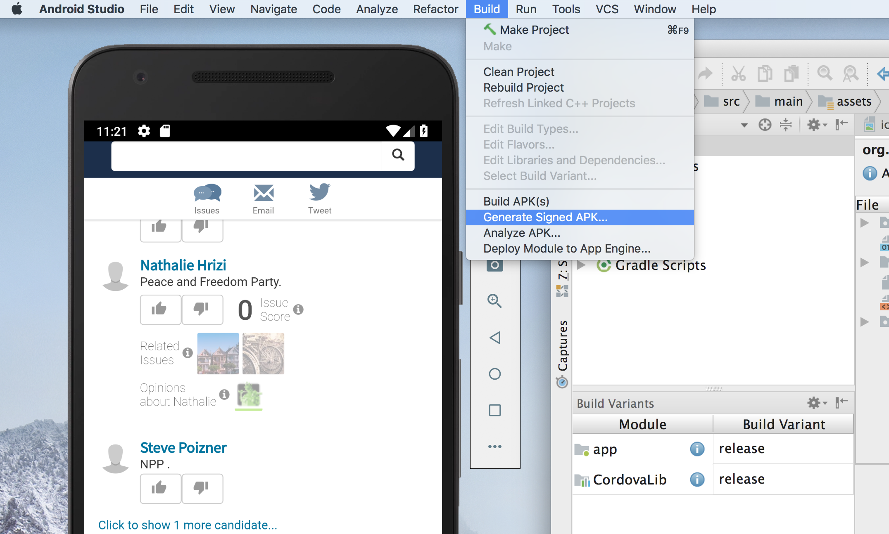
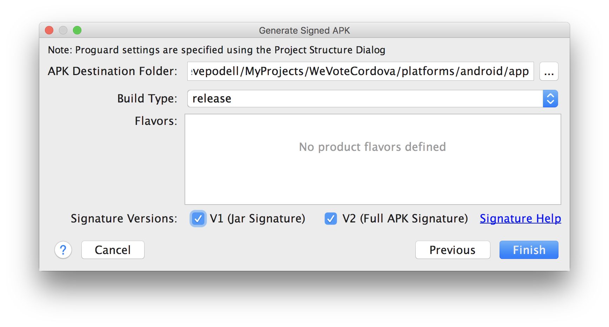
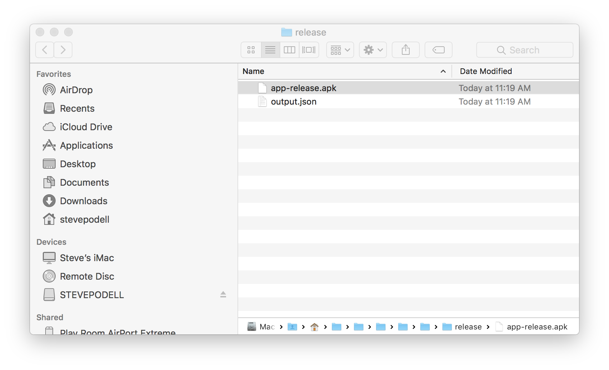

## Making an Android release

1. Test and complete your new version
    1. Test on the "AVD" Simulators
        1. On a common phone like Google's Nexus 6, or one of the lastest Samsung or Motorola phones
        1. Test on an Android tablet, like Google's Nexus 10
    1. Get access to a current Android device and test on it.  You can just plug it in with a USB cable.  Unlike Apple, the Android 
    manufacturers have little incentive to keep their old phones, current with the latest OS.  So phones probably become out of date 
    for andorid testing in a year or so.  I hear that Google's nexus phones are upgradeable, and one might be available used.

1. Bump the android release version number in ```platforms/android/app/src/main/AndroidManifest.xml```

   On the line that says something like...
   
   ```<manifest android:hardwareAccelerated="true" android:versionCode="100001" android:versionName="1.0.3" package="org.wevote.cordova" xmlns:android="http://schemas.android.com/apk/res/android">```
   
   Increment the `android:versionCode` by one, and update the `android:versionName` as desired (this usually should be the same
    as the new iOS release name that we are releasing at the same time).

1. Make sure your changes are in a pull request against the WeVoteCordova project, and ideally merged!

1. Generate an APK (a file that contains the entire app).  Our first APK was 6.6 MB is size.


1. Get the signing certificate and access to the WeVote Android developer account from Dale McGrew

1. Make sure your build Variants are set to release
1. Generate a Signed APK (Make sure both the V1 and the V2 Signature Versions are checked!)


1. After the signing and building 


1. Press the locate button in the Event Log, which reveals the app in finder


1. Navigate to the [Google Play Console](https://play.google.com/apps/publish/?account=5667543967745776856#AppListPlace), 
and login

    
    Drag the APK file to the browser "BROWSE FILES" pane on the https://play.google.com/apps/publish/  "Google Play", "App Releases" tab, which uploads the file to Google.

1. Finally update any marketing documentation on https://play.google.com/apps/publish/ and type in a brief release note
in the English section of the "What's new in this release?" pane.

1. Review then publish


----------
## Next Step:

**[Return to the WeVote Cordova home documentation page ](/README.md)**

----------
## Other documentation pages:


**[Setting up your Computer for Android Development](AndroidSetup.md)**

**[Making an iOS Release](MakingAniOSrelease.md)**

**[Making an Android Release](MakingAnAndroidRelease.md)**

**[Cordova JavaScript Differences](CordovaJavaScriptDifferences.md)**

**[Testing with localhost from an actual phone](TestingWithLocalHostFromPhone.md)**

