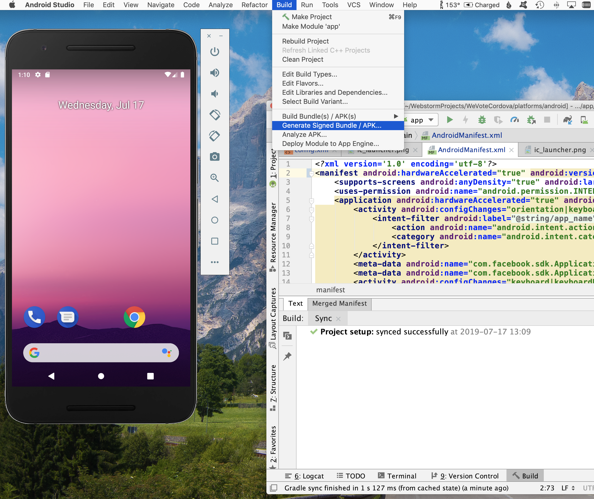
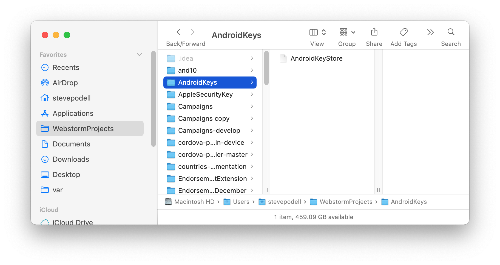
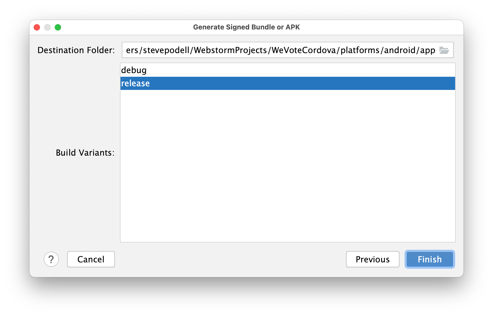
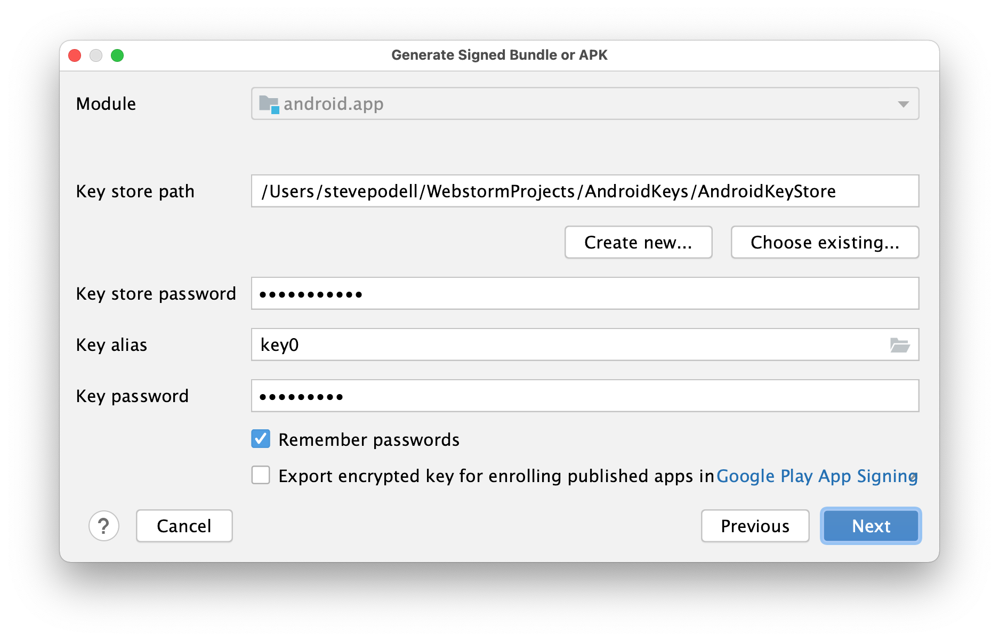
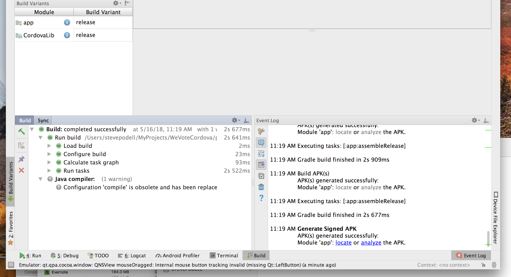
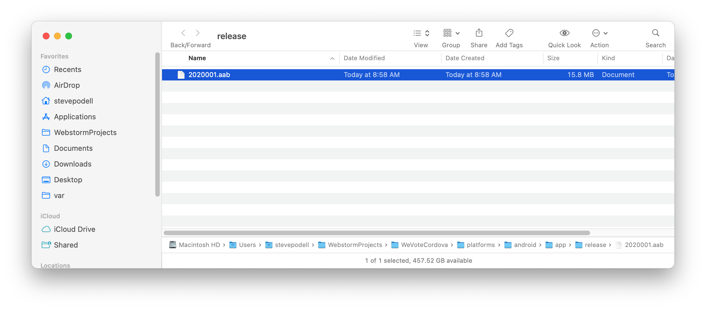
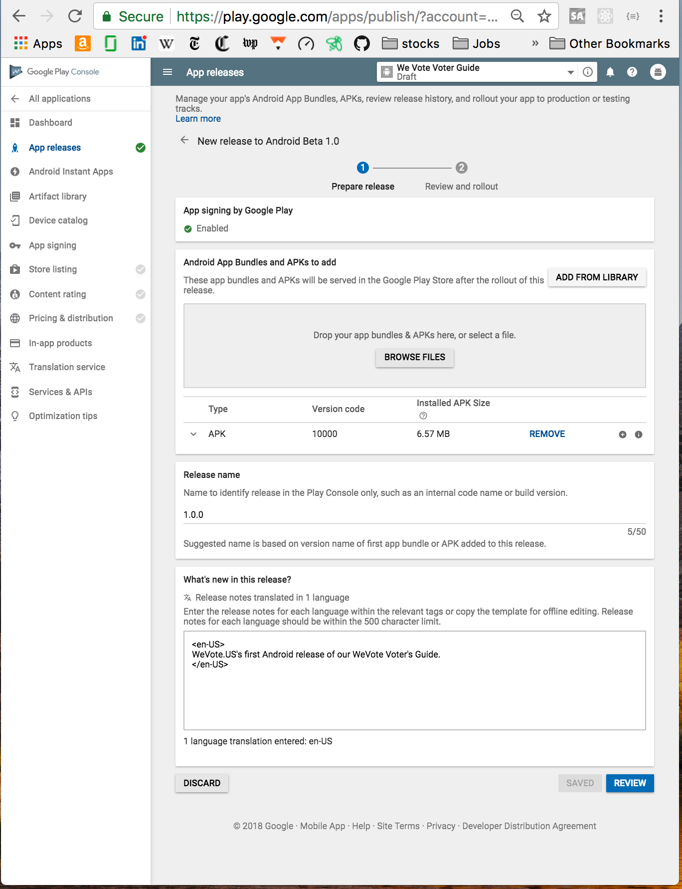

# Making an Android release

1. Test and complete your new version
    1. Test on the "AVD" Simulators
        1. On a common phone like Google's Nexus 6, or one of the latest Samsung or Motorola phones
        1. Test on an Android tablet, like Google's Nexus 10
    2. Get access to a current Android device and test on it.  You can just plug it in with a USB cable.  Unlike Apple, the Android 
    manufacturers have little incentive to keep their old phones, current with the latest OS.  So phones probably become out of date 
    for android testing in a year or so.  2021:  I found a very nice current model Samsung Galaxy A11 on Amazon for $69, it comes configured for Tracfone, but 
    there is no need to activate its cell services, and it works fine as a WIFI only device.

2. Bump the android release version number in `config.xml`

   The beginning of the config.xlm file will look something like this.
   ```
    <widget
      android-versionCode="2030104"
      id="org.wevote.cordova"
      ios-CFBundleVersion="2.3.1.7"
      version="2.3.1"
   ```
   The version number is the release version and is shared by the iOS and Android release, if you need to add a point release 
   (like 2.3.2 for this examole) increase the version line, no need to change the `ios-CFBundleVersion` for an Android release. 
   Most importantly change the `android-versionCode` -- No decimal points are allowed, so leave zeros to fill the spaces, 2.3.1 bundle 4 becomes 2030104.

3. Then at the command line type
    ```
    cordova platform remove ios android
    cordova platform add ios android
    node buildSymLinks /Users/stevepodell/WebstormProjects/WebApp/build
   ```
   This seems like a bit of overkill, but only takes a minute, and gets those new version numbers you created into all the generated Android intermediate files.

4. Make sure your changes are in a pull request against the WeVoteCordova project, and ideally merged!

5. Generate a signed "Android App Bundle" an AAB file (a file that contains the entire app, with duplicate code removed).  Bundles are about half the
size of the prior packaging output file (the APK).  AAB files are preferred for releases to the Google Play Store.  Sometimes ABB files error out, and can't be built without a big exploratory effort, it is perfectly ok to build a signed APk instead, and Google Play will accept them.


6. Get the signing certificate (AndroidKeyStore file) and access to the WeVote Android developer account from Dale McGrew.  On my machine it is stored here:


7. Make sure your build Variants are set to release


8. Generate a Signed Bundle (aab)


9. After the signing and building, a pop-up will appear that allows you to locate the `app-release.aab` file (the bundle).
 
  If that pop-up disappears before you can "locate" the build, you can rebuild the app, and watch more carefully for the appearance pop-up.

   My app ended up at `/Users/stevepodell/WebstormProjects/WeVoteCordova/platforms/android/app/release`
11. Navigate to the [Google Play Console](https://play.google.com/apps/publish/?account=5667543967745776856#AppListPlace), 
and login

    
     Drag the AAB file to the browser "BROWSE FILES" pane on the https://play.google.com/apps/publish/  "Google Play", "App Releases" tab, which uploads the file to Google.

12. Finally, update any marketing documentation on https://play.google.com/apps/publish/ and type in a brief release note
in the English section of the "What's new in this release?" pane.

13. Possible new step, August 2022:
     1. cd to the directory that contains the apk
     2. 'cd /Users/stevepodell/WebstormProjects/WeVoteCordova/platforms/android/app/build/outputs/apk/debug'
     3. run  `stevepodell@StevesM1Dec2021 debug % keytool -list -v -keystore ~/.android/debug.keystore -alias androiddebugkey -storepass android -keypass android`
     ```
    stevepodell@StevesM1Dec2021 apk % cd /Users/stevepodell/WebstormProjects/WeVoteCordova/platforms/android/app/build/outputs/apk/debug
    stevepodell@StevesM1Dec2021 debug % ls
    app-debug.apk           output-metadata.json
    stevepodell@StevesM1Dec2021 debug % keytool -list -v -keystore ~/.android/debug.keystore -alias androiddebugkey -storepass android -keypass android
    Alias name: androiddebugkey
    Creation date: Sep 29, 2017
    Entry type: PrivateKeyEntry
    Certificate chain length: 1
    Certificate[1]:
    Owner: C=US, O=Android, CN=Android Debug
    Issuer: C=US, O=Android, CN=Android Debug
    Serial number: 1
    Valid from: Fri Sep 29 18:28:57 PDT 2017 until: Sun Sep 22 18:28:57 PDT 2047
    Certificate fingerprints:
    SHA1: 67:25:62:FE:33:8E:FB:36:3B:DF:D2:AB:62:00:A1:65:C9:07:3F:28
    SHA256: 04:1F:E1:F5:EB:E9:98:91:88:68:95:1A:8B:2A:D5:09:A7:80:58:59:25:4B:0A:54:4B:DB:FB:42:0B:1C:26:59
    Signature algorithm name: SHA1withRSA (weak)
    Subject Public Key Algorithm: 1024-bit RSA key (weak)
    Version: 1
    
    Warning:
    The certificate uses the SHA1withRSA signature algorithm which is considered a security risk. This algorithm will be disabled in a future update.
    The certificate uses a 1024-bit RSA key which is considered a security risk. This key size will be disabled in a future update.
    The JKS keystore uses a proprietary format. It is recommended to migrate to PKCS12 which is an industry standard format using "keytool -importkeystore -srckeystore /Users/stevepodell/.android/debug.keystore -destkeystore /Users/stevepodell/.android/debug.keystore -deststoretype pkcs12".
    stevepodell@StevesM1Dec2021 debug %
    ```
    3. Copy the `SHA1` fingerprint number (in this example 67:25:62:FE:33:8E:FB:36:3B:DF:D2:AB:62:00:A1:65:C9:07:3F:28)
    and pasted it into a hash generator like http://tomeko.net/online_tools/hex_to_base64.php
    4. Which creates a base64 output like `eBPVt+ilY1ebD7OxGCpOA4itNTg=`
    5. Open `https://developers.facebook.com/apps/1097389196952441/settings/basic/` -- settings, then basic.  Scroll to the bottom and add the new
    hash to the Android, Key hashes list.
    6. This (should) allow Sign in with Facebook, to complete on Android.


13. Review, then publish

## Making an APK for Saucelabs testing

The build process in Android Studio, can also be used to build an APK file -- the one you upload to Saucelabs for testing,
it is located at 

    WeVoteCordova/platforms/android/app/build/outputs/apk/debug/app-debug.apk

----------
## Next Step:

**[Return to the WeVote Cordova home documentation page ](/README.md)**

----------
## Other documentation pages:


**[Making an iOS Release](MakingAniOSrelease.md)**

**[Setting up your Computer for Android Development](AndroidSetup.md)**

**[Cordova JavaScript Differences](CordovaJavaScriptDifferences.md)**

**[Testing with localhost from an actual phone](TestingWithLocalHostFromPhone.md)**

