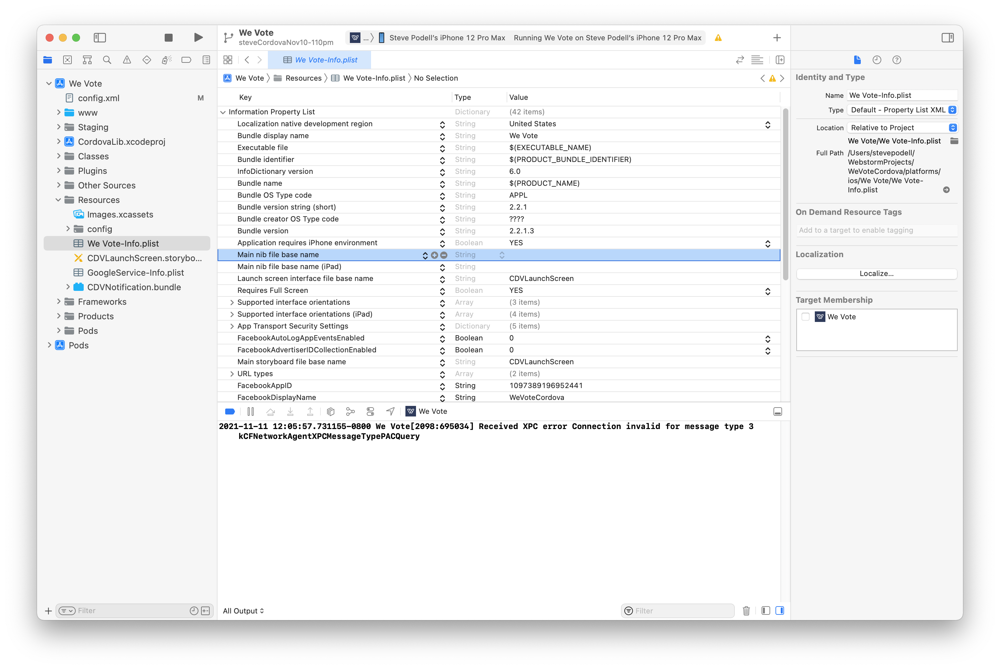
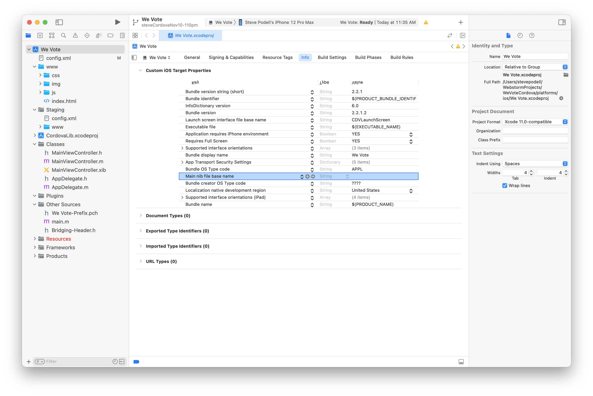
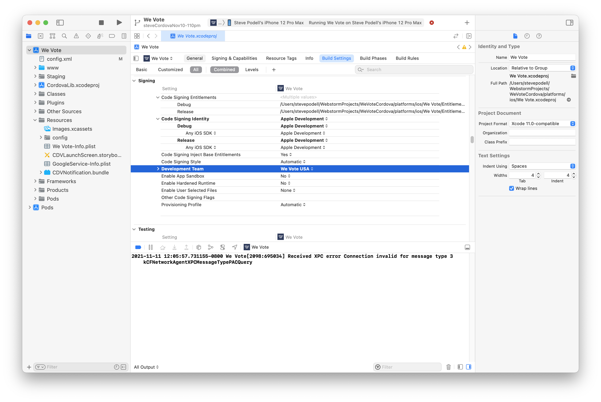

# Making an iOS release

1. After testing,and making your React changes in the WebApp, check in those changes and prepare (ideally) to build from a fully 
up-to-date WebApp develop.  Compile the WebApp with `npm run buildCordova` to build a single bundle.js with all of the lazy loading removed.

2. Your WebApp config.js, should look like this:
    ```
    module.exports = {
      WE_VOTE_URL_PROTOCOL: "https://",  // "http://" for local dev or "https://" for live server
      WE_VOTE_HOSTNAME: ""WeVote.US",  // This should be without "http...". This is "WeVote.US" on live server.
    
      WE_VOTE_SERVER_ROOT_URL: "https://api.wevoteusa.org/",
      WE_VOTE_SERVER_ADMIN_ROOT_URL: "https://api.wevoteusa.org/admin/",
      WE_VOTE_SERVER_API_ROOT_URL: "https://api.wevoteusa.org/apis/v1/",
    
      DEBUG_MODE: false,
    
      // Use 1 or 0 as opposed to true or false
      test: {
        use_test_election: 0,
      },
    
      location: {
        text_for_map_search: "",
      },
    
      FACEBOOK_APP_ID: "<the actual number that you got from Dale>",
    
      STRIPE_API_KEY: "<the production 'pk_live_...' api key from Dale.  NOT the test 'pk_test_...'>",
    };
    ```

    
    Be sure to double check that you are using these production config values, it
    would be difficult (but possible) to detect a misconfiguration while testing.

3. In the WebApp 'npm run buildCordova', to update the build directory and to create the the WebApp `bundle.js`

4. On WeVoteCordova side,on the Target General Properties tab, make sure the build has been incremented by one.
   In config.xml the second line ...
    `<widget android-versionCode="2020001" id="org.wevote.cordova" ios-CFBundleVersion="2.2.1.3" version="2.2.1" xmlns="http://www.w3.org/ns/widgets" xmlns:cdv="http://cordova.apache.org/ns/1.0">`
   has the iOS release version (in this case 2.2.1), and the iOS build number (in this case 2.2.1.3).  You will probably go through multiple builds uploaded to Test Flight
   before you are ready to release to the App Store, so keep incrementing that build number each time.
   Note:  The info in config.xml is only loaded into Xcode when you run "cordova platform add ios", so changes that you make to versions in the Xcode ide will have to be manually entered in config.xml

   
    
   Be sure to check in the changes to config.xml every time you make a release, by commiting your changes
   in WeVoteCordova to git.  When you do check it it, please include a reference to the WebApp
   Git commit that resulted in the `bundle.js`

6. Before checking in WeVoteCordova, test on a simulator for both an iPhone and iPad.

7. November 2021:  Remove the two "Main nib file base name" fields

    Navigate to the Info tab in the Xcode ide (this edits the Info.plist file behind the scenes).
   
    Select the "Main nib file base name (iPad)" entry, then press the little '-' sign to remove this entry.
   
   Select the "Main nib file base name" entry, then press the little '-' sign to remove this entry.

8. Build a release candidate in Xcode 

   * You will need a physical iPhone plugged into your computer via a USB cable (It is possible that an iPad or iPod touch would work for this purpose.)  Make sure the iPhone is not asleep.
   * Your build target should be set to 'We Vote > Any iOS Device (arm64)'
   * The phone will have to be registered with Apple in order for Xcode to sign the app.
   * Make sure the config.xml setting for `<name>We Vote</name>` had made it into the settings in Xcode, if not correct change "General" > "Identity" > "Display Name" to "We Vote" (instead of "WeVoteCordova")
   * Make sure your "Signing and Capabilities" 
     * Team is "We Vote USA"
     * Bundle identifier is "org.wevote.cordova"
     * Provision Profile is "Xcode Managed Profile"
     * Signing Certificate: "Apple Development: Dale McGrew"
   * Make sure your "Build Settings" "Signing" "Code Signing Identity" is set to "Apple Development"
     * 
   * Clean the build dir, to guarantee all the config is applied, in Xcode via Product > Clean Build Folder
   * Then build the release candidate, in Xcode via Product > Archive (Takes a few minutes)
     * Then press Distribute App (if the build succeeded)
     * Select "App Store Connect" and press Next
     * Now [unplug your iPhone](https://stackoverflow.com/questions/35047557/unable-to-upload-app-to-itunes-connect-itunes-store-operation-failed-authenti) from the USB cable
     * Select "Upload" and press Next
     * For App Store Connect Distribution options (Accept all defaults) Press Next
     * Select "Automatically manage signing" (Accept default) and press Next  (and it prepares the Archive for distribution)
     * Look  at "Review We Vote.ipa content:" and press Upload  (and it takes a few minutes to upload)
       

 


 
  * After upload, it could take a half hour for the build to appear on itunes connect, and then
the build could be "Processing" for another half hour.  Refreshing the page could make the "processing" build disappear, but it
is still processing, and will reappear when done.  
You may have to refresh to confirm that it is done processing, and probably shows "Missing Compliance"
as its status.)

   
   iTunes Connect Processing

5.  Wait for the build to appear
When processing is done, the build will be in the "Missing Compliance" state, clikc on the build number link, 
to "Provide Export Compliance Information"  Click on the "Provide Export Compliance Information" button

   * Have you added or made changes to encryption features since your last submission of this app? **NO**
   * Proceed to "Start Internal Testing"

6. Test in TestFlight
    After compliance is done, and you have proceeded to internal testing, it take can a minute to an hour for the app build
    to be available on the "iOS Builds" list in TestFlight.  Then a minute to an hour for the app to be available to test
    on your iPhone via the TestFlight app.

      

7. Finally submit for review in iTunesConnect
    Submit it for TestFlight
    
    Test it on TestFlight (the app might rejected if Apple does not see any
    evidence of testing, ideally by multiple users).

8.  Once testing is complete, submit it for "Review"

## Making an IPA file for Saucelabs testing

See the [SauceLabs instructions for creating an IPA file](https://wiki.saucelabs.com/display/DOCS/Creating+an+ipa+File)

----
Next Steps:

**[Return to the WeVoteCordova home documentation page ](/README.md)**

**[On to the Making an Android Release page](MakingAnAndroidRelease.md)**
