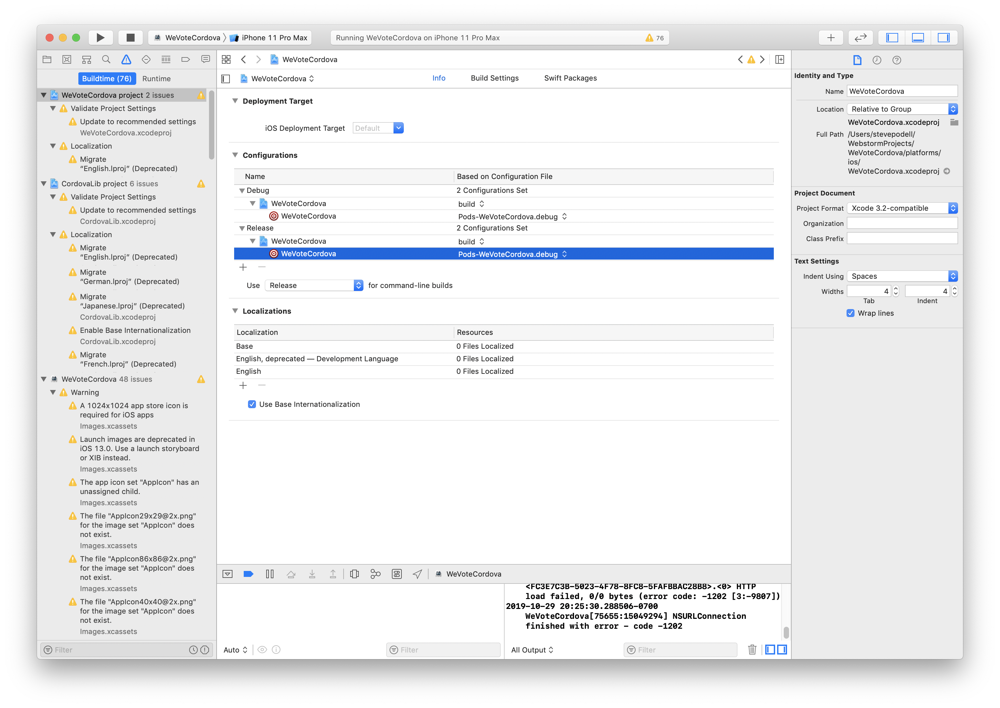
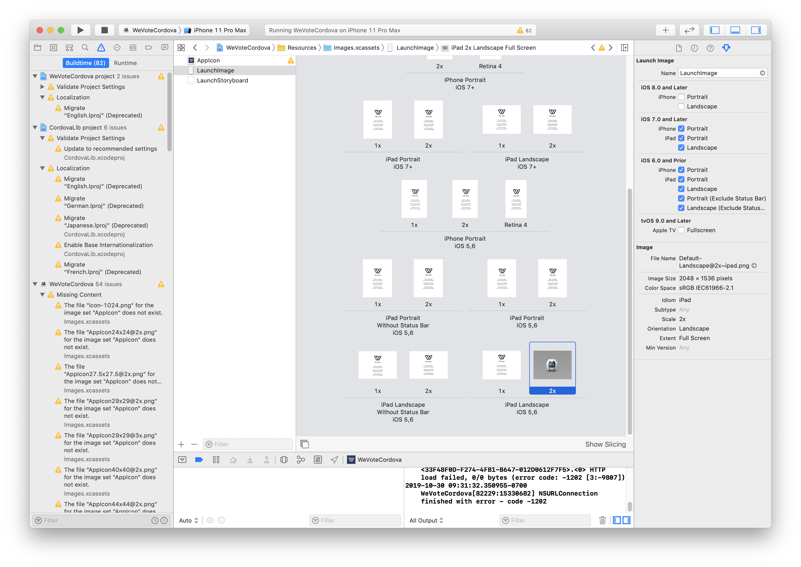
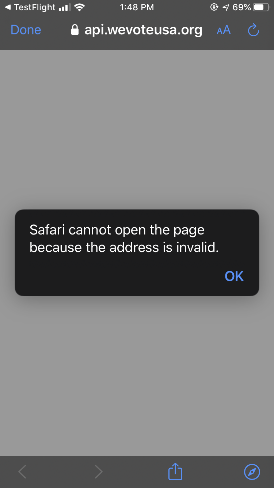
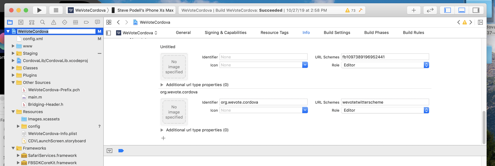

This is really just a list of strange things that happen at install
or upgrade, and the fixes that allowed me to proceed -- Sometimes the
same problem appears months later (as a result of a intentional Cordova plugin upgrade), mostly at upgrade time.

1) In Xcode, 'sandbox is not in sync'
    diff: /../Podfile.lock: No such file or directory
    diff: Manifest.lock: No such file or directory error: 
    The sandbox is not in sync with the Podfile.lock. Run 'pod install' or update your CocoaPods installation.`
https://stackoverflow.com/questions/17072396/cocoapods-errors-on-project-build


On Nov 2, 2019 this was solved by making sure that the installed Cordova cli was at version 9, and all of the
plugin versions (that seem to have default values in the cli), were updated to the current versions,
especially "cordova-plugin-facebook4" for ios.
```
Steves-MacBook:WeVoteCordova stevepodell$ cordova -v
9.0.0 (cordova-lib@9.0.1)
Steves-MacBook:WeVoteCordova stevepodell$ 
```

2) Sometimes you lose the Launch Images and AppIcon settings
Open the Images.xcassets in Xcode, and
drag the images from your IDE or Finder to the Xcode IDE.  Clicking on
the missing icon/launch image shows which size is needed.


3) /Users/stevepodell/WebstormProjects/WeVoteCordova/platforms/ios/WeVoteCordova/Plugins/cordova-plugin-facebook4/FacebookConnectPlugin.h:13:9: **'FBSDKCoreKit/FBSDKCoreKit.h' file not found**

4) Starting with Xcode 8 you should use --codeSignIdentity="iPhone Developer" both for debug and release.
https://cordova.apache.org/docs/en/latest/guide/platforms/ios/index.html#project-configuration

5) Twitter sign on stops working with a "Safari cannot open page error" with the URL showing api.wevote.org

This means that the twitter scheme is no longer registered in XCode.  Make sure the settings for 
both Twitter and Facebook match what is in the following picture:



### Updating compiled c++ libraries like cordova-plugin-facebook4
**This may no longer be necessary with Cordova cli V9, but saving these notes just in case.**

This is very ugly, and not necessarily a straight path to the end goal.  Make a full copy of your WeVoteCordova directory in finder before
proceeding, so you can always do a binary exact fallback, and to compare as you make changes.
* If you are the first one making the change, and you will be checking in your results, you will need to ...
  * `cd WeVoteCordova/platforms`
  * `cordova platform remove ios`
  * `cordova platform add ios`
  * Remove and re-add the plugin` cd WeVoteCordova/platforms/ios`
    1) `cordova plugin remove cordova-plugin-facebook4`
    1) `cordova plugin add cordova-plugin-facebook4 --save --variable APP_ID="1097389196952441" --variable APP_NAME="WeVoteWebApp"`
       1) You many have to manually remove `platforms/android/app/src/main/res/values/facebookconnect.xml` to do the add.
       1) Another reminder: **you need to open WeVoteCordova.xcworkspace** (not WeVoteCordova.xcodeproj) so both our Cordova app project and the Pods project will be loaded into Xcode.
    1) `sudo gem install cocoapods`  (update to the latest version of the CocoaPod package manager)
    1) `pod repo update`  (update the Cocoapod repository -- this can take 20 minutes to complete!)
    1) `sudo gem install cocoapods-dependencies`
    1) `pod dependencies` (To sconfirm that 'Bolts' and the 3 FB SDK libaries are dependencies)
    1)  `pod update`
    1)  cd to `WeVoteCordova/platforms/ios/www` and rebuild all your symlinks as described above 
* Yuck: see [Facebook Requirements and Set-Up iOS](https://github.com/jeduan/cordova-plugin-facebook4/blob/master/docs/ios/README.md)

### Moving the spinner upwards on the iOS Splash screen and changing it from grey to white:  Manual step required

In the non-source controlled file `/Users/your-username/MyProjects/WeVoteCordova/platforms/ios/WeVoteCordova/Plugins/cordova-plugin-splashscreen/CDVSplashScreen.m` 
change the line at about line 102:

<!-- 
July 2019:  Don't do this for now, since we now have a white background to the splash screen (again).
two lines.  The first at about line 84:

    UIActivityIndicatorViewStyle topActivityIndicatorStyle = UIActivityIndicatorViewStyleGray;
to

    UIActivityIndicatorViewStyle topActivityIndicatorStyle = UIActivityIndicatorViewStyleWhite;

The second at about line 102:
-->

    _activityView.center = CGPointMake(parentView.bounds.size.width / 2, parentView.bounds.size.height / 1 );
to

    _activityView.center = CGPointMake(parentView.bounds.size.width / 2, parentView.bounds.size.height * 1 / 5 );
