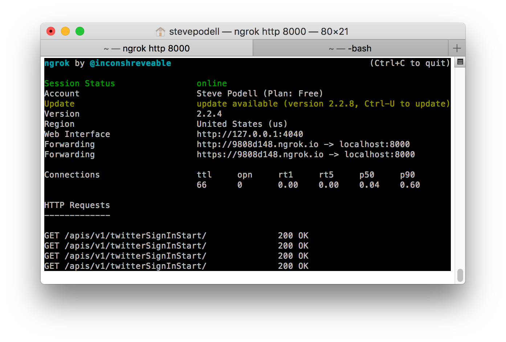
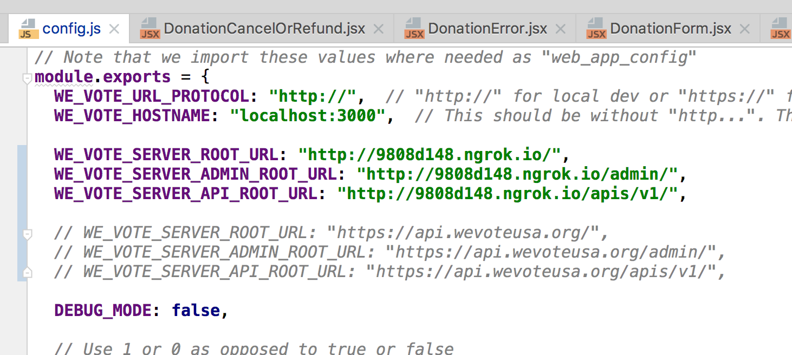

# Debugging from your phone to the Python WeVoteServer running on your Mac

## Android Setup

For Android, the app will see localhost at http://10.0.2.2:8000/   so just configure
the api server URLs with this address, and http requests in the simulator will go to localhost.

## iOS Setup

Since your phone, even if attached by a USB cord, will be your WiFi network, it will not be able to
directly reach localhost on your Mac.  If you are configured to fetch API requests from
the live server, you should be ready to go.  If you have changes on your local Python API server
that you need to test, you will need to setup a proxy server, so that an address on
the internet, tunnels to the localhost:8000 on your Mac.  Here's a very easy way to setup that
proxy:

1.  Download and install ngrok, "Secure Tunnels to Localhost"  [https://ngrok.com/](https://ngrok.com/)

2.  Run ngrok so that it proxys to your localhost port 8000:

```
Steves-iMac:~ your-username$ /Users/your-username/PythonProjects/ngrok/ngrok http 8000
```



3.  Configure your api server to respond at the url provided by ngrok




4.  Recompile your `bundle.js` in order to include the new config changes.   At this point the Cordova app on 
your phone should be communicating with your local API server.

_____

[Return to the WeVoteCordova home documentation page ](/README.md)